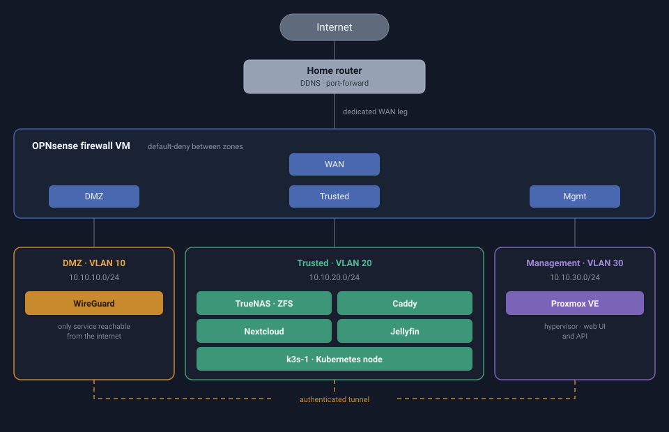

# Homelab

A self-hosted infrastructure project built on a single refurbished mini PC: a VLAN-segmented network behind a dedicated firewall, running NAS, personal cloud, media streaming and VPN services, with automated and restore-tested backups.

Everything here is documented as it was actually built, including the parts that broke. The incident write-ups are the point, not an afterthought.

## Stack

| Layer | Technology |
|---|---|
| Hypervisor | Proxmox VE (VMs + LXC containers) |
| Firewall / routing | OPNsense (dedicated VM, 4 network zones) |
| Network | 802.1Q VLANs, VLAN-aware Linux bridges, managed switch trunk |
| Storage | TrueNAS SCALE, ZFS, NFS + SMB exports |
| VPN | WireGuard |
| Services | Nextcloud, Jellyfin, Caddy (all Docker Compose inside LXC) |
| Media automation | Sonarr, Radarr, Prowlarr, qBittorrent, Jellyseerr - download traffic isolated behind gluetun |
| Hardware acceleration | Intel QuickSync passed through to an unprivileged LXC for Jellyfin transcoding |
| Backups | `rsync` to external SSD, cron-scheduled, restore validated |
| Planned | OpenTofu, Ansible, k3s, Prometheus + Grafana, GitHub Actions CI |

Hardware: Dell OptiPlex 3060 Micro (i5-8500T, 16GB RAM), 1TB HDD, 1TB external SSD for backups, TP-Link TL-SG608E managed switch.

## Network architecture

Traffic between zones is mediated by a dedicated OPNsense VM. The home network reaches the internet directly, without crossing the firewall; only the homelab VLANs go through it.

| Zone | VLAN | Subnet | Contents |
|---|---|---|---|
| DMZ | 10 | `10.10.10.0/24` | WireGuard, the only service reachable from the internet |
| Trusted | 20 | `10.10.20.0/24` | TrueNAS, Caddy, Nextcloud, Jellyfin |
| Management | 30 | `10.10.30.0/24` | Proxmox web UI and API, switch management |
| VPN tunnel | - | `10.10.40.0/24` | Virtual subnet, assigned to authenticated clients |

**Note on the diagram above**: it shows the target state. The segmentation is built and working, and WireGuard, the Proxmox management interface and TrueNAS have been migrated. Caddy, Nextcloud and Jellyfin are still on the flat network. The [network document](docs/NETWORK.md) tracks current state and target state as separate diagrams, deliberately, so the documentation never claims more than what exists.

## Current status

| Phase | State |
|---|---|
| 0. Hardware | Done, except a pending RAM upgrade to 32GB |
| 1. Base services | **Done** and validated (TrueNAS, WireGuard, Caddy, Nextcloud, Jellyfin, backups) |
| 2. VLANs and firewall | **In progress** (network built; WireGuard and TrueNAS migrated, three services to go) |
| 2b. Media automation | **Done** (hardware transcoding, *arr stack behind a VPN kill-switch) |
| 3. Storage / RAID | Not started |
| 4. IaC and Kubernetes | Not started |
| 5. Monitoring and alerting | Not started |
| 6. Documentation tooling | Not started |

Full task-level breakdown in [CHECKLIST.md](docs/CHECKLIST.md).

## What this project demonstrates

**Network segmentation that actually exists.** Most homelabs are a flat network with containers on it. This one has 802.1Q VLANs trunked over a single physical link, a VLAN-aware bridge on the hypervisor, and a dedicated firewall VM with a default-deny policy between four zones.

**Backups that were restored, not just taken.** The restore was validated at three levels: structural comparison of file listings, checksum verification, and playing back an actual restored video file. A backup nobody has restored is a hypothesis.

**Failure analysis written down.** Every incident has a post-mortem covering the symptom, the diagnosis path, the root cause and the fix. Some of them document my own wrong turns, because the wrong turn is usually the useful part.

**Honest state tracking.** Documents separate what is built from what is planned. When a diagram described the intended architecture as if it were reality, that was treated as a defect and fixed.

## Selected engineering write-ups

These are the parts worth reading if you want to see how problems were approached, not just what was installed.

**[The hypervisor locked up by a dead NFS mount](docs/CHECKLIST.md#history)** - a routine reboot ended with PID 1 itself in uninterruptible sleep, `systemctl` returning `Transport endpoint is not connected` and the cluster filesystem dead. The host mounts NFS from a VM it hosts itself, so shutting down that VM before unmounting deadlocked the shutdown, and `hard` mounts meant the unmount could never fail. The fix replaced boot-time mounts with `x-systemd.automount` plus `soft`, and revealed that no guest had `onboot` set - which retroactively explained several earlier "the services stopped working" reports. The write-up also records a fix I got wrong first: an ordering directive that created a circular dependency between the mount and the guests waiting on it.

**[Load average of 274 with every disk idle](docs/CHECKLIST.md#history)** - I/O pressure pinned at 98% for two hours while SMART was clean, the disk sat at 0% utilisation and swap was not moving. The break came from separating two layers: the NFS port accepted TCP connections while `showmount` hung, because an open port proves the kernel is listening, not that the RPC service is answering. Stopping the storage VM dropped the load from 274 to 4.6 in seconds. Three hypotheses were eliminated by measurement before the right one, and the earlier `soft` mount change is what made recovery possible instead of repeating the lockup above.

**[VPN completely unreachable after the VLAN migration](docs/CHECKLIST.md#history)** - symptom was a WireGuard client reporting a connection with zero bytes received. Diagnosis eliminated layers from the inside out: inter-zone firewall rules, then the container's own iptables (packet counters stayed at zero through a real VPN reconnect, proving handshake packets never even reached the DMZ), then the NAT rule, then DNS. Root cause was a port-forward rule on the home router still pointing at the service's pre-migration IP. The lesson recorded was about verifying persisted configuration rather than trusting an earlier edit.

**[NFS permissions through two layers of UID translation](docs/CHECKLIST.md#history)** - Nextcloud failed with `chown: Operation not permitted` against an NFS export. The cause was that "root" inside an unprivileged LXC running Docker never arrives at the NFS server as real UID 0, so `Maproot` does not apply and `Mapall` is required. The finding was applied preemptively to the next service, which worked first time.

**[Backup silently aborting on exFAT](docs/CHECKLIST.md#history)** - `rsync -a` failed the entire transfer because exFAT cannot store Unix ownership, and `-a` always tries to preserve it. Resolved with explicit flags matched to the filesystem's actual capabilities.

**[DHCP leases expiring without renewal](docs/CHECKLIST.md#history)** - containers lost IPv4 connectivity after hours of uptime. Two rounds of fixes treated the symptom before the actual cause was identified, leading to a project-wide move to static addressing.

## Documentation

| Document | Contents |
|---|---|
| [CHECKLIST.md](docs/CHECKLIST.md) | Task-level status per phase, plus the full incident log |
| [NETWORK.md](docs/NETWORK.md) | Network reference: current vs target state, physical topology, firewall rule matrix, end-to-end packet paths |
| [STORAGE.md](docs/STORAGE.md) | Storage chain from physical disk to container, boot-order dependencies, backup design |
| [PROJECT_CONTEXT.md](docs/PROJECT_CONTEXT.md) | Decision log with rationale, including reversed decisions |
| [TOOLING.md](docs/TOOLING.md) | Tooling decisions: IaC, monitoring, documentation |
| [WORKFLOW.md](docs/WORKFLOW.md) | Where each tool runs and how the workflow fits together |
| [HARDWARE.md](docs/HARDWARE.md) | Hardware criteria and options considered |

## A note on secrets

Credentials, keys and access details live in `docs/SECRETS.md`, which is gitignored and has never been committed. [SECRETS.example.md](docs/SECRETS.example.md) is the versioned template with the structure and no real values.

Hostnames, public addresses and personal identifiers have been redacted from the public documentation. Internal RFC 1918 addresses are kept because they carry no risk on their own and removing them would make the network documentation unreadable.
