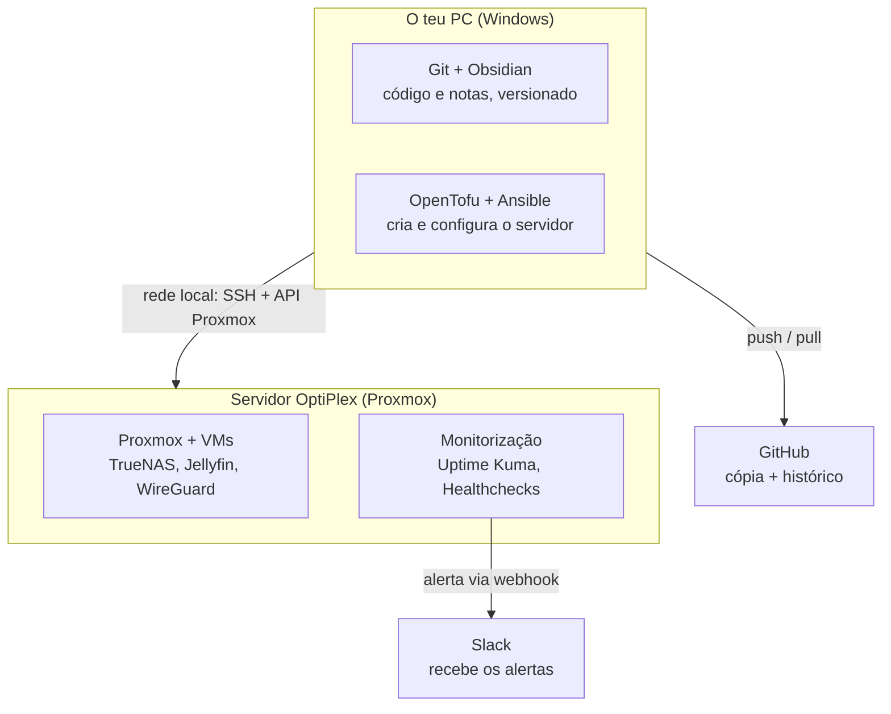

# Arquitetura e fluxo de trabalho (para iniciantes)

Documento vivo — atualizar sempre que uma ferramenta mudar de sítio ou o fluxo mudar. Não é um plano de decisão (isso é `PLANO_FERRAMENTAS_E_BOAS_PRATICAS.md`); é o "onde é que isto vive e como é que tudo se encaixa", explicado de forma simples.

## Regra de ouro

**O teu PC é onde planeias e comandas. O OptiPlex é onde tudo corre 24/7.**
Quase nenhuma ferramenta é instalada nos dois sítios — cada uma tem um único lugar certo. O teu PC nunca corre nada 24/7; ele só é usado quando estás a trabalhar. O OptiPlex é que fica sempre ligado a fazer o trabalho de fundo.

## Onde vive cada ferramenta

| Ferramenta | Para que serve | Onde fica instalada |
|---|---|---|
| Git | Guardar o histórico de todas as alterações (código, configs, notas) | **O teu PC** (repo clonado em `Documents\GitHub\homelab`) |
| GitHub | Cópia de segurança do repo na nuvem + histórico partilhável | **Nuvem** (github.com) — o teu PC envia (`push`) e recebe (`pull`) |
| Obsidian | Ler/editar a documentação com mais conforto (links, tags, pesquisa) | **O teu PC** (aponta para a mesma pasta do repo) |
| OpenTofu | Cria/apaga VMs e LXCs no Proxmox a partir de ficheiros de código | **O teu PC** — liga-se à API do Proxmox pela rede local |
| Ansible | Configura o que está *dentro* das VMs (instalar TrueNAS, Jellyfin...) | **O teu PC** — liga-se por SSH às VMs no OptiPlex |
| Proxmox | O "sistema operativo" do servidor, corre as VMs/LXCs | **OptiPlex** (já instalado) |
| TrueNAS, Jellyfin, WireGuard | Os serviços em si (storage, media, VPN) | **OptiPlex**, dentro de VMs criadas pelo Proxmox |
| Uptime Kuma, Healthchecks.io | Vigiar se os serviços acima estão vivos e a correr | **OptiPlex**, numa VM/LXC dedicada a monitorização |
| Slack | Onde recebes os alertas (só uma app/site, nada para instalar no homelab) | **Nuvem** (slack.com) — o OptiPlex envia-lhe mensagens |

## O fluxo de trabalho típico, do início ao fim

1. No teu PC, editas ficheiros (documentação no Obsidian, ou código Terraform/Ansible num editor) — tudo dentro da pasta `homelab`.
2. `git commit` + `push` — fica guardado no GitHub.
3. A partir do teu PC corres `tofu apply` — fala com o Proxmox pela rede local (mesma rede de casa) e cria/atualiza uma VM no OptiPlex.
4. A partir do teu PC corres `ansible-playbook` — entra por SSH nessa VM (ainda no OptiPlex) e instala/configura o que for preciso (TrueNAS, Jellyfin, Uptime Kuma...).
5. Uma vez o Uptime Kuma a correr *dentro* do OptiPlex, ele próprio (sem precisares de fazer nada) fica a verificar os outros serviços; se algo cair, envia uma mensagem para o Slack através do webhook.
6. Recebes o alerta no telemóvel/PC via app do Slack — o teu PC não é intermediário nesse último passo.

## Nota técnica: Ansible no Windows precisa de WSL2

O OpenTofu corre nativamente no Windows sem problema, mas o **Ansible não corre no Windows como "máquina de comando"** — só sabe configurar máquinas Linux remotas, e para isso precisa de ele próprio correr dentro de um Linux. A forma standard de resolver isto é ativar o **WSL2** (Windows Subsystem for Linux, já vem com o Windows 11) e instalar o Ansible lá dentro — continua-se a editar tudo no mesmo PC, só se corre esse comando específico de dentro do WSL em vez do PowerShell.

## Histórico

- 18/07/2026: primeira versão deste documento, com o mapa de onde vive cada ferramenta e o fluxo de trabalho ponta a ponta.
