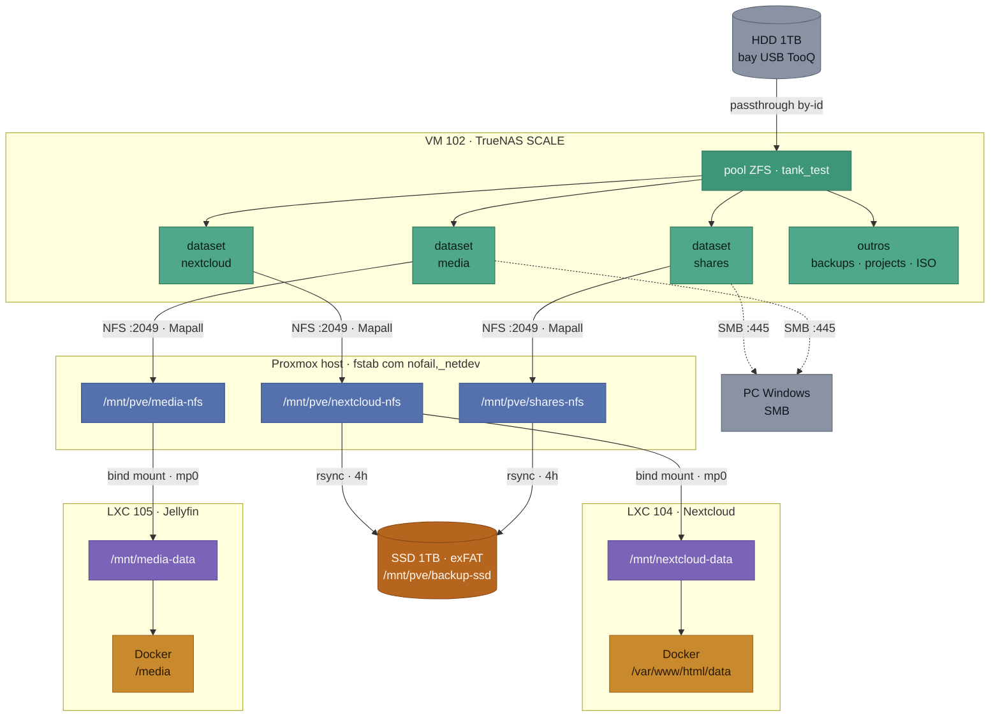
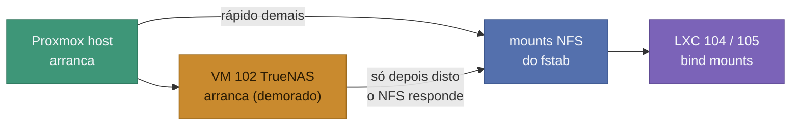

# Esquema de Dados e Storage - Homelab v2

Companheiro do [ESQUEMA_LOGICO_REDE.md](ESQUEMA_LOGICO_REDE.md): onde aquele mostra por onde passam os pacotes, este mostra **onde vivem os ficheiros** e por quantas camadas passam entre o disco físico e a aplicação que os lê.

Existe por um motivo concreto: a cadeia é comprida, cada elo é invisível a partir do elo seguinte, e já causou três incidentes distintos (permissões NFS, mounts perdidos após reinício, e caminhos confundidos no diagnóstico). Ter isto desenhado poupa o tempo de reconstruir a cadeia de cabeça de cada vez.

## A cadeia completa, do disco ao container



| Camada | |
|---|---|
| ⬜ | Disco físico / cliente externo |
| 🟩 | ZFS (pool e datasets) no TrueNAS |
| 🟦 | Mount NFS no host Proxmox |
| 🟪 | Caminho dentro do LXC (alvo do bind mount) |
| 🟧 | Caminho dentro do container Docker |
| 🟫 | Destino de backup |

## Porque é que a cadeia é tão comprida

Cada camada existe por uma razão que não é óbvia até se tentar cortar caminho:

1. **Passthrough em vez de disco virtual**: o TrueNAS gere o disco diretamente, o que preserva a pool ZFS que já vinha da v1.
2. **NFS montado no host, não no container**: um LXC *unprivileged* não consegue montar NFS, mesmo com `nesting`. A tentativa falha com `Operation not permitted`. Por isso o host monta e passa adiante.
3. **Bind mount (`mp0`) para o LXC**: é a forma de o container ver uma pasta do host.
4. **Volume do Docker dentro do LXC**: mais uma camada, porque a aplicação corre em Docker dentro do LXC.

O efeito prático: **o "root" que chega ao TrueNAS não é o root verdadeiro**. Passou por duas traduções de UID (unprivileged + Docker), e chega com um UID deslocado. É por isso que os exports precisam de `Mapall` e não de `Maproot`: o `Maproot` só trata como root quem chega mesmo como UID 0.

## Onde cada coisa realmente vive

| Dados | Onde vivem | Backup? |
|---|---|---|
| Ficheiros do Nextcloud | dataset `nextcloud` (TrueNAS) | **Sim**, diário |
| `shares` (documentos, vídeos pessoais) | dataset `shares` (TrueNAS) | **Sim**, diário |
| Biblioteca de media do Jellyfin | dataset `media` (TrueNAS) | **Não** |
| Base de dados do Nextcloud (MariaDB) | volume Docker no disco do LXC 104 | **Não** |
| Config e cache do Jellyfin | volumes Docker no disco do LXC 105 | **Não** |
| Discos das VMs/LXCs | SSD 256GB local do Proxmox | **Não** |
| Configuração do OPNsense | dentro da VM 106 | **Não** |

### O que isto revela

Três lacunas que a tabela torna visíveis, por ordem de gravidade:

- **A base de dados do Nextcloud não tem backup.** Os *ficheiros* estão salvaguardados, mas a base de dados que sabe a quem pertencem, que partilhas existem e que metadados têm, não está. Um restore hoje devolveria ficheiros sem o Nextcloud à volta deles.
- **A configuração do OPNsense não tem backup.** Já está registado como risco no `PROJECT_CONTEXT.md` e como tarefa por fazer no `CHECKLIST.md`, mas vale a pena repetir: perder isto é perder toda a política de rede, não um serviço.
- **A biblioteca de media não tem backup**, o que provavelmente é uma decisão consciente (é grande e recuperável), mas nunca foi registada como tal. Vale a pena confirmar que é mesmo intencional.

## Protocolos e portas usados nesta cadeia

| Ligação | Protocolo | Porta |
|---|---|---|
| Host Proxmox → TrueNAS (mounts NFS) | NFS | 2049/TCP, mais 111/TCP-UDP (rpcbind) e portas dinâmicas de `mountd`/`statd`/`lockd` |
| PC Windows → TrueNAS (partilhas) | SMB | 445/TCP |
| Bind mount host → LXC | *(nenhum)* | Não passa pela rede, é o kernel a expor a mesma pasta |
| Volume Docker LXC → container | *(nenhum)* | Também local, sem rede |
| Backup para o SSD | *(nenhum)* | `rsync` local, disco ligado por USB ao host |

Só os dois primeiros atravessam a rede, e são por isso os únicos que precisam de regra de firewall quando o TrueNAS for para a zona Trusted. Os restantes são locais ao host e continuam a funcionar independentemente do que a firewall fizer.

## Dependências de arranque

Explica o incidente recorrente do Nextcloud e do Jellyfin depois de reiniciar o host.



O TrueNAS é uma VM *dentro* do próprio host que precisa dele. Quando o host arranca, tenta montar o NFS antes de o TrueNAS estar pronto a servir.

O `nofail,_netdev` no fstab resolve metade do problema: o arranque deixa de bloquear à espera. Mas **não** remonta sozinho depois, e sobretudo: se um LXC já arrancou com o bind mount a apontar para uma pasta vazia, corrigir o mount do host mais tarde **não atualiza o que o container vê**. Daí a receita ter dois passos:

```bash
mount -a
pct stop 104 && pct start 104
pct stop 105 && pct start 105
```

## Backup

| Campo | Valor |
|---|---|
| Destino | SSD externo 1TB (SanDisk Portable), exFAT, em `/mnt/pve/backup-ssd` |
| Origem | `/mnt/pve/nextcloud-nfs` e `/mnt/pve/shares-nfs` |
| Comando | `rsync -rlt --delete --modify-window=1` |
| Agendamento | cron diário às 4h, no host Proxmox |
| Script | `/usr/local/bin/backup-homelab.sh` |
| Log | `/var/log/backup-homelab.log` |

**Porque não `rsync -a`**: o exFAT não guarda dono/grupo Unix. O `-a` tenta sempre preservá-los, falha com `chown failed: Operation not permitted`, e o rsync aborta a transferência inteira. O `-rlt` copia sem tentar, e o `--modify-window=1` compensa a precisão mais baixa das datas no exFAT.

**Porque exFAT e não ZFS**: mantém o disco utilizável como disco externo comum no Windows, em troca de perder as *Replication Tasks* nativas do TrueNAS. Foi uma escolha deliberada.

Restore validado em 03/08/2026 a três níveis (listagens, checksum, reprodução real de um ficheiro). Receita de remontagem depois de desligar o disco, em `SEGREDOS.md`.

## Histórico

- 06/08/2026: criado este documento. A cadeia de storage estava descrita só em fragmentos espalhados pelo `CHECKLIST.md` (dentro dos relatos de incidentes) e pelo `SEGREDOS.md` (caminhos soltos), sem nenhuma vista de conjunto. Ao desenhá-la de ponta a ponta tornaram-se visíveis três lacunas de backup que não estavam registadas em lado nenhum, a mais séria sendo a base de dados do Nextcloud.
