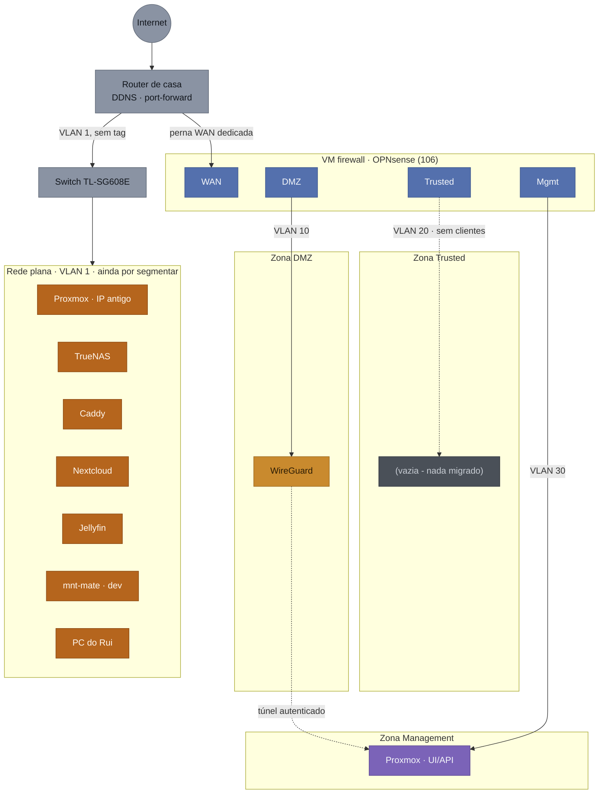

# Esquema Lógico de Rede - Homelab v2

Documento de referência rápida: "como está montada a rede", para consultar a qualquer momento sem ter de procurar dentro do `PROJECT_CONTEXT.md`. As decisões, o histórico e os porquês continuam lá.

**Este documento tem dois diagramas** e é importante não os confundir: o primeiro é o **estado atual** (o que está mesmo montado hoje), o segundo é o **estado alvo** (onde a Fase 2 vai chegar). Até 06/08/2026 existia só o diagrama do alvo, o que dava a impressão errada de que os serviços já estavam segmentados.

## Diagrama 1: estado atual (06/08/2026)

A leitura mais importante deste diagrama: **a zona Trusted está vazia**. Os serviços que ela devia proteger (TrueNAS, Caddy, Nextcloud, Jellyfin) continuam todos na rede plana de casa, ao lado do PC e de qualquer outro dispositivo doméstico. A segmentação existe e funciona, mas ainda não está a proteger nada.

| Zonas | |
| ----- | -------------------------------------- |
| ⬜ | Internet / router / switch |
| 🟫 | Rede plana · VLAN 1 · `192.168.1.0/24` - **por segmentar** |
| 🟦 | Firewall dedicada (interfaces) |
| 🟧 | DMZ · VLAN 10 · `10.10.10.0/24` |
| ⬛ | Trusted · VLAN 20 · `10.10.20.0/24` - criada, ainda sem clientes |
| 🟪 | Management · VLAN 30 · `10.10.30.0/24` |

| Ligações | |
|---|---|
| ── | Rede real (uplink ou VLAN com tag) |
| ┄┄ | Túnel WireGuard autenticado · `10.10.40.0/24`, ou ligação ainda inexistente |

**Nota sobre o Proxmox aparecer duas vezes**: não é erro do diagrama. O host está *dual-homed* de propósito - tem o IP antigo na rede plana (`192.168.1.206`) e outro na Management (`10.10.30.2`, via `vmbr0.30`). O IP antigo é a rede de segurança contra lockout: se a firewall falhar ou uma regra estiver errada, é por ele que se entra a corrigir. Foi exatamente o que salvou o diagnóstico do incidente de 06/08/2026 (ver `PROJECT_CONTEXT.md` §Riscos).

## Inventário: onde está cada componente hoje

| Componente | ID | Zona atual | IP | Zona alvo |
|---|---|---|---|---|
| Router de casa | - | *(gateway)* | 192.168.1.1 | *(mantém-se)* |
| Switch TL-SG608E | - | Rede plana | 192.168.1.88 | Management |
| OPNsense - WAN | VM 106 | Rede plana | 192.168.1.95 | *(mantém-se)* |
| OPNsense - DMZ | VM 106 | DMZ | 10.10.10.1 | *(mantém-se)* |
| OPNsense - Trusted | VM 106 | Trusted | 10.10.20.1 | *(mantém-se)* |
| OPNsense - Management | VM 106 | Management | 10.10.30.1 | *(mantém-se)* |
| Proxmox VE (host) | - | Rede plana **e** Management | 192.168.1.206 + 10.10.30.2 | Management (mantendo o IP antigo como via de recurso) |
| WireGuard | LXC 103 | **DMZ** | 10.10.10.10 | *(já migrado)* |
| TrueNAS | VM 102 | Rede plana | 192.168.1.66 | Trusted |
| Caddy | LXC 101 | Rede plana | 192.168.1.83 | Trusted |
| Nextcloud | LXC 104 | Rede plana | 192.168.1.84 | Trusted |
| Jellyfin | LXC 105 | Rede plana | 192.168.1.87 | Trusted |
| mnt-mate (dev) | VM 100 | Rede plana | 192.168.1.212 | *(por decidir - ver `CHECKLIST.md` §Decisões em aberto)* |
| Clientes VPN | - | Túnel | 10.10.40.2 (telemóvel), 10.10.40.3 (PC) | *(mantém-se)* |

## Diagrama 2: estado alvo (quando a Fase 2 fechar)

| Zonas |                                        |
| ----- | -------------------------------------- |
| ⬜     | Internet / router (rede de casa)       |
| 🟦    | Firewall dedicada (interfaces)         |
| 🟧    | DMZ · VLAN 10 · `10.10.10.0/24`        |
| 🟩    | Trusted · VLAN 20 · `10.10.20.0/24`    |
| 🟪    | Management · VLAN 30 · `10.10.30.0/24` |

| Ligações | |
|---|---|
| ── | Rede real (uplink ou VLAN com tag) |
| ┄┄ | Túnel WireGuard autenticado · `10.10.40.0/24` |

## Zonas / VLANs

| VLAN | Nome | Subnet | O que vive aqui (alvo) | Estado |
|---|---|---|---|---|
| 1 *(nativa, sem tag)* | Rede de casa | 192.168.1.0/24 | A perna WAN da firewall, o PC do Rui e o resto da rede doméstica | Ativa, mas ainda a alojar serviços que deviam estar na Trusted |
| 10 | DMZ | 10.10.10.0/24 | WireGuard (perna internet-facing). Caddy só entra aqui quando houver app decidida para exposição pública | **Ativa e povoada** (WireGuard) |
| 20 | Trusted | 10.10.20.0/24 | TrueNAS, Caddy (HTTPS interno), Nextcloud, Jellyfin, nós k3s e workloads | Criada, **vazia** |
| 30 | Management | 10.10.30.0/24 | UI/API do Proxmox, gestão do switch, SSH aos nós | **Ativa** (Proxmox); switch ainda na rede plana |
| - | Túnel WireGuard | 10.10.40.0/24 | **Não é VLAN do switch** - subnet virtual só dentro da VM do WireGuard, atribuída a clientes já autenticados | Ativa (2 peers) |

## Atribuição de NICs

- **NIC onboard** → trunk para o switch, a transportar as VLANs 10/20/30 com tag **e a VLAN 1 sem tag** (rede doméstica normal, ver "Fisicamente, o que liga ao switch" abaixo) - papel mais crítico, hardware mais fiável.
- **Adaptador USB→RJ45** → perna WAN, sem tags, ligada à rede de casa/router (papel mais simples, tolera melhor uma eventual instabilidade do adaptador).
- No switch, só a porta ligada à NIC onboard do OptiPlex precisa de ser trunk; as restantes portas ficam livres.

## Fisicamente, o que liga ao switch

Três cabos, cada um com um propósito diferente:

- **Optiplex (NIC onboard) → switch, porta 3**: um único cabo, configurado como trunk - transporta a VLAN 1 sem tag (rede doméstica normal) **e** as VLANs 10/20/30 com tag (zonas do homelab), tudo misturado no mesmo fio físico. Todos os "dispositivos" das 3 zonas são VMs/containers dentro do mesmo host físico; a separação acontece no bridge VLAN-aware do Proxmox, não por cabos extra.
- **Switch → adaptador powerline → router**: cabo próprio e independente (já existia antes da Fase 2), dá acesso à internet à VLAN 1 - a qualquer dispositivo ligado ao switch, como o PC do Rui. **Este tráfego nunca passa pela firewall dedicada.**
- **Optiplex (adaptador USB→RJ45) → adaptador powerline → router**: outro cabo independente (criado na Fase 2), é a perna WAN dedicada da VM de firewall - só serve o tráfego das zonas DMZ/Trusted/Management.

O switch faz assim dupla função: é ao mesmo tempo o trunk das VLANs do homelab **e** um switch normal da rede doméstica (VLAN 1) - a separação entre as duas coisas existe só por causa das tags em cada porta, não por hardware dedicado. Ver também "Rede doméstica (fora deste esquema)" abaixo.

## Regras entre zonas

O OPNsense é *default-deny*: o que não estiver explicitamente permitido é bloqueado. Por isso a lista do que existe é, por si só, a política completa.

### Regras mesmo configuradas hoje (06/08/2026)

| # | Interface | Origem | Destino | Ação | Descrição |
|---|---|---|---|---|---|
| 1 | DMZ | `10.10.10.10` (WireGuard) | Rede Trusted | Pass | Deixa os clientes VPN chegar à zona Trusted |
| 2 | DMZ | `10.10.10.10` (WireGuard) | Rede Management | Pass | Deixa os clientes VPN chegar ao Proxmox |
| 3 | MGMT | Rede Management | Qualquer | Pass | O host Proxmox precisa de iniciar ligações a todas as zonas |
| NAT | WAN | Qualquer | WAN `:51820/UDP` | Pass + DNAT | Encaminha o WireGuard para `10.10.10.10:51820` |

Mais as regras automáticas do OPNsense, que não foram criadas à mão mas contam para o comportamento real: *anti-lockout* (TCP 80/443 para a própria firewall, por interface), bloqueio de redes privadas e *bogons* vindas da WAN, e a *default deny* final.

Dois detalhes que já custaram tempo a perceber:

- **As regras 1 e 2 têm origem no IP do WireGuard, não na rede DMZ inteira.** É o efeito do `MASQUERADE` do WireGuard: o tráfego de um cliente VPN chega à firewall como se viesse de `10.10.10.10`. O efeito lateral bom é que a regra geral "DMZ → Management: bloqueado" continua válida para qualquer serviço futuro que venha a viver na DMZ.
- **As regras *anti-lockout* explicam porque `https://10.10.10.1` funciona sem regra própria.** Elas cobrem TCP 80/443 para a própria firewall, mas não cobrem ICMP - por isso um `ping` ao OPNsense a partir da DMZ falha sem que isso seja sintoma de nada.

### Regras ainda por escrever (alvo)

- **DMZ → Trusted deve ser restringida a portas específicas.** Hoje a regra 1 permite qualquer porta; o alvo é só o que os serviços em DMZ precisam mesmo de contactar.
- **WAN-side → Management**, permitido só a partir do IP do PC do Rui (OpenTofu/Ansible → API do Proxmox). Só passa a fazer sentido na Fase 4, quando existir IaC.
- **Regras para a Trusted**, quando lá viver alguma coisa - hoje a zona está vazia, por isso não há nada a permitir nem a negar.

## Rede doméstica (fora deste esquema)

Wi-Fi geral, rede de convidados e eventual isolamento de IoT ficam **fora** desta segmentação - vivem no router (Vodafone Smart Router / Huawei OptiXstar HG8247B7-8N) e não dependem do OptiPlex. Detalhe em `PROJECT_CONTEXT.md` § Router de casa e rede doméstica.

**Nota**: o switch TL-SG608E, apesar de fazer o trunk das VLANs do homelab (ver "Fisicamente, o que liga ao switch" acima), também continua a servir esta rede doméstica normal (VLAN 1, sem tag) para quem lá estiver ligado por cabo - por exemplo o PC do Rui. Esse tráfego não passa pela firewall dedicada, tal como o resto da rede doméstica.

## Pendente

Qual app vai para a zona DMZ, e a zona de rede da futura VM de desenvolvimento/agentes-LLMs - ver `docs/CHECKLIST.md` § Decisões em aberto.

## Histórico

- 29/07/2026: criado este documento, movendo o diagrama e a referência de rede que viviam em `PROJECT_CONTEXT.md` § Rede e Segmentação para um ficheiro próprio, mais fácil de consultar sem percorrer o log de decisões.
- 29/07/2026: diagrama redesenhado - cada zona passou a uma única caixa (em vez de uma caixa por serviço) para caber sem scroll horizontal; os serviços de cada zona já estão detalhados na tabela "Zonas / VLANs" abaixo. Tentativa anterior (`direction TB` dentro de cada subgraph) não resultou - o Mermaid ignora essa direção quando há ligações entre subgraphs, confirmado por teste local antes de aplicar. Legenda também reformatada em tabela compacta com marcadores de cor/linha.
- 29/07/2026: revertido para caixas individuais por serviço - a versão colapsada, além de menos explícita, introduziu sobreposição visual (o título longo da firewall ficou espremido contra as caixas com o diagrama mais estreito). Confirmado por teste local que a versão de caixas individuais não tem esse problema, só é mais larga (pode precisar de scroll horizontal ou zoom out no Obsidian). Legenda em tabela mantém-se.
- 02/08/2026: **clarificada a dupla função do switch** - o diagrama e o texto só mostravam o caminho Internet → Router → Firewall → zonas, dando a entender (incorretamente) que toda a rede passava pela firewall. Corrigido: a porta trunk do switch transporta também a VLAN 1 sem tag (rede doméstica normal), que chega à internet por um cabo próprio (switch → powerline → router), sem tocar na firewall - é o caminho que o PC do Rui usa, por exemplo. Só o tráfego das VLANs 10/20/30 é que passa pela firewall, via a perna WAN dedicada (adaptador USB→RJ45). Esta ambiguidade só foi detetada ao configurar fisicamente a Fase 2 (porta trunk + bridges no Proxmox), não durante o desenho original do esquema.
- 06/08/2026: **separado o estado atual do estado alvo** - o documento tinha um único diagrama, o do alvo, apresentado como se fosse a realidade. Como a Fase 2 só migrou o WireGuard e o Proxmox até agora, isso escondia o facto mais importante do momento: **a zona Trusted está criada mas vazia**, e TrueNAS/Caddy/Nextcloud/Jellyfin continuam na rede plana, sem qualquer proteção da firewall. Adicionados: diagrama do estado atual, tabela de inventário componente a componente (com zona atual e zona alvo), e a distinção entre regras de firewall realmente configuradas e as que ainda faltam escrever. A secção "Regras entre zonas" era inteiramente aspiracional e não correspondia a nada do que estava aplicado.
