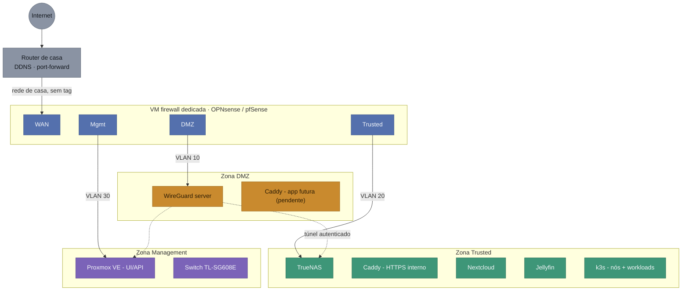

# Esquema Lógico de Rede — Homelab v2

Documento de referência rápida: "como está montada a rede", para consultar a qualquer momento sem ter de procurar dentro do `PROJECT_CONTEXT.md`. As decisões, o histórico e os porquês continuam lá — aqui fica só o desenho atual.

## Diagrama

**Legenda** — cores: cinzento = internet/router; azul = interfaces da firewall; âmbar = DMZ; verde = Trusted; roxo = Management. Linhas: sólida = ligação de rede real (uplink ou VLAN com tag); tracejada = túnel WireGuard autenticado.

## Zonas / VLANs

| VLAN | Nome | Subnet | O que vive aqui |
|---|---|---|---|
| *(nativa, sem tag)* | WAN-side | rede de casa atual (ex. 192.168.1.0/24) | Só a perna WAN da VM de firewall; o router continua a fazer DDNS + port-forward para aqui |
| 10 | DMZ | 10.10.10.0/24 | WireGuard (perna internet-facing). Caddy só entra aqui quando houver app decidida para exposição pública |
| 20 | Trusted | 10.10.20.0/24 | TrueNAS, Caddy (HTTPS interno), Nextcloud, Jellyfin, nós k3s e workloads |
| 30 | Management | 10.10.30.0/24 | UI/API do Proxmox, gestão do switch, SSH aos nós |
| — | Túnel WireGuard | 10.10.40.0/24 | **Não é VLAN do switch** — subnet virtual só dentro da VM do WireGuard, atribuída a clientes já autenticados |

## Atribuição de NICs

- **NIC onboard** → trunk para o switch, a transportar as VLANs 10/20/30 com tag (papel mais crítico, hardware mais fiável).
- **Adaptador USB→RJ45** → perna WAN, sem tags, ligada à rede de casa/router (papel mais simples, tolera melhor uma eventual instabilidade do adaptador).
- No switch, só a porta ligada à NIC onboard do OptiPlex precisa de ser trunk; as restantes portas ficam livres.

## Fisicamente, o que liga ao switch

Hoje, só **um cabo** — o da NIC onboard do OptiPlex, numa porta configurada como trunk. Todos os "dispositivos" das 3 zonas são VMs/containers dentro do mesmo host físico; a separação acontece no bridge VLAN-aware do Proxmox, não por cabos extra. O adaptador USB→RJ45 vai direto ao router, não ao switch.

## Regras entre zonas

- DMZ → Trusted: só as portas específicas que os serviços em DMZ precisam de contactar. Nada mais.
- DMZ → Management: bloqueado.
- WAN-side → Management: permitido só a partir do IP do PC do Rui (OpenTofu/Ansible → API do Proxmox).
- Túnel WireGuard → Trusted + Management: permitido (é o propósito do VPN).

## Rede doméstica (fora deste esquema)

Wi-Fi geral, rede de convidados e eventual isolamento de IoT ficam **fora** desta segmentação — vivem no router (Vodafone Smart Router / Huawei OptiXstar HG8247B7-8N) e não dependem do OptiPlex. Detalhe em `PROJECT_CONTEXT.md` § Router de casa e rede doméstica.

## Pendente

Qual app vai para a zona DMZ, e a zona de rede da futura VM de desenvolvimento/agentes-LLMs — ver `docs/CHECKLIST.md` § Decisões em aberto.

## Histórico

- 29/07/2026: criado este documento, movendo o diagrama e a referência de rede que viviam em `PROJECT_CONTEXT.md` § Rede e Segmentação para um ficheiro próprio, mais fácil de consultar sem percorrer o log de decisões.
