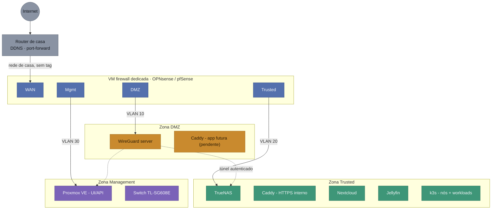

# Esquema Lógico de Rede - Homelab v2

Documento de referência rápida: "como está montada a rede", para consultar a qualquer momento sem ter de procurar dentro do `PROJECT_CONTEXT.md`. As decisões, o histórico e os porquês continuam lá - aqui fica só o desenho atual.

## Diagrama

| Zonas |                                        |
| ----- | -------------------------------------- |
| ⬜     | Internet / router (rede de casa)       |
| 🟦    | Firewall dedicada (interfaces)         |
| 🟧    | DMZ · VLAN 10 · `10.10.10.0/24`        |
| 🟩    | Trusted · VLAN 20 · `10.10.20.0/24`    |
| 🟪    | Management · VLAN 30 · `10.10.30.0/24` |

| Ligações | |
|---|---|
| ── | Rede real (uplink ou VLAN com tag) |
| ┄┄ | Túnel WireGuard autenticado · `10.10.40.0/24` |

## Zonas / VLANs

| VLAN | Nome | Subnet | O que vive aqui |
|---|---|---|---|
| *(nativa, sem tag)* | WAN-side | rede de casa atual (ex. 192.168.1.0/24) | Só a perna WAN da VM de firewall; o router continua a fazer DDNS + port-forward para aqui |
| 10 | DMZ | 10.10.10.0/24 | WireGuard (perna internet-facing). Caddy só entra aqui quando houver app decidida para exposição pública |
| 20 | Trusted | 10.10.20.0/24 | TrueNAS, Caddy (HTTPS interno), Nextcloud, Jellyfin, nós k3s e workloads |
| 30 | Management | 10.10.30.0/24 | UI/API do Proxmox, gestão do switch, SSH aos nós |
| - | Túnel WireGuard | 10.10.40.0/24 | **Não é VLAN do switch** - subnet virtual só dentro da VM do WireGuard, atribuída a clientes já autenticados |

## Atribuição de NICs

- **NIC onboard** → trunk para o switch, a transportar as VLANs 10/20/30 com tag **e a VLAN 1 sem tag** (rede doméstica normal, ver "Fisicamente, o que liga ao switch" abaixo) - papel mais crítico, hardware mais fiável.
- **Adaptador USB→RJ45** → perna WAN, sem tags, ligada à rede de casa/router (papel mais simples, tolera melhor uma eventual instabilidade do adaptador).
- No switch, só a porta ligada à NIC onboard do OptiPlex precisa de ser trunk; as restantes portas ficam livres.

## Fisicamente, o que liga ao switch

Três cabos, cada um com um propósito diferente:

- **Optiplex (NIC onboard) → switch, porta 3**: um único cabo, configurado como trunk - transporta a VLAN 1 sem tag (rede doméstica normal) **e** as VLANs 10/20/30 com tag (zonas do homelab), tudo misturado no mesmo fio físico. Todos os "dispositivos" das 3 zonas são VMs/containers dentro do mesmo host físico; a separação acontece no bridge VLAN-aware do Proxmox, não por cabos extra.
- **Switch → adaptador powerline → router**: cabo próprio e independente (já existia antes da Fase 2), dá acesso à internet à VLAN 1 - a qualquer dispositivo ligado ao switch, como o PC do Rui. **Este tráfego nunca passa pela firewall dedicada.**
- **Optiplex (adaptador USB→RJ45) → adaptador powerline → router**: outro cabo independente (criado na Fase 2), é a perna WAN dedicada da VM de firewall - só serve o tráfego das zonas DMZ/Trusted/Management.

O switch faz assim dupla função: é ao mesmo tempo o trunk das VLANs do homelab **e** um switch normal da rede doméstica (VLAN 1) - a separação entre as duas coisas existe só por causa das tags em cada porta, não por hardware dedicado. Ver também "Rede doméstica (fora deste esquema)" abaixo.

## Regras entre zonas

- DMZ → Trusted: só as portas específicas que os serviços em DMZ precisam de contactar. Nada mais.
- DMZ → Management: bloqueado.
- WAN-side → Management: permitido só a partir do IP do PC do Rui (OpenTofu/Ansible → API do Proxmox).
- Túnel WireGuard → Trusted + Management: permitido (é o propósito do VPN).

## Rede doméstica (fora deste esquema)

Wi-Fi geral, rede de convidados e eventual isolamento de IoT ficam **fora** desta segmentação - vivem no router (Vodafone Smart Router / Huawei OptiXstar HG8247B7-8N) e não dependem do OptiPlex. Detalhe em `PROJECT_CONTEXT.md` § Router de casa e rede doméstica.

**Nota**: o switch TL-SG608E, apesar de fazer o trunk das VLANs do homelab (ver "Fisicamente, o que liga ao switch" acima), também continua a servir esta rede doméstica normal (VLAN 1, sem tag) para quem lá estiver ligado por cabo - por exemplo o PC do Rui. Esse tráfego não passa pela firewall dedicada, tal como o resto da rede doméstica.

## Pendente

Qual app vai para a zona DMZ, e a zona de rede da futura VM de desenvolvimento/agentes-LLMs - ver `docs/CHECKLIST.md` § Decisões em aberto.

## Histórico

- 29/07/2026: criado este documento, movendo o diagrama e a referência de rede que viviam em `PROJECT_CONTEXT.md` § Rede e Segmentação para um ficheiro próprio, mais fácil de consultar sem percorrer o log de decisões.
- 29/07/2026: diagrama redesenhado - cada zona passou a uma única caixa (em vez de uma caixa por serviço) para caber sem scroll horizontal; os serviços de cada zona já estão detalhados na tabela "Zonas / VLANs" abaixo. Tentativa anterior (`direction TB` dentro de cada subgraph) não resultou - o Mermaid ignora essa direção quando há ligações entre subgraphs, confirmado por teste local antes de aplicar. Legenda também reformatada em tabela compacta com marcadores de cor/linha.
- 29/07/2026: revertido para caixas individuais por serviço - a versão colapsada, além de menos explícita, introduziu sobreposição visual (o título longo da firewall ficou espremido contra as caixas com o diagrama mais estreito). Confirmado por teste local que a versão de caixas individuais não tem esse problema, só é mais larga (pode precisar de scroll horizontal ou zoom out no Obsidian). Legenda em tabela mantém-se.
- 02/08/2026: **clarificada a dupla função do switch** - o diagrama e o texto só mostravam o caminho Internet → Router → Firewall → zonas, dando a entender (incorretamente) que toda a rede passava pela firewall. Corrigido: a porta trunk do switch transporta também a VLAN 1 sem tag (rede doméstica normal), que chega à internet por um cabo próprio (switch → powerline → router), sem tocar na firewall - é o caminho que o PC do Rui usa, por exemplo. Só o tráfego das VLANs 10/20/30 é que passa pela firewall, via a perna WAN dedicada (adaptador USB→RJ45). Esta ambiguidade só foi detetada ao configurar fisicamente a Fase 2 (porta trunk + bridges no Proxmox), não durante o desenho original do esquema.
