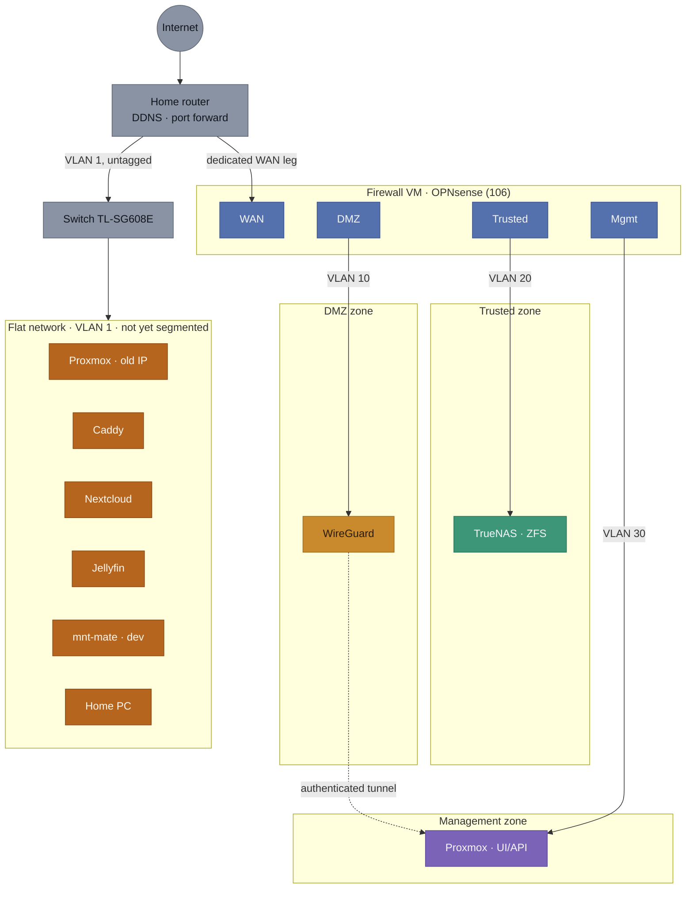
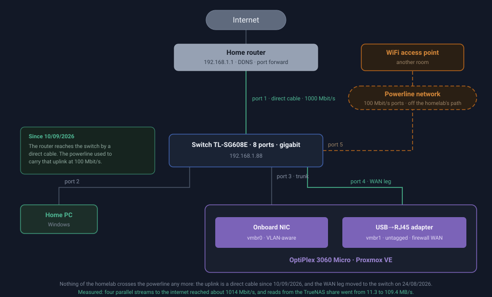
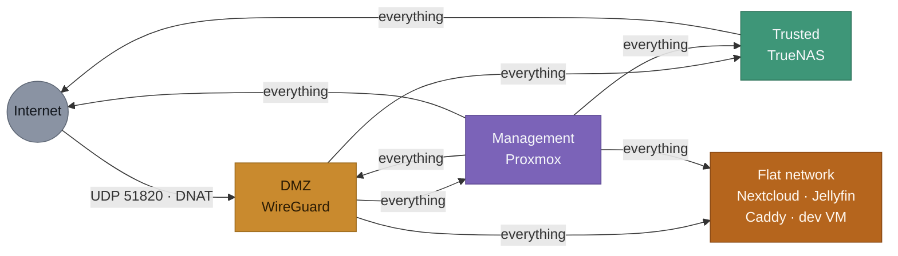
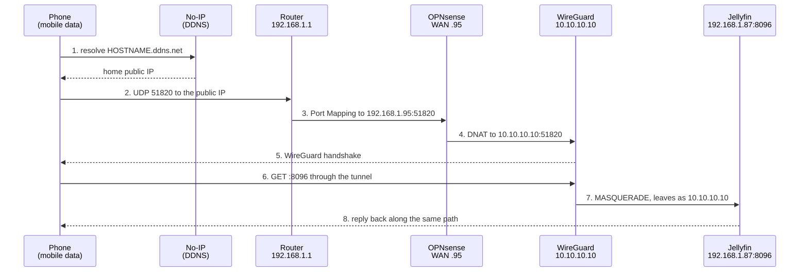
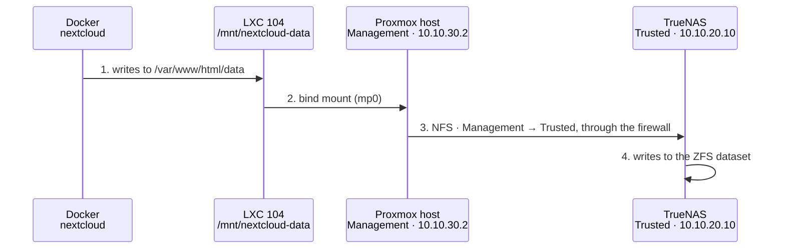
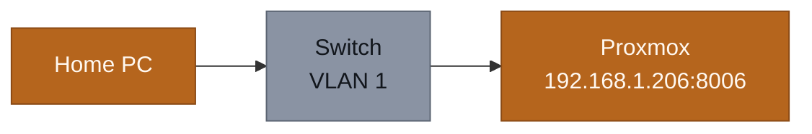

# Network Reference - Homelab v2

Quick-reference document: "how the network is put together", to consult at any moment without digging through `PROJECT_CONTEXT.md`. The decisions, the history and the reasoning stay there.

**There are two zone diagrams and it matters not to confuse them**: the "current state" is what is actually built today, the "target state" is where Phase 2 is heading. Until 06/08/2026 only the target existed, which gave the false impression that the services were already segmented.

**About the formats**: the diagrams come in two formats, deliberately. The ones that change with every network change (current state, rule matrix, packet paths) stay in **Mermaid**, written directly in the markdown, because editing text is fast and needs no tooling. The ones that are stable and act as showcase pieces (target state, physical topology) are **hand-written SVG** under `diagrams/`, because Mermaid's automatic layout cannot align the firewall interfaces above the zones they serve, nor place the zones side by side. The trade is intentional: better looks where it counts, easier editing where things move often.

## Diagram 1: current state (11/08/2026)

The most important reading of this diagram: **the Trusted zone now protects something**. TrueNAS was migrated on 11/08/2026 and is the first service inside it, which means the data (all of it) is now on the right side of the firewall. The ones still to move (Caddy, Nextcloud, Jellyfin) remain on the flat network, alongside the PC and every other household device.

One practical consequence worth holding on to: storage now crosses the firewall. The host's NFS mounts leave the Management zone and enter Trusted (`clientaddr=10.10.30.2`, `addr=10.10.20.10`), instead of both sitting on the same flat network. It is the first time real data traffic passes through the segmentation.

| Zones | |
| ----- | -------------------------------------- |
| ⬜ | Internet / router / switch |
| 🟫 | Flat network · VLAN 1 · `192.168.1.0/24` - **still to be segmented** |
| 🟦 | Dedicated firewall (interfaces) |
| 🟧 | DMZ · VLAN 10 · `10.10.10.0/24` |
| 🟩 | Trusted · VLAN 20 · `10.10.20.0/24` |
| 🟪 | Management · VLAN 30 · `10.10.30.0/24` |

| Links | |
|---|---|
| ── | Real network (uplink or tagged VLAN) |
| ┄┄ | Authenticated WireGuard tunnel · `10.10.40.0/24` |

**A note on Proxmox appearing twice**: not a mistake in the diagram. The host is *dual-homed* on purpose - it has the old IP on the flat network (`192.168.1.206`) and another one in Management (`10.10.30.2`, via `vmbr0.30`). The old IP is the safety net against lockout: if the firewall fails or a rule is wrong, that is the way back in to fix it. It is exactly what saved the diagnosis during the incident of 06/08/2026 (see `PROJECT_CONTEXT.md` §Risks).

## Inventory: where each component is today

| Component | ID | Current zone | Access address | Target zone |
|---|---|---|---|---|
| Home router | - | *(gateway)* | `http://192.168.1.1` | *(unchanged)* |
| Switch TL-SG608E | - | Flat network | `http://192.168.1.88` | Management |
| OPNsense - WAN | VM 106 | Flat network | `192.168.1.95` *(no GUI exposed here)* | *(unchanged)* |
| OPNsense - DMZ | VM 106 | DMZ | `https://10.10.10.1` | *(unchanged)* |
| OPNsense - Trusted | VM 106 | Trusted | `https://10.10.20.1` | *(unchanged)* |
| OPNsense - Management | VM 106 | Management | `https://10.10.30.1` | *(unchanged)* |
| Proxmox VE (host) | - | Flat network **and** Management | `https://192.168.1.206:8006` and `https://10.10.30.2:8006` | Management (keeping the old IP as a fallback) |
| WireGuard | LXC 103 | **DMZ** | `10.10.10.10:51820/UDP` | *(migrated)* |
| TrueNAS | VM 102 | **Trusted** | `https://10.10.20.10`, or `https://192.168.1.95:8443` from the home network | *(migrated)* |
| Caddy | LXC 101 | Flat network | `192.168.1.83:80` and `:443` | *(deferred - see `CHECKLIST.md`)* |
| Nextcloud | LXC 104 | Flat network | `http://192.168.1.84:8080` | Trusted |
| Jellyfin | LXC 105 | Flat network | `http://192.168.1.87:8096` | Trusted |
| mnt-mate (dev) | VM 100 | Flat network | `192.168.1.212:22` (SSH) | *(undecided - see `CHECKLIST.md` §Open decisions)* |
| VPN clients | - | Tunnel | `10.10.40.2` (phone), `10.10.40.3` (PC) | *(unchanged)* |

### Ports per service

Reference for writing the restricted firewall rules that are still missing (see "Rules still to be written"). Only ports the service listens on **over the network**; container-internal ports that never leave the Docker host do not count.

| Service | Port | Protocol | What for |
|---|---|---|---|
| Proxmox VE | 8006 | TCP | Web interface and API |
| Proxmox VE | 22 | TCP | SSH |
| OPNsense | 443 | TCP | Web interface |
| WireGuard | 51820 | UDP | VPN tunnel (the only port open to the internet) |
| TrueNAS | 443 | TCP | Web interface |
| TrueNAS | 445 | TCP | SMB shares |
| TrueNAS | 2049 | TCP | NFS *(see the note below)* |
| TrueNAS | 111 | TCP/UDP | rpcbind, required by NFS |
| Nextcloud | 8080 | TCP | Web interface |
| Jellyfin | 8096 | TCP | Web interface |
| Jellyfin | 1900, 7359 | UDP | Local network auto-discovery *(optional)* |
| Caddy | 80, 443 | TCP | HTTP and HTTPS |
| Switch | 80 | TCP | Management web interface |

**Not exposed on the network** (only inside the respective LXC's Docker, no firewall rule needed): Nextcloud's MariaDB 3306 and Redis 6379.

**Careful with NFS when restricting ports**: besides 2049 and 111, NFS uses helper services (`mountd`, `statd`, `lockd`) that by default pick dynamic ports on every boot. A rule allowing only 2049 will work sometimes and fail other times, in a way that is hard to diagnose. Before restricting, those ports have to be pinned on TrueNAS and then allowed explicitly. Until that is done, keeping the broad rule for NFS traffic is safer than creating a restriction that breaks intermittently.

## Diagram 2: target state (once Phase 2 closes)

| Zones | |
| ----- | -------------------------------------- |
| ⬜ | Internet / router (home network) |
| 🟦 | Dedicated firewall (interfaces) |
| 🟧 | DMZ · VLAN 10 · `10.10.10.0/24` |
| 🟩 | Trusted · VLAN 20 · `10.10.20.0/24` |
| 🟪 | Management · VLAN 30 · `10.10.30.0/24` |

| Links | |
|---|---|
| ── | Real network (uplink or tagged VLAN) |
| ┄┄ | Authenticated WireGuard tunnel · `10.10.40.0/24` |

## Zones / VLANs

| VLAN | Name | Subnet | What lives here (target) | State |
|---|---|---|---|---|
| 1 *(native, untagged)* | Home network | 192.168.1.0/24 | The firewall's WAN leg, the home PC and the rest of the household network | Active, but still hosting services that belong in Trusted |
| 10 | DMZ | 10.10.10.0/24 | WireGuard (the internet-facing leg). Caddy only moves here once there is a decided app for public exposure | **Active and populated** (WireGuard) |
| 20 | Trusted | 10.10.20.0/24 | TrueNAS, Nextcloud, Jellyfin, k3s nodes and workloads | **Active and populated** (TrueNAS since 11/08/2026) |
| 30 | Management | 10.10.30.0/24 | Proxmox UI/API, switch management, SSH to the nodes | **Active** (Proxmox); the switch is still on the flat network |
| - | WireGuard tunnel | 10.10.40.0/24 | **Not a switch VLAN** - a virtual subnet living only inside the WireGuard container, handed to already-authenticated clients | Active (2 peers) |

## NIC assignment

- **Onboard NIC** → trunk to the switch, carrying VLANs 10/20/30 tagged **and VLAN 1 untagged** (the ordinary household network, see "What physically connects to the switch" below) - the more critical role, on the more reliable hardware.
- **USB→RJ45 adapter** → the WAN leg, untagged, connected to the home network and router (the simpler role, better able to tolerate any instability from the adapter).
- On the switch, only the port connected to the OptiPlex's onboard NIC needs to be a trunk; the remaining ports stay free.

## Physical topology

What is actually connected to what, with real cables and ports. The earlier diagrams are logical (zones and VLANs); this is the one you use to know which cable to unplug.

### Switch port map

| Port | Connected to | VLANs |
|---|---|---|
| 2 | Home PC | VLAN 1 untagged |
| 3 | OptiPlex, onboard NIC | **Trunk**: VLAN 1 untagged + 10/20/30 tagged |
| *(to be confirmed)* | Powerline adapter, uplink to the router | VLAN 1 untagged |
| *(to be confirmed)* | OptiPlex, USB→RJ45 adapter (firewall WAN leg) | VLAN 1 untagged - **moved here 24/08/2026**, see below |
| the rest | *(free)* | VLAN 1 untagged, by default |

### Two consequences of this topology

- **Everything going to the internet passes over the same powerline**, both the home network (VLAN 1) and the homelab zones (the dedicated WAN leg). They are two logically distinct cables, but they share the same electrical wiring. It is a single point of failure: without the powerline, neither the house nor the homelab has internet.
- **Traffic between the PC and the homelab services does not touch the powerline** - but only since 24/08/2026, and the earlier version of this section claimed it as though it had always been true. It was half right: the PC (port 2) and the OptiPlex's onboard NIC (port 3) are both on the switch, so anything reached through the host's own flat-network address is local switching at gigabit. **But the homelab services in Trusted are not reached that way.** They are reached through the redirects on `192.168.1.95`, which is the firewall's WAN leg, and that leg was plugged into the powerline adapter - into a **100 Mbit/s port**, capping every household-to-homelab transfer at around 11 MB/s. Corrected on 24/08/2026 by moving that cable to a free port on the gigabit switch: the same measurement went from **11.3 MB/s to 109.4 MB/s**, and the path now stays inside the switch from end to end.

## What physically connects to the switch

Three cables, each with a different purpose:

- **OptiPlex (onboard NIC) → switch, port 3**: a single cable configured as a trunk - carrying VLAN 1 untagged (the ordinary household network) **and** VLANs 10/20/30 tagged (the homelab zones), all mixed on the same physical wire. Every "device" across the three zones is a VM or container inside the same physical host; the separation happens in Proxmox's VLAN-aware bridge, not through extra cabling.
- **Switch → powerline adapter → router**: its own independent cable (it predates Phase 2), giving VLAN 1 internet access - for any device plugged into the switch, such as the home PC. **This traffic never passes through the dedicated firewall.**
- **OptiPlex (USB→RJ45 adapter) → switch**: another independent cable, the firewall VM's dedicated WAN leg, serving only the DMZ/Trusted/Management traffic. **Moved here on 24/08/2026**; it previously went to the powerline adapter, whose RJ45 ports are 100 Mbit/s, which throttled everything the household sent to the homelab. It still reaches the router through the switch's own uplink, so nothing is lost: internet traffic was always limited by the ISP link long before this. Physical separation is preserved - it remains a separate cable, a separate NIC and a separate switch port from the trunk.

The switch therefore plays a double role: it is simultaneously the trunk for the homelab VLANs **and** an ordinary switch for the household network (VLAN 1) - the separation between the two exists only because of the tags on each port, not through dedicated hardware. See also "Household network (outside this scheme)" below.

## Rules between zones

OPNsense is *default-deny*: anything not explicitly permitted is blocked. Which means the list of what exists is, by itself, the complete policy.

### Rules actually configured today (11/08/2026)

| # | Interface | Source | Destination | Action | Description |
|---|---|---|---|---|---|
| 1 | DMZ | `10.10.10.10` (WireGuard) | Trusted network | Pass | Lets VPN clients reach the Trusted zone |
| 2 | DMZ | `10.10.10.10` (WireGuard) | Management network | Pass | Lets VPN clients reach Proxmox |
| 3 | MGMT | Management network | Any | Pass | The Proxmox host needs to initiate connections to every zone |
| 4 | DMZ | `10.10.10.10` (WireGuard) | WAN network (`192.168.1.0/24`) | Pass | Lets VPN clients reach the flat network, where Caddy, Nextcloud and Jellyfin still live (see History, 11/08/2026) |
| 5 | TRUSTED | Trusted network | Any | Pass | Outbound from the Trusted zone: without it TrueNAS has no internet, NTP or updates |
| NAT | WAN | Any | WAN `:51820/UDP` | Pass + DNAT | Forwards WireGuard to `10.10.10.10:51820` |
| NAT | WAN | `192.168.1.0/24` | WAN `:445/TCP` | Pass + DNAT | SMB from the home network to TrueNAS (`10.10.20.10:445`) |
| NAT | WAN | `192.168.1.0/24` | WAN `:8443/TCP` | Pass + DNAT | TrueNAS web interface from the home network (`10.10.20.10:443`) |

Plus OPNsense's automatic rules, which were not hand-written but count towards the real behaviour: *anti-lockout* (TCP 80/443 to the firewall itself, per interface), blocking of private networks and *bogons* arriving from WAN, and the final *default deny*.

Two details that cost time to work out:

- **Rules 1 and 2 are sourced from WireGuard's IP, not from the whole DMZ network.** That is the effect of WireGuard's `MASQUERADE`: a VPN client's traffic arrives at the firewall as if it came from `10.10.10.10`. The useful side effect is that the general rule "DMZ → Management: blocked" stays valid for any future service that comes to live in the DMZ.
- **The *anti-lockout* rules explain why `https://10.10.10.1` works without a rule of its own.** They cover TCP 80/443 to the firewall itself, but not ICMP - which is why a `ping` to OPNsense from the DMZ fails without that being a symptom of anything.

### Matrix: who can talk to whom

Only **initiated** connections count. Replies on established connections always pass, because OPNsense is *stateful* - so a missing arrow does not mean the reply cannot get back, it means that side cannot be the one to speak first.

| From ↓ / To → | Internet | Flat network | DMZ | Trusted | Management |
|---|---|---|---|---|---|
| **Internet** | - | *(router)* | UDP 51820 only | No | No |
| **Flat network** | Yes *(router)* | Yes | No | TrueNAS SMB and `:8443` only, by redirection | No |
| **DMZ** (WireGuard) | *(see note)* | **Everything** | - | **Everything** | **Everything** |
| **Trusted** (TrueNAS) | Yes | Yes | Yes | - | Yes |
| **Management** | Yes | Yes | **Everything** | **Everything** | - |

Three uncomfortable readings the matrix makes obvious:

- **The Management zone is currently the most powerful on the network**, not the most protected. The `MGMT → any` rule was created to unblock the Proxmox host and ended up giving it unrestricted access to everything. That is fine while only Proxmox lives there, and stops being fine the moment the switch (or anything else) joins the zone.
- **The DMZ has full access to Trusted, Management and the flat network.** It is restricted to WireGuard's IP, which makes it acceptable for now, but "everything" ought to be a short list of ports. That is the difference between "my VPN works" and "my VPN only does what it needs to".
- **The three arrows leaving the DMZ exist because the services are scattered.** While Nextcloud, Jellyfin and Caddy remain on the flat network, WireGuard needs to reach all four zones to be useful. As the migration to Trusted advances, rule 4 (DMZ → flat network) should shrink and eventually disappear: it is the simplest measure of whether the segmentation is genuinely happening.

### Rules still to be written (target)

- **DMZ → Trusted should be restricted to specific ports.** Today rule 1 allows any port; the target is only what the DMZ services genuinely need to contact. The list is under "Ports per service" above, but mind the NFS warning: restricting without first pinning the helper ports produces intermittent failures.
- **WAN-side → Management**, allowed only from the home PC's IP (OpenTofu/Ansible → the Proxmox API). Only becomes relevant in Phase 4, once IaC exists.
- **Tighten the Trusted outbound.** Rule 5 allows `Trusted → any`, which includes the DMZ and Management, neither of which TrueNAS needs to reach. The target is to allow only outbound to the internet (DNS, NTP, updates) and deny the rest.
- **Confirm DMZ outbound to the internet.** There is no explicit `DMZ → WAN` rule. The WireGuard tunnel works anyway (replies leave through *state tracking* on the inbound connection), but an `apt update` from inside LXC 103 is probably blocked. To be confirmed the next time that container needs updating.

## Packet paths (end to end)

These diagrams follow a real request from source to destination, step by step. They are diagnostic tools: when something does not work, you walk the chain and test each hop until you find the one that fails.

### Flow 1: a phone away from home wants to watch Jellyfin

The longest path in the homelab, and the one that has broken most often. Each numbered hop is a place where something has failed (or could).

| Hop | What can fail | How to test |
|---|---|---|
| 1 | DDNS out of date against the real public IP | `Resolve-DnsName HOSTNAME.ddns.net` and compare with the current public IP |
| 2 | Public IP changed, or the ISP blocks the port | compare the two values from hop 1 |
| 3 | **Port Mapping pointing at the wrong IP** | check the rule on the router; this was exactly the cause of the 06/08/2026 incident |
| 4 | NAT rule missing or with the wrong target | Firewall → NAT → Port Forward in OPNsense |
| 5 | Keys mismatched, or the packet never arrives | `pct exec 103 -- wg show` should show a recent *latest handshake* |
| 6 | Client has no route to the destination | check `AllowedIPs` in the client config |
| 7 | Missing firewall rule for the destination zone | Firewall → Rules → DMZ; this was the cause of the 11/08/2026 incident, where the tunnel worked but reached no service at all |
| 8 | Destination service down | test the service from the local network |

**Note**: hop 7 today exits to the **flat network** (`192.168.1.87`), not to Trusted, because Jellyfin has not been migrated. Once it is, the destination becomes `10.10.20.x` and the path genuinely crosses the firewall rather than going around it.

### Flow 2: Nextcloud reads a file from TrueNAS

Short in network terms but long in layers, and where the storage incidents concentrate. Full detail of the data chain in [STORAGE.md](STORAGE.md).

Since 11/08/2026 hop 3 **crosses the dedicated firewall**: it leaves the Management zone and enters Trusted. Before that, the host and TrueNAS both sat on the flat network and the traffic was filtered by nobody. Hops 1, 2 and 4 remain local to the machine and touch no network at all.

| Hop | Typical failure already seen |
|---|---|
| 2 | Bind mount showing the empty local folder instead of the NFS, after the host booted before TrueNAS. Only fixed by restarting the container; correcting the host mount is not enough |
| 3 | Mount missing at boot and never retried. Resolved on 10/08/2026 with `x-systemd.automount` plus explicit guest startup order - the earlier `nofail` only hid the failure |
| 4 | `Operation not permitted` on `chown`, because the export was set to `Maproot` instead of `Mapall` |

### Flow 3: a home PC opens Proxmox

The shortest path there is, and therefore the most reliable. It is the fallback when everything else fails.

It does not touch the firewall, and depends on neither OPNsense nor WireGuard. **This is why Proxmox's old IP on the flat network should not be removed** while the firewall is the only route into the Management zone: it was the only access that survived the 06/08/2026 incident, and the way an SSH tunnel reached the OPNsense GUI to fix the rules.

## Household network (outside this scheme)

General Wi-Fi, the guest network and any eventual IoT isolation stay **outside** this segmentation - they live on the router (Vodafone Smart Router / Huawei OptiXstar HG8247B7-8N) and do not depend on the OptiPlex. Detail in `PROJECT_CONTEXT.md` § Home router and household network.

**Note**: the TL-SG608E switch, despite trunking the homelab VLANs (see "What physically connects to the switch" above), also keeps serving this ordinary household network (VLAN 1, untagged) for anything wired into it - the home PC, for example. That traffic does not pass through the dedicated firewall, just like the rest of the household network.

## Pending

Which app goes into the DMZ zone, and the network zone for the future development/LLM-agents VM - see `docs/CHECKLIST.md` § Open decisions.

## History

- 29/07/2026: document created, moving the diagram and network reference that used to live in `PROJECT_CONTEXT.md` § Network and Segmentation into a file of its own, easier to consult without scrolling through the decision log.
- 29/07/2026: diagram redrawn - each zone became a single box (instead of one box per service) so it would fit without horizontal scrolling; the services in each zone are already detailed in the "Zones / VLANs" table. An earlier attempt (`direction TB` inside each subgraph) did not work - Mermaid ignores that direction when there are links between subgraphs, confirmed by a local test before applying. The legend was also reformatted into a compact table with colour and line markers.
- 29/07/2026: reverted to individual boxes per service - the collapsed version, besides being less explicit, introduced visual overlap (the firewall's long title got squeezed against the boxes on the narrower diagram). Confirmed by local test that the per-service version does not have that problem, it is just wider (may need horizontal scrolling or zooming out in Obsidian). The table legend stays.
- 02/08/2026: **clarified the switch's double role** - the diagram and the text only showed the Internet → Router → Firewall → zones path, implying (incorrectly) that the whole network went through the firewall. Corrected: the switch's trunk port also carries VLAN 1 untagged (the ordinary household network), which reaches the internet over its own cable (switch → powerline → router) without touching the firewall - the path the home PC uses, for instance. Only VLAN 10/20/30 traffic passes through the firewall, via the dedicated WAN leg (the USB→RJ45 adapter). This ambiguity only surfaced while physically configuring Phase 2 (trunk port + Proxmox bridges), not during the original design.
- 06/08/2026: **adopted two diagram formats, deliberately**. The target state and the physical topology moved from Mermaid to hand-written SVG (`diagrams/`), because Mermaid's automatic layout cannot align the firewall interfaces with the zones they serve, nor lay the zones out side by side, and the result was tall and misaligned. The rest (current state, rule matrix, packet paths) stay in Mermaid on purpose: they change with every network change, and there the ease of editing text is worth more than the looks. The accepted cost is that touching an SVG means adjusting coordinates by hand.
- 06/08/2026: **added physical topology, firewall matrix and packet path diagrams**. The physical topology only existed in prose; it now has a diagram with switch ports and a port map. Confirmed that the switch and the OptiPlex are both still connected over powerline (the planned move next to the router never happened), which makes the powerline a single point of failure and the bandwidth bottleneck for everything going to the internet. Still to confirm which switch port carries the powerline uplink.
- 06/08/2026: **separated current state from target state** - the document had a single diagram, the target one, presented as if it were reality. Since Phase 2 had only migrated WireGuard and Proxmox at that point, this hid the most important fact of the moment: **the Trusted zone was created but empty**, with TrueNAS/Caddy/Nextcloud/Jellyfin still on the flat network, with no firewall protection whatsoever. Added: a current-state diagram, a component-by-component inventory table (with current and target zone), and the distinction between firewall rules actually configured and those still to be written. The "Rules between zones" section had been entirely aspirational and matched nothing that was applied.
- 11/08/2026: added rule 4 (`WireGuard → flat network`) to the rule list, the matrix and the diagram, after discovering the VPN had reached no service at all since WireGuard's migration to the DMZ. The matrix gained the flat network as an explicit destination, since that is where most services still live - incident detail in `CHECKLIST.md`.
- 11/08/2026: **TrueNAS migrated to Trusted**, so the zone is no longer empty and storage traffic now crosses the firewall. Added rule 5 (Trusted outbound) and the two destination-NAT rules that keep SMB and the TrueNAS web interface reachable from the home network. Document translated to English.
