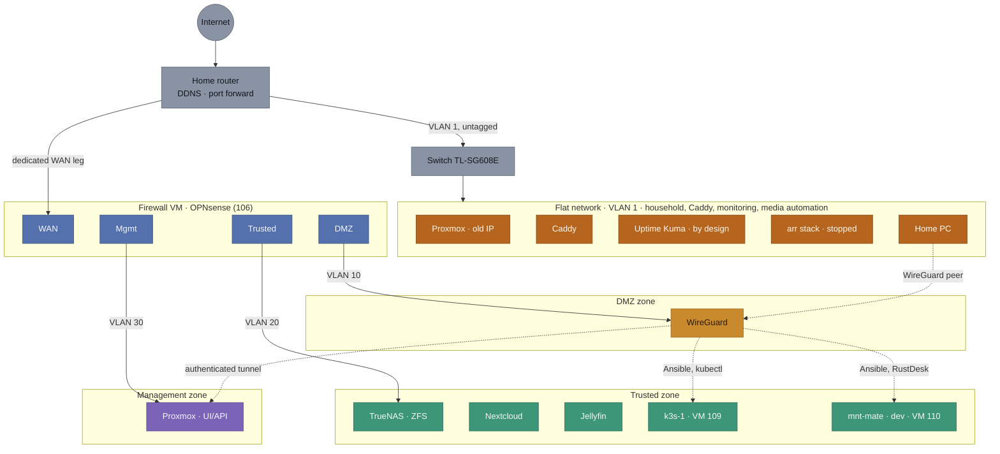
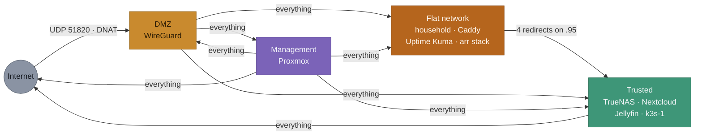
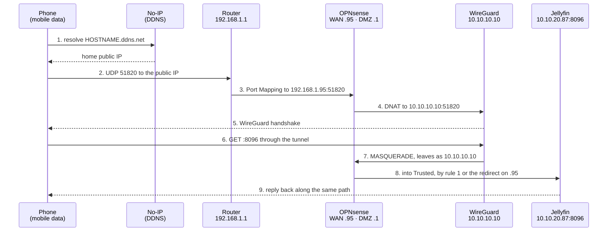
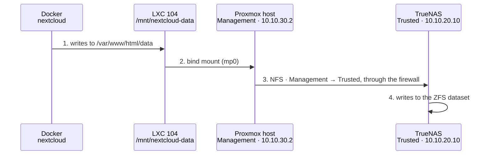
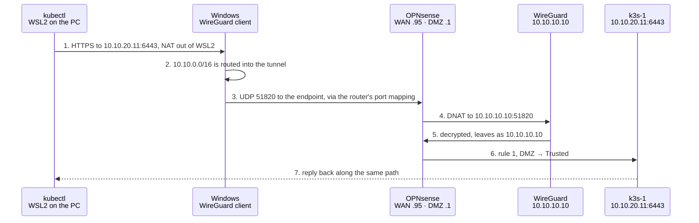

# Network Reference - Homelab v2

Quick-reference document: "how the network is put together", to consult at any moment without digging through `PROJECT_CONTEXT.md`. The decisions, the history and the reasoning stay there.

**There are two zone diagrams and it matters not to confuse them**: the "current state" is what is actually built today, the "target state" is where Phase 2 is heading. Until 06/08/2026 only the target existed, which gave the false impression that the services were already segmented.

**About the formats**: the diagrams come in two formats, deliberately. The ones that change with every network change (current state, rule matrix, packet paths) stay in **Mermaid**, written directly in the markdown, because editing text is fast and needs no tooling. The ones that are stable and act as showcase pieces (target state, physical topology) are **hand-written SVG** under `diagrams/`, because Mermaid's automatic layout cannot align the firewall interfaces above the zones they serve, nor place the zones side by side. The trade is intentional: better looks where it counts, easier editing where things move often.

## Diagram 1: current state (17/09/2026)

The most important reading of this diagram: **the Trusted zone now holds every service that stores or serves data**. TrueNAS moved there on 11/08/2026 and was alone for four weeks; Jellyfin and Nextcloud joined it on 08/09/2026. What remains on the flat network is Caddy, which has no configuration yet and will be created directly in the right zone; Uptime Kuma, which is there **on purpose**: to raise an alert it must reach the internet without depending on the firewall it watches; and the *arr stack (LXC 107), there since it was created on 12/08 and stopped since 08/09, a placement no document recorded until the inventory was checked against the host on 17/09/2026, and a zone never decided.

**k3s-1 (VM 109) joined Trusted on 16/09/2026**, the first machine born in its zone rather than migrated into it. It is also the first one administered from the PC through the WireGuard tunnel, drawn as the dashed line leaving the home PC: Ansible and `kubectl` reach it that way, see Flow 4 below.

One practical consequence worth holding on to: storage now crosses the firewall. The host's NFS mounts leave the Management zone and enter Trusted (`clientaddr=10.10.30.2`, `addr=10.10.20.10`), instead of both sitting on the same flat network. It is the first time real data traffic passes through the segmentation.

| Zones | |
| ----- | -------------------------------------- |
| ⬜ | Internet / router / switch |
| 🟫 | Flat network · VLAN 1 · `192.168.1.0/24` - since 21/09/2026, of the homelab only Caddy, Uptime Kuma and the *arr stack (stopped) |
| 🟦 | Dedicated firewall (interfaces) |
| 🟧 | DMZ · VLAN 10 · `10.10.10.0/24` |
| 🟩 | Trusted · VLAN 20 · `10.10.20.0/24` |
| 🟪 | Management · VLAN 30 · `10.10.30.0/24` |

| Links | |
|---|---|
| ── | Real network (uplink or tagged VLAN) |
| ┄┄ | Authenticated WireGuard tunnel · `10.10.40.0/24` |

**A note on Proxmox appearing twice**: not a mistake in the diagram. The host is *dual-homed* on purpose - it has the old IP on the flat network (`192.168.1.206`) and another one in Management (`10.10.30.2`, via `vmbr0.30`). The old IP is the safety net against lockout: if the firewall fails or a rule is wrong, that is the way back in to fix it. It is exactly what saved the diagnosis during the incident of 06/08/2026 (see `PROJECT_CONTEXT.md` §Risks).

## Inventory: where each component is today

Checked against the host on 17/09/2026: the bridge, VLAN tag and address of every guest, read from `pct config` and `qm config` rather than from an earlier version of this table.

| Component | ID | Current zone | Access address | Target zone |
|---|---|---|---|---|
| Home router | - | *(gateway)* | `http://192.168.1.1` | *(unchanged)* |
| Switch TL-SG608E | - | Flat network | `http://192.168.1.88` | Management |
| OPNsense - WAN | VM 106 | Flat network | `192.168.1.95` *(no GUI exposed here)* | *(unchanged)* |
| OPNsense - DMZ | VM 106 | DMZ | `https://10.10.10.1` | *(unchanged)* |
| OPNsense - Trusted | VM 106 | Trusted | `https://10.10.20.1` | *(unchanged)* |
| OPNsense - Management | VM 106 | Management | `https://10.10.30.1` | *(unchanged)* |
| Proxmox VE (host) | - | Flat network **and** Management | `https://192.168.1.206:8006` and `https://10.10.30.2:8006` | Management (keeping the old IP as a fallback) |
| WireGuard | LXC 103 | **DMZ** | `10.10.10.10:51820/UDP` | *(migrated)* |
| TrueNAS | VM 102 | **Trusted** | `https://10.10.20.10`, or `https://192.168.1.95:8443` from the home network | *(migrated)* |
| k3s-1 (k3s node) | VM 109 | **Trusted** | `10.10.20.11:22` (SSH, user `ansible`, key only); the Kubernetes API on `:6443`, live since 16/09/2026 and reached from the PC through the WireGuard tunnel | *(born there, created by OpenTofu on 16/09/2026)* |
| Caddy | LXC 101 | Flat network | `192.168.1.83:80` and `:443` | *(deferred - see `CHECKLIST.md`)* |
| Nextcloud | LXC 104 | **Trusted** | `http://10.10.20.84:8080`, or `http://192.168.1.95:8080` from the home network | *(migrated 08/09/2026)* |
| Jellyfin | LXC 105 | **Trusted** | `http://10.10.20.87:8096`, or `http://192.168.1.95:8096` from the home network | *(migrated 08/09/2026)* |
| *arr stack (qBittorrent, Sonarr, Radarr, Prowlarr, Jellyseerr) | LXC 107 | Flat network | `192.168.1.90`, one web interface per application; **stopped since 08/09/2026** | *(never decided - see `CHECKLIST.md` §Open decisions)* |
| Uptime Kuma | LXC 108 | Flat network | `http://192.168.1.91:3001` | *(stays, by design - see `MONITORING.md`)* |
| mnt-mate (dev) | VM 110 | **Trusted** | `10.10.20.12:22` (SSH, user `ansible`, key only) and the RustDesk direct port in the `2111x` range for the desktop. Off unless somebody is using it | *(rebuilt 21/09/2026: VM 100 deleted, VM 110 created by OpenTofu in Trusted)* |
| VPN clients | - | Tunnel | `10.10.40.2` (phone), `10.10.40.3` (PC). The PC's tunnel is also the administration path into Trusted and Management since 16/09/2026 (Ansible over SSH, `kubectl`) | *(unchanged)* |

### Ports per service

Reference for writing the restricted firewall rules that are still missing (see "Rules still to be written"). Only ports the service listens on **over the network**; container-internal ports that never leave the Docker host do not count.

| Service | Port | Protocol | What for |
|---|---|---|---|
| Proxmox VE | 8006 | TCP | Web interface and API |
| Proxmox VE | 22 | TCP | SSH |
| OPNsense | 443 | TCP | Web interface |
| WireGuard | 51820 | UDP | VPN tunnel (the only port open to the internet) |
| TrueNAS | 443 | TCP | Web interface |
| TrueNAS | 445 | TCP | SMB shares |
| TrueNAS | 2049 | TCP | NFS *(see the note below)* |
| TrueNAS | 111 | TCP/UDP | rpcbind, required by NFS |
| Nextcloud | 8080 | TCP | Web interface |
| Jellyfin | 8096 | TCP | Web interface |
| Jellyfin | 1900, 7359 | UDP | Local network auto-discovery *(optional)* |
| k3s-1 | 22 | TCP | SSH, for Ansible (key only) |
| k3s-1 | 6443 | TCP | Kubernetes API, for `kubectl` |
| k3s-1 | 80, 443 | TCP | Traefik, the ingress controller k3s installs by default, behind its ServiceLB. `/whoami` reaches the test workload; any other path answers `404` |
| Caddy | 80, 443 | TCP | HTTP and HTTPS |
| Switch | 80 | TCP | Management web interface |

**Not exposed on the network** (only inside the respective LXC's Docker, no firewall rule needed): Nextcloud's MariaDB 3306 and Redis 6379.

**Careful with NFS when restricting ports**: besides 2049 and 111, NFS uses helper services (`mountd`, `statd`, `lockd`) that by default pick dynamic ports on every boot. A rule allowing only 2049 will work sometimes and fail other times, in a way that is hard to diagnose. Before restricting, those ports have to be pinned on TrueNAS and then allowed explicitly. Until that is done, keeping the broad rule for NFS traffic is safer than creating a restriction that breaks intermittently.

## Diagram 2: target state (once Phase 2 closes)

| Zones | |
| ----- | -------------------------------------- |
| ⬜ | Internet / router (home network) |
| 🟦 | Dedicated firewall (interfaces) |
| 🟧 | DMZ · VLAN 10 · `10.10.10.0/24` |
| 🟩 | Trusted · VLAN 20 · `10.10.20.0/24` |
| 🟪 | Management · VLAN 30 · `10.10.30.0/24` |

| Links | |
|---|---|
| ── | Real network (uplink or tagged VLAN) |
| ┄┄ | Authenticated WireGuard tunnel · `10.10.40.0/24` |

## Zones / VLANs

| VLAN | Name | Subnet | What lives here (target) | State |
|---|---|---|---|---|
| 1 *(native, untagged)* | Home network | 192.168.1.0/24 | The firewall's WAN leg, the home PC and the rest of the household network | Active. Of the homelab, only Caddy (its move deferred by decision), Uptime Kuma (there by design) and the *arr stack (stopped, its zone never decided) remain. `mnt-mate` left on 21/09/2026, when it was deleted and rebuilt in Trusted |
| 10 | DMZ | 10.10.10.0/24 | WireGuard (the internet-facing leg). Caddy only moves here once there is a decided app for public exposure | **Active and populated** (WireGuard) |
| 20 | Trusted | 10.10.20.0/24 | TrueNAS `10.10.20.10`, k3s-1 `10.10.20.11`, mnt-mate `10.10.20.12`, Nextcloud `10.10.20.84`, Jellyfin `10.10.20.87`, and later the k3s workloads | **Active and populated** (TrueNAS 11/08/2026, Jellyfin and Nextcloud 08/09/2026, k3s-1 16/09/2026, mnt-mate 21/09/2026) |
| 30 | Management | 10.10.30.0/24 | Proxmox UI/API, switch management, SSH to the nodes | **Active** (Proxmox); the switch is still on the flat network |
| - | WireGuard tunnel | 10.10.40.0/24 | **Not a switch VLAN** - a virtual subnet living only inside the WireGuard container, handed to already-authenticated clients | Active (2 peers) |

## NIC assignment

- **Onboard NIC** → trunk to the switch, carrying VLANs 10/20/30 tagged **and VLAN 1 untagged** (the ordinary household network, see "What physically connects to the switch" below) - the more critical role, on the more reliable hardware.
- **USB→RJ45 adapter** → the WAN leg, untagged, connected to the home network and router (the simpler role, better able to tolerate any instability from the adapter).
- On the switch, only the port connected to the OptiPlex's onboard NIC needs to be a trunk; the remaining ports stay free.

## Physical topology

What is actually connected to what, with real cables and ports. The earlier diagrams are logical (zones and VLANs); this is the one you use to know which cable to unplug.

### Switch port map

| Port | Connected to | VLANs |
|---|---|---|
| 1 | **Router, direct cable** - replaced the powerline on 10/09/2026 | VLAN 1 untagged |
| 2 | Home PC | VLAN 1 untagged |
| 3 | OptiPlex, onboard NIC | **Trunk**: VLAN 1 untagged + 10/20/30 tagged |
| 4 | OptiPlex, USB→RJ45 adapter (firewall WAN leg) | VLAN 1 untagged - **moved here 24/08/2026**, see below |
| 5 | Powerline injector - **no longer in the homelab's path** since 10/09/2026; it now feeds a WiFi access point in another room. Negotiates at **100MF**, which is why it mattered while it carried the uplink | VLAN 1 untagged |
| the rest | *(free)* | VLAN 1 untagged, by default |

### Two consequences of this topology

- **Everything going to the internet used to pass over the same powerline**, both the household network and the homelab's dedicated WAN leg. **Not since 10/09/2026**: the router is now on port 1 by ordinary cable, negotiated at **1000MF**. Measured from the host with four parallel streams: **120.9 MiB/s, about 1014 Mbit/s**, against the 12.5 MB/s ceiling the powerline's 100 Mbit ports imposed. **The line is gigabit and now saturates.** The bottleneck is no longer the connection either: it is the OptiPlex's own network card, which tops out near 940 Mbit of useful traffic.
- **Traffic between the PC and the homelab services does not touch the powerline** - but only since 24/08/2026, and the earlier version of this section claimed it as though it had always been true. It was half right: the PC (port 2) and the OptiPlex's onboard NIC (port 3) are both on the switch, so anything reached through the host's own flat-network address is local switching at gigabit. **But the homelab services in Trusted are not reached that way.** They are reached through the redirects on `192.168.1.95`, which is the firewall's WAN leg, and that leg was plugged into the powerline adapter - into a **100 Mbit/s port**, capping every household-to-homelab transfer at around 11 MB/s. Corrected on 24/08/2026 by moving that cable to a free port on the gigabit switch: the same measurement went from **11.3 MB/s to 109.4 MB/s**, and the path now stays inside the switch from end to end.

## What physically connects to the switch

Three cables, each with a different purpose:

- **OptiPlex (onboard NIC) → switch, port 3**: a single cable configured as a trunk - carrying VLAN 1 untagged (the ordinary household network) **and** VLANs 10/20/30 tagged (the homelab zones), all mixed on the same physical wire. Every "device" across the three zones is a VM or container inside the same physical host; the separation happens in Proxmox's VLAN-aware bridge, not through extra cabling.
- **Switch → router, direct cable on port 1**: gives VLAN 1 its internet access, for any device plugged into the switch, the home PC included. Ran on 10/09/2026, replacing a powerline whose RJ45 ports negotiated at 100 Mbit and capped every byte leaving the house. The powerline was not thrown away: it moved to port 5 and now feeds a WiFi access point in another room, where 100 Mbit is rarely the limiting factor since the radio usually is.
- **OptiPlex (USB→RJ45 adapter) → switch**: another independent cable, the firewall VM's dedicated WAN leg, serving only the DMZ/Trusted/Management traffic. **Moved here on 24/08/2026**; it previously went to the powerline adapter, whose RJ45 ports are 100 Mbit/s, which throttled everything the household sent to the homelab. It still reaches the router through the switch's own uplink, so nothing is lost: internet traffic was always limited by the ISP link long before this. Physical separation is preserved - it remains a separate cable, a separate NIC and a separate switch port from the trunk.

The switch therefore plays a double role: it is simultaneously the trunk for the homelab VLANs **and** an ordinary switch for the household network (VLAN 1) - the separation between the two exists only because of the tags on each port, not through dedicated hardware. See also "Household network (outside this scheme)" below.

### Why two cables between the switch and the OptiPlex

The intuitive reading is that one cable carries the homelab VLANs and the other carries the household network. That is not what happens: **the trunk carries VLAN 1 as well**, untagged, alongside 10/20/30 tagged. It is how the host holds `192.168.1.206` on `vmbr0`, and why a throughput test against that address reaches full gigabit. Both cables carry VLAN 1; one of them simply carries more on top.

The real reason for the second cable is the firewall. OPNsense needs a **WAN** interface, meaning the side it treats as outside, distinct from the interfaces facing the internal zones. That is not a preference, it is how a routing firewall decides which policy applies to what. The design question was only *where that WAN leg should live*, and there were two answers:

| | How | Trade-off |
|---|---|---|
| **A - physical separation** *(chosen)* | Its own NIC (USB→RJ45) on its own bridge, `vmbr1` | WAN traffic and the internal VLANs never share a wire or a bridge. Costs a second cable, a second port and a USB adapter |
| **B - logical separation** | One more virtual interface on `vmbr0`, untagged, using the VLAN 1 already on the trunk | One cable, no adapter, one less component to fail. Separation rests entirely on 802.1Q tags being correct |

Option A was chosen deliberately (reaffirmed 24/08/2026): if the switch's VLAN configuration or a bridge definition is ever wrong, a physically distinct path cannot leak traffic by accident, whereas a mistagged interface can.

**Where that separation actually lives is worth being precise about**, now that both cables land on the same switch:

- **Inside the OptiPlex it is real.** `vmbr0` and `vmbr1` are separate bridges, and Linux does not forward frames between bridges. OPNsense holds its WAN on one and the three zones on the other, and **routes** between them rather than bridging - so no broadcast domain is shared.
- **At the switch they meet.** Both cables sit on VLAN 1, in the same broadcast domain. There the separation is by port, not by network.

A note for anyone changing this later: there is **no bridging loop today**, because nothing joins `vmbr0` and `vmbr1` inside the host - OPNsense has no untagged interface on `vmbr0`, and the bridges do not talk to each other. Give OPNsense an untagged leg on `vmbr0`, or bridge the two in any other way, and VLAN 1 would have two paths between the switch and the host. With `bridge-stp off` in `/etc/network/interfaces`, nothing would detect or break that loop.

### What the trunk on port 3 actually carries today

A fair question, once the paths above are clear: if traffic from the household reaches TrueNAS through the WAN leg, does anything at all use the trunk?

**Homelab traffic does not.** When OPNsense routes a packet from its WAN interface to TrueNAS, it leaves the OPNsense *Trusted* interface and arrives at TrueNAS's interface - and both of those are virtual NICs attached to **the same `vmbr0`**. A Linux bridge behaves like a switch: it learns which MAC sits on which port and delivers directly. Both endpoints are `tap` ports on that bridge, so the kernel hands the frame from one to the other. The physical NIC is simply another port on the same bridge, and receives nothing, because the destination is not on its side.

**And it is worth being exact about who separates what.** The separation is done by **`vmbr0`**, the VLAN-aware bridge inside the host: it knows TrueNAS's interface is on tag 20, that OPNsense's Trusted leg is on tag 20 as well, and that WireGuard on tag 10 must see neither. Port 3 does not separate anything. It carries already-tagged frames *when they need to leave the machine* - and today they do not, because every device in all three zones is a VM or a container inside the same host.

So the trunk currently carries exactly two things:

- **VLAN 1 untagged**, which is how the host holds `192.168.1.206`. That is the path SSH and the Proxmox interface use when everything else breaks, the lockout fallback recorded on 06/08/2026, and the one that carried the entire diagnosis that day.
- **Broadcast and flooded traffic** - ARP, DHCP and the like, which a bridge sends out of every port.

The 10/20/30 tags on that port carry **no traffic at all** right now. They are infrastructure waiting for a case that does not yet exist, and there are three that would change it:

| Case | What changes |
|---|---|
| The switch moves to Management | Its own management interface (`192.168.1.88` today) starts living on VLAN 30 - already the target zone in the inventory table above |
| A **physical** machine joins a zone | Its switch port gets a tag, and the trunk starts carrying real traffic. The development machine arriving on Ethernet is exactly this decision, deliberately left open |
| A second Proxmox host | The zones would have to cross a cable between machines, and the trunk becomes indispensable |

None of this makes the trunk configuration wasted work: it is what allows a physical device to join a zone without redesigning anything. But it is honest to record that, as things stand, day-to-day traffic does not use it.

## Rules between zones

OPNsense is *default-deny*: anything not explicitly permitted is blocked. Which means the list of what exists is, by itself, the complete policy.

### Rules actually configured today (11/08/2026, redirects as recorded on 08/09/2026)

| # | Interface | Source | Destination | Action | Description |
|---|---|---|---|---|---|
| 1 | DMZ | `10.10.10.10` (WireGuard) | Trusted network | Pass | Lets VPN clients reach the Trusted zone |
| 2 | DMZ | `10.10.10.10` (WireGuard) | Management network | Pass | Lets VPN clients reach Proxmox |
| 3 | MGMT | Management network | Any | Pass | The Proxmox host needs to initiate connections to every zone |
| 4 | DMZ | `10.10.10.10` (WireGuard) | WAN network (`192.168.1.0/24`) | Pass | Lets VPN clients reach the flat network, where Caddy, the *arr stack and the household devices live. Nextcloud and Jellyfin lived there too until 08/09/2026 (see History, 11/08/2026) |
| 5 | TRUSTED | Trusted network | Any | Pass | Outbound from the Trusted zone: without it TrueNAS has no internet, NTP or updates |
| 6 | DMZ | `10.10.10.10` (WireGuard) | Any, TCP 80 and 443 | Pass | **Added 21/09/2026** so the container can fetch its own updates. Until then it could not: the tunnel works on state tracking of the connections that come in, and nothing it started itself ever left. It is the one machine here that faces the internet, and it was also the only one unable to patch itself |
| NAT | WAN | Any | WAN `:51820/UDP` | Pass + DNAT | Forwards WireGuard to `10.10.10.10:51820` |
| NAT | WAN and DMZ | alias `OrigensLocais` | `192.168.1.95:445/TCP` | Pass + DNAT | SMB to TrueNAS (`10.10.20.10:445`) |
| NAT | WAN and DMZ | alias `OrigensLocais` | `192.168.1.95:8443/TCP` | Pass + DNAT | TrueNAS web interface (`10.10.20.10:443`) |
| NAT | WAN and DMZ | alias `OrigensLocais` | `192.168.1.95:8096/TCP` | Pass + DNAT | Jellyfin (`10.10.20.87:8096`) |
| NAT | WAN and DMZ | alias `OrigensLocais` | `192.168.1.95:8080/TCP` | Pass + DNAT | Nextcloud (`10.10.20.84:8080`) |

Plus OPNsense's automatic rules, which were not hand-written but count towards the real behaviour: *anti-lockout* (TCP 80/443 to the firewall itself, per interface), blocking of private networks and *bogons* arriving from WAN, and the final *default deny*.

**The redirects changed on 08/09/2026**, when Jellyfin and Nextcloud moved to Trusted: two were added, and all four are now bound to both WAN and DMZ with a shared source alias, so a single address, `192.168.1.95:<port>`, works from the house and over the VPN. The table records them from `CHECKLIST.md` Phase 2, not from a fresh reading of the firewall.

Two details that cost time to work out:

- **Rules 1 and 2 are sourced from WireGuard's IP, not from the whole DMZ network.** That is the effect of WireGuard's `MASQUERADE`: a VPN client's traffic arrives at the firewall as if it came from `10.10.10.10`. The useful side effect is that the general rule "DMZ → Management: blocked" stays valid for any future service that comes to live in the DMZ.
- **The *anti-lockout* rules explain why `https://10.10.10.1` works without a rule of its own.** They cover TCP 80/443 to the firewall itself, but not ICMP - which is why a `ping` to OPNsense from the DMZ fails without that being a symptom of anything.

### Matrix: who can talk to whom

Only **initiated** connections count. Replies on established connections always pass, because OPNsense is *stateful* - so a missing arrow does not mean the reply cannot get back, it means that side cannot be the one to speak first.

| From ↓ / To → | Internet | Flat network | DMZ | Trusted | Management |
|---|---|---|---|---|---|
| **Internet** | - | *(router)* | UDP 51820 only | No | No |
| **Flat network** | Yes *(router)* | Yes | No | By redirection only: TrueNAS SMB and `:8443`, Jellyfin `:8096`, Nextcloud `:8080` | No |
| **DMZ** (WireGuard) | *(see note)* | **Everything** | - | **Everything** | **Everything** |
| **Trusted** | Yes | Yes | Yes | - | Yes |
| **Management** | Yes | Yes | **Everything** | **Everything** | - |

Three uncomfortable readings the matrix makes obvious:

- **The Management zone is currently the most powerful on the network**, not the most protected. The `MGMT → any` rule was created to unblock the Proxmox host and ended up giving it unrestricted access to everything. That is fine while only Proxmox lives there, and stops being fine the moment the switch (or anything else) joins the zone.
- **The DMZ has full access to Trusted, Management and the flat network.** It is restricted to WireGuard's IP, which makes it acceptable for now, but "everything" ought to be a short list of ports. That is the difference between "my VPN works" and "my VPN only does what it needs to".
- **The three arrows leaving the DMZ exist because the services were scattered.** That is much less true since 08/09/2026: with Nextcloud and Jellyfin in Trusted, the DMZ needs Trusted and Management, and reaches the flat network only for Caddy, the *arr stack and the household. Narrowing those three arrows is now a smaller job than it was.

### Rules still to be written (target)

- **DMZ → Trusted should be restricted to specific ports.** Today rule 1 allows any port; the target is only what the DMZ services genuinely need to contact. The list is under "Ports per service" above, but mind the NFS warning: restricting without first pinning the helper ports produces intermittent failures.
- ~~**WAN-side → Management**, allowed only from the home PC's IP (OpenTofu/Ansible → the Proxmox API). Only becomes relevant in Phase 4, once IaC exists.~~ **Not needed, decided 16/09/2026**: the PC administers the zones through its WireGuard tunnel, gated by a key rather than by a source address any household device could take (Flow 4 below). OpenTofu still reaches the API on the host's flat address, an accepted debt; through the tunnel the Management address answers as well (`401`, measured 17/09/2026), which is the way out of that debt whenever it is taken.
- **Tighten the Trusted outbound.** Rule 5 allows `Trusted → any`, which includes the DMZ and Management, neither of which TrueNAS needs to reach. The target is to allow only outbound to the internet (DNS, NTP, updates) and deny the rest.
- **DMZ outbound to the internet: confirmed blocked, 21/09/2026.** There is no explicit `DMZ → WAN` rule. The WireGuard tunnel works anyway, because replies leave through *state tracking* on the inbound connection; what does not work is any connection the container itself starts. `apt-get update` inside LXC 103 failed on every Debian mirror, IPv4 and IPv6 alike, while DNS answered normally, so the name resolution is fine and the traffic is not. That is why it sits 55 packages behind and cannot patch itself, and it is the one machine here that faces the internet. The fix, applied the same day, is rule 6 above: from `10.10.10.10` to the internet on TCP 80 and 443, which is what `apt` needs and nothing more. It adds nothing inwards, since rules 1 and 2 already let that address reach Trusted and Management on any port. Verified immediately: `apt-get update` inside LXC 103 fetched every list.

## Packet paths (end to end)

These diagrams follow a real request from source to destination, step by step. They are diagnostic tools: when something does not work, you walk the chain and test each hop until you find the one that fails.

### Flow 1: a phone away from home wants to watch Jellyfin

The longest path in the homelab, and the one that has broken most often. Each numbered hop is a place where something has failed (or could).

| Hop | What can fail | How to test |
|---|---|---|
| 1 | DDNS out of date against the real public IP | `Resolve-DnsName HOSTNAME.ddns.net` and compare with the current public IP |
| 2 | Public IP changed, or the ISP blocks the port | compare the two values from hop 1 |
| 3 | **Port Mapping pointing at the wrong IP** | check the rule on the router; this was exactly the cause of the 06/08/2026 incident |
| 4 | NAT rule missing or with the wrong target | Firewall → NAT → Port Forward in OPNsense |
| 5 | Keys mismatched, or the packet never arrives | `pct exec 103 -- wg show` should show a recent *latest handshake* |
| 6 | Client has no route to the destination | check `AllowedIPs` in the client config |
| 7-8 | Missing firewall rule for the destination zone, or the redirect not bound to the DMZ | Firewall → Rules → DMZ and Firewall → NAT → Port Forward; a missing rule was the cause of the 11/08/2026 incident, where the tunnel worked but reached no service at all |
| 9 | Destination service down | test the service from the local network |

**Note**: since 08/09/2026 the path **genuinely crosses the firewall** at hop 8. Jellyfin lives in Trusted, so what leaves WireGuard has to be let into that zone, either by rule 1 or by the redirect on `192.168.1.95:8096`, which is bound to the DMZ as well as the WAN. Until then hop 7 exited to the flat network and went around the firewall entirely.

### Flow 2: Nextcloud reads a file from TrueNAS

Short in network terms but long in layers, and where the storage incidents concentrate. Full detail of the data chain in [STORAGE.md](STORAGE.md).

Since 11/08/2026 hop 3 **crosses the dedicated firewall**: it leaves the Management zone and enters Trusted. Before that, the host and TrueNAS both sat on the flat network and the traffic was filtered by nobody. Hops 1, 2 and 4 remain local to the machine and touch no network at all.

| Hop | Typical failure already seen |
|---|---|
| 2 | Bind mount showing the empty local folder instead of the NFS, after the host booted before TrueNAS. Only fixed by restarting the container; correcting the host mount is not enough |
| 3 | Mount missing at boot and never retried. Resolved on 10/08/2026 with `x-systemd.automount` plus explicit guest startup order - the earlier `nofail` only hid the failure |
| 4 | `Operation not permitted` on `chown`, because the export was set to `Maproot` instead of `Mapall` |

### Flow 3: a home PC opens Proxmox

The shortest path there is, and therefore the most reliable. It is the fallback when everything else fails.

It does not touch the firewall, and depends on neither OPNsense nor WireGuard. **This is why Proxmox's old IP on the flat network should not be removed** while the firewall is the only route into the Management zone: it was the only access that survived the 06/08/2026 incident, and the way an SSH tunnel reached the OPNsense GUI to fix the rules.

### Flow 4: the home PC administers the zones through its tunnel

Added 17/09/2026. The path every administration command from the PC has taken into the zones since 16/09: `kubectl` to the Kubernetes API is drawn here, and Ansible over SSH follows it hop for hop to port 22 instead. It starts inside WSL2, a small Linux VM on the PC, whose traffic leaves through Windows and so obeys the Windows routes, which is how a tunnel opened in Windows serves tools running in Linux.

| Hop | What can fail | How to test |
|---|---|---|
| 1 | The wrong kubeconfig, or the wrong binary: inside WSL2, `kubectl.exe` is Docker Desktop's | `KUBECONFIG=~/.kube/homelab-k3s.yaml kubectl config current-context` answers `homelab-k3s` |
| 2 | Tunnel down, or `AllowedIPs` not covering `10.10.0.0/16`. At home, a profile that also claims `192.168.1.0/24` captures the local network (see History, 16/09/2026) | `Find-NetRoute -RemoteIPAddress 10.10.20.11` in PowerShell names the tunnel interface |
| 3-4 | Endpoint or port mapping, exactly as in Flow 1 hops 2 to 4 | the WireGuard client shows a recent handshake |
| 5-6 | Missing DMZ → Trusted rule | Firewall → Rules → DMZ |
| 7 | The API itself is down | `curl -k https://10.10.20.11:6443/version` answering `401` proves the API is up and merely refusing an anonymous request |

The same tunnel reaches the Management zone through rule 2: `https://10.10.30.2:8006` answered `401` from the PC on 17/09/2026. Flow 3 stays the path that survives a firewall failure, since this one crosses the firewall twice.

## Household network (outside this scheme)

General Wi-Fi, the guest network and any eventual IoT isolation stay **outside** this segmentation - they live on the router (Vodafone Smart Router / Huawei OptiXstar HG8247B7-8N) and do not depend on the OptiPlex. Detail in `PROJECT_CONTEXT.md` § Home router and household network.

**Note**: the TL-SG608E switch, despite trunking the homelab VLANs (see "What physically connects to the switch" above), also keeps serving this ordinary household network (VLAN 1, untagged) for anything wired into it - the home PC, for example. That traffic does not pass through the dedicated firewall, just like the rest of the household network.

## Pending

**Closed 04/09/2026: nothing will be published to the internet**, so the DMZ holds WireGuard and nothing else. Still open: the network zone for the future development machine - see `docs/CHECKLIST.md` § Open decisions.

## History

- 29/07/2026: document created, moving the diagram and network reference that used to live in `PROJECT_CONTEXT.md` § Network and Segmentation into a file of its own, easier to consult without scrolling through the decision log.
- 29/07/2026: diagram redrawn - each zone became a single box (instead of one box per service) so it would fit without horizontal scrolling; the services in each zone are already detailed in the "Zones / VLANs" table. An earlier attempt (`direction TB` inside each subgraph) did not work - Mermaid ignores that direction when there are links between subgraphs, confirmed by a local test before applying. The legend was also reformatted into a compact table with colour and line markers.
- 29/07/2026: reverted to individual boxes per service - the collapsed version, besides being less explicit, introduced visual overlap (the firewall's long title got squeezed against the boxes on the narrower diagram). Confirmed by local test that the per-service version does not have that problem, it is just wider (may need horizontal scrolling or zooming out in Obsidian). The table legend stays.
- 02/08/2026: **clarified the switch's double role** - the diagram and the text only showed the Internet → Router → Firewall → zones path, implying (incorrectly) that the whole network went through the firewall. Corrected: the switch's trunk port also carries VLAN 1 untagged (the ordinary household network), which reaches the internet over its own cable (switch → powerline → router) without touching the firewall - the path the home PC uses, for instance. Only VLAN 10/20/30 traffic passes through the firewall, via the dedicated WAN leg (the USB→RJ45 adapter). This ambiguity only surfaced while physically configuring Phase 2 (trunk port + Proxmox bridges), not during the original design.
- 06/08/2026: **adopted two diagram formats, deliberately**. The target state and the physical topology moved from Mermaid to hand-written SVG (`diagrams/`), because Mermaid's automatic layout cannot align the firewall interfaces with the zones they serve, nor lay the zones out side by side, and the result was tall and misaligned. The rest (current state, rule matrix, packet paths) stay in Mermaid on purpose: they change with every network change, and there the ease of editing text is worth more than the looks. The accepted cost is that touching an SVG means adjusting coordinates by hand.
- 06/08/2026: **added physical topology, firewall matrix and packet path diagrams**. The physical topology only existed in prose; it now has a diagram with switch ports and a port map. Confirmed that the switch and the OptiPlex are both still connected over powerline (the planned move next to the router never happened), which makes the powerline a single point of failure and the bandwidth bottleneck for everything going to the internet. Still to confirm which switch port carries the powerline uplink.
- 06/08/2026: **separated current state from target state** - the document had a single diagram, the target one, presented as if it were reality. Since Phase 2 had only migrated WireGuard and Proxmox at that point, this hid the most important fact of the moment: **the Trusted zone was created but empty**, with TrueNAS/Caddy/Nextcloud/Jellyfin still on the flat network, with no firewall protection whatsoever. Added: a current-state diagram, a component-by-component inventory table (with current and target zone), and the distinction between firewall rules actually configured and those still to be written. The "Rules between zones" section had been entirely aspirational and matched nothing that was applied.
- 11/08/2026: added rule 4 (`WireGuard → flat network`) to the rule list, the matrix and the diagram, after discovering the VPN had reached no service at all since WireGuard's migration to the DMZ. The matrix gained the flat network as an explicit destination, since that is where most services still live - incident detail in `CHECKLIST.md`.
- 11/08/2026: **TrueNAS migrated to Trusted**, so the zone is no longer empty and storage traffic now crosses the firewall. Added rule 5 (Trusted outbound) and the two destination-NAT rules that keep SMB and the TrueNAS web interface reachable from the home network. Document translated to English.
- 24/08/2026: **the firewall's WAN leg moved from the powerline adapter to the switch**, and the port map, the cable list and the physical topology diagram updated accordingly. Corrected a claim that had stood since 02/08: that traffic between the PC and the homelab never touched the powerline. It was true only for the host's own flat-network address, and false for every service reached through the firewall's redirects - which is to say all of them, since those go to `192.168.1.95`, the WAN leg, and that leg was plugged into a **100 Mbit/s** RJ45 port on the powerline adapter. The same read test went from **11.3 MB/s to 109.4 MB/s**. Also added "Why two cables between the switch and the OptiPlex", which answers a question the document had never addressed: the trunk carries VLAN 1 too, so the second cable exists for the firewall's WAN leg, and the physical-versus-logical separation trade-off is now written down along with where that separation actually holds.
- 24/08/2026: added "What the trunk on port 3 actually carries today", which answers a question the document implied but never stated: homelab traffic never crosses that cable. When OPNsense routes from its WAN leg to TrueNAS, both endpoints are virtual NICs on the same `vmbr0`, and a Linux bridge delivers between its own ports without touching the physical one. **The separation is done by `vmbr0`, not by the cable** - port 3 only transports already-tagged frames when they need to leave the machine, and today they never do, because every device in the three zones is a VM or container inside the same host. The trunk currently carries VLAN 1 untagged (the host's `192.168.1.206`, the lockout fallback) and broadcast traffic, and nothing else. The 10/20/30 tags are infrastructure waiting for the switch moving to Management, a physical machine joining a zone, or a second Proxmox host.
- 10/09/2026: **the powerline left the homelab's path, and the measurement is the point**. An ordinary cable now runs from the router to port 1 of the switch, negotiated at **1000MF**. Four parallel streams from the host measured **120.9 MiB/s, about 1014 Mbit/s**, against a hard ceiling of 12.5 MB/s while the powerline carried the uplink: its RJ45 ports negotiate at 100 Mbit, which `ethtool` had shown back on 24/08 and which nobody had thought to check before that.

  **The bottleneck left the house entirely.** It is now the OptiPlex's gigabit card rather than the line, the cables or the ISP.

  **A single stream is not a speed test, and believing it was cost a wrong conclusion.** Sequential downloads settled at **65.7 MiB/s, about 551 Mbit/s**, and that was recorded here as the final figure and as evidence that the ISP was the new limit. It was neither: one TCP connection is bounded by its window and by the latency to the far end, which is exactly why every real speed test opens several at once. Four in parallel reached 1014 Mbit. The number was honest, the interpretation was not, and the correction cost one command.

  The figure slightly exceeds what a gigabit card can actually pass, around 940 Mbit of useful traffic, because the four streams neither started nor finished together and summing their averages overstates the peak. The order of magnitude is what matters: **gigabit, saturated**.

  Two details worth keeping. The 100MB test kept returning zero bytes in a tenth of a second, which looks like a broken network and was **HTTP 403 from Cloudflare**, a limit on their own endpoint rather than anything local; the failure was only visible because `curl -sS` shows errors that `-s` swallows. And a 10MB download measured 42 MiB/s against 67 for 25MB and 50MB, because a quarter of a second is not enough for TCP to leave slow start. **Both failure modes look like a slow network and neither is one.**

  The powerline was not discarded: it moved to port 5, where it feeds a WiFi access point in another room. It still negotiates at 100 Mbit, which rarely limits a distant access point since the radio usually does that first. The switch port map also loses its two "to be confirmed" entries, resolved by reading the switch's own port table.
- 16/09/2026: **k3s-1 added**, VM 109 at `10.10.20.11` in Trusted, the first machine created by OpenTofu rather than by hand, and the first to be born in its zone instead of migrated into it. In passing, **two rows of the services table were a week out of date**: Nextcloud and Jellyfin were still listed on the flat network with their old addresses, although the VLAN table in the same document had recorded their migration to Trusted on 08/09. Two tables describing the same fact drift apart as soon as only one of them is edited, which is an argument for fewer tables rather than more care.
- 16/09/2026: **the PC's WireGuard tunnel became the administration path into the zones, and captured the home network while doing it.** Chosen over a WAN rule for the PC's address because it already existed, needed no new rule, and gates access by key. SSH from WSL2 to the k3s node worked through it first time. The side effect showed up only because the route table was asked: the PC's tunnel profile carries `AllowedIPs = 192.168.1.0/24, 10.10.0.0/16`, and with the tunnel up **Windows routes the whole home network through it**. The tunnel route wins on metric, 5 against 281 for the Ethernet card, so a request from the PC to the Proxmox host on the same switch leaves encrypted towards the public DDNS address, comes back in through the router, is decrypted in the WireGuard container and is sent back out through OPNsense to the home network. The same happens to SMB, to Jellyfin on `192.168.1.95`, to the router's own page and to the TV box, and while the tunnel is up the PC cannot reach its neighbours at all if the homelab is down. The `192.168.1.0/24` entry is correct for a device away from home and wrong for one inside it. The fix is a profile for home use with `AllowedIPs = 10.10.0.0/16` and `Endpoint = 192.168.1.95:51820`, keeping the current one for away.
- 17/09/2026: the k3s API answers on `10.10.20.11:6443`, and `kubectl` on the PC reaches it through the WireGuard tunnel, the same path SSH already used, with no new firewall rule. The k3s-1 row no longer describes it as future.
- 17/09/2026: **documentation review after Phase 4 reached a running k3s node, and four diagrams were describing an earlier month.** The current-state diagram gained k3s-1 in Trusted and the tunnel from the home PC that administers it. The matrix diagram still drew Nextcloud and Jellyfin on the flat network, and the flat network with no way into Trusted, while four redirects have carried the household there since 08/09; the rule table listed two of those four. Flow 1 still ended at Jellyfin's old flat address, around the firewall rather than through it. Added Flow 4, the administration path through the tunnel, with the failures already met on it, and the ports of k3s-1, including 80 and 443, which answer before anything is deployed because k3s ships Traefik by default. The pending WAN-side rule for the PC is closed by the decision of 16/09. And both SVGs were redrawn: the physical topology still showed the powerline carrying the uplink, a week after the direct cable of 10/09, and the target state did not know k3s-1 existed.
- 17/09/2026: **the inventory checked against the host, and it had never listed two guests.** `pct config` and `qm config` for every guest, bridge, VLAN tag and address, confirmed every row that existed and found two that did not: LXC 108, the monitor, and LXC 107, the *arr stack, which has lived on the flat network at `192.168.1.90` since it was created on 12/08. Several places in this document, the legend and the matrix diagram among them, described the flat network as holding only Caddy and Uptime Kuma. The stack is stopped, so the omission exposed nothing, but its zone was never decided either, which is now an open decision in `CHECKLIST.md`.
- 21/09/2026: **the development VM came back, and came back in Trusted.** VM 100 `mnt-mate` had sat on the flat network at `192.168.1.212`, powered off since August and promised to a machine that does not exist yet. It was deleted, and VM 110 was created by OpenTofu at `10.10.20.12`, in the zone the decision of 24/08 had closed as no longer applicable. What that changes here: the flat network loses its last VM and now holds only Caddy, Uptime Kuma and the stopped *arr stack; Trusted gains a fifth address; and the machine is reached from the PC the same way as everything else there, through the WireGuard tunnel, with SSH on `:22` for Ansible and a remote desktop on top of it. No firewall rule was added for either: the tunnel already reaches the zone, which is the same thing that made the k3s API work in September without a new rule.
- 22/09/2026: **the remote desktop took three tries, and the path was never the problem.** The first attempt, NoMachine, was refused by its own licensing; the second, xrdp, works and feels like 2010 because Ubuntu 24.04 carries 0.9.24 and H.264 over RDP arrives in 0.10; the third, RustDesk, sends video and attaches to the session already on screen. Between the second and the third the path was measured instead of blamed, which is the part worth keeping: **2ms round trip and 79MB/s from the PC to `10.10.20.12`**, through the WireGuard tunnel, over `scp` of a 23MB file. The hairpin this document has warned about since 16/09 was not happening, the guest was 86% idle, and what was left was the one thing nobody had looked at, an emulated VGA framebuffer that is slow to draw into and slower to read back, thirty times a second. It is `virtio-gpu` now.
