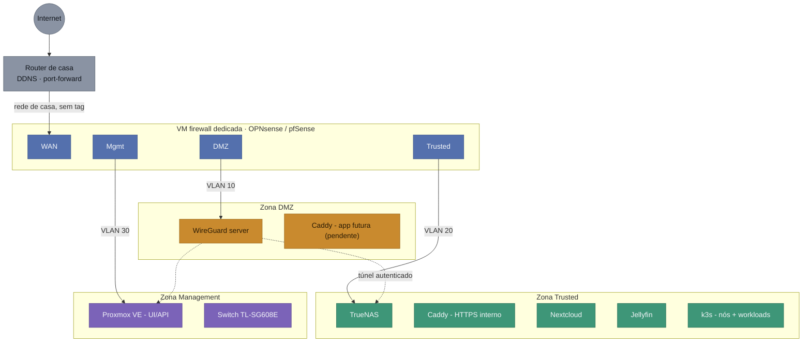

# Project Context: HomeLab

Documento de contexto vivo do projeto. Atualizar quando houver decisoes novas.

## Snapshot (19/02/2026, atualizado 18/07/2026)
- Objetivo: aprender e fazer deploy de projetos num homelab com exposicao externa controlada (1-2 apps).
- Decidido: Proxmox VE + TrueNAS (VM) + Caddy + WireGuard + Nextcloud + Jellyfin.
- Decidido: comprar um mini PC como host inicial (baixo consumo/ruido).
- Storage atual: 1x HDD 1TB (3.5", em bay USB TooQ, com o pool ZFS da NAS antiga por importar) + 1x SSD 240GB (Proxmox); existe tambem 1x SSD externo 1TB (para backup).
- Rede: arquitetura de VLANs + firewall dedicada decidida (22/07/2026) - ver seccao "Rede e Segmentacao". Switch TL-SG608E e gerido, com suporte a VLAN 802.1Q.
- Novo requisito (28/07/2026): VM Linux para programar e testar agentes/LLMs (modelos locais pequenos + APIs externas) - zona de rede ainda por decidir, ver "Ambiente de desenvolvimento" e Pendencias.

## Historico: v1 (PC antigo) vs v2 (OptiPlex, atual)
- **v1 (PC antigo)**: primeira versao do homelab, ja tinha TrueNAS, Jellyfin e WireGuard instalados e funcionais (DDNS proprio, Jellyfin acessivel na rede local e remotamente via WireGuard). Havia tambem uma stack de IA/RAG em Docker (Open WebUI + Ollama + Qdrant) a correr nesta v1.
- **v2 (Dell OptiPlex 3060 Micro, em curso)**: novo homelab, a substituir a v1. Estado atual real: **apenas o Proxmox VE esta instalado**. TrueNAS (VM), Jellyfin, WireGuard, Nextcloud, Caddy e a stack RAG ainda **nao foram (re)criados** no novo host.

## Objetivos
- Construir um homelab com custos controlados e baixo consumo/ruido.
- Ter NAS, media server, cloud pessoal, VPN e reverse proxy.
- Permitir crescimento futuro (especialmente storage/RAID, servicos e seguranca).
- Ambiente de desenvolvimento: VM Linux para programar e testar agentes/LLMs (28/07/2026).

## Escopo
- Inclui: hardware base, servicos faseados, exposicao externa segura, plano de evolucao, arquitetura de rede com VLANs e firewall dedicado (decidido 22/07/2026 - ver seccao "Rede e Segmentacao").
- Nao inclui (por agora): mais zonas/VLANs alem das 3 definidas (DMZ/Trusted/Management); alta disponibilidade (multi-host); segmentacao Wi-Fi/guest/IoT da rede domestica geral (28/07/2026: decidido manter independente do OptiPlex, ver "Router de casa e rede domestica").

## Servicos (Fase 1)
- NAS: TrueNAS (VM) com ZFS. Zona: Trusted.
- VPN: WireGuard para administracao remota - ponto de entrada para a zona Trusted a partir da internet. Zona: DMZ (perna internet-facing); atribui IPs aos clientes autenticados numa subnet propria (tunel).
- Reverse proxy: Caddy - por agora so serve HTTPS interno (Nextcloud/Jellyfin) para quem ja esta ligado por WireGuard. Zona: Trusted. So ganha uma perna em DMZ quando houver uma app decidida para exposicao publica (ver Pendencias).
- Cloud: Nextcloud - decidido (22/07/2026) ficar so interno, sem exposicao publica; acesso exclusivamente via WireGuard. Zona: Trusted.
- Media: Jellyfin - mesmo padrao da v1 (so acesso remoto via WireGuard). Zona: Trusted.

## Arquitetura (alto nivel)
- Router atual com DDNS; port-forward (80/443 quando houver app exposta; porta UDP do WireGuard) aponta para a perna WAN-side da VM de firewall - nao diretamente para os servicos.
- Host unico com Proxmox VE no SSD (240GB).
- VM de firewall dedicada (tipo OPNsense/pfSense) media todo o trafego entre zonas - ver "Rede e Segmentacao (VLANs + Firewall)".
- TrueNAS em VM com disco(s) dedicados e datasets para `apps`, `cloud`, `media`, `backups` (zona Trusted).
- Apps em VMs/LXCs (ou, mais tarde, workloads k3s) com dados persistidos no TrueNAS.
- Administracao remota via WireGuard; evitar expor interfaces de admin na internet.

## Rede e Segmentação (VLANs + Firewall)

**Decidido em 22/07/2026.** Substitui a exclusão anterior no Escopo ("não inclui arquitetura detalhada de rede").

### Esquema lógico

Legenda: linha sólida = ligação de rede real (uplink ou VLAN com tag); linha tracejada = túnel WireGuard autenticado. Cores: cinzento = internet/router; azul = interfaces da firewall; âmbar = DMZ; verde = Trusted; roxo = Management.

### Hardware
- Adaptador USB 3.0 -> RJ45 Gigabit (TP-Link) ligado a uma porta USB do OptiPlex (segunda interface de rede, além da NIC onboard).
- Switch **TP-Link TL-SG608E — "Easy Smart Switch" gerido (8 portas Gigabit)**, com suporte a VLAN 802.1Q (port-based, tag-based e MTU VLAN), QoS, IGMP Snooping e LACP, configurável via GUI web ou o utilitário Easy Smart Configuration ([datasheet oficial TP-Link](https://static.tp-link.com/upload/product-overview/2023/202305/20230511/TL-SG608E(UN)6.6_Datasheet.pdf)). Escolhido precisamente por isto — permite segmentação por VLAN, não é um switch unmanaged.

### Decisão: VM de firewall dedicada (não a firewall nativa do Proxmox)
Escolhida uma VM de firewall dedicada (tipo OPNsense/pfSense) em vez das regras nativas do Proxmox (Datacenter → Firewall), por ser mais capaz (IDS/IPS, rotas/NAT mais ricas). Ver riscos concretos desta escolha em "Riscos e mitigações" (RAM, lockout, fiabilidade do USB, manutenção).

### Zonas / VLANs

| VLAN | Nome | Subnet | O que vive aqui |
|---|---|---|---|
| *(nativa, sem tag)* | WAN-side | rede de casa atual (ex. 192.168.1.0/24) | Só a perna WAN da VM de firewall; o router continua a fazer DDNS + port-forward para aqui |
| 10 | DMZ | 10.10.10.0/24 | WireGuard (perna internet-facing). Caddy só entra aqui quando houver app decidida para exposição pública |
| 20 | Trusted | 10.10.20.0/24 | TrueNAS, Caddy (HTTPS interno), Nextcloud, Jellyfin, nós k3s e workloads |
| 30 | Management | 10.10.30.0/24 | UI/API do Proxmox, gestão do switch, SSH aos nós |
| — | Túnel WireGuard | 10.10.40.0/24 | **Não é VLAN do switch** — subnet virtual só dentro da VM do WireGuard, atribuída a clientes já autenticados |

### Atribuição de NICs
- **NIC onboard** → trunk para o switch, a transportar as VLANs 10/20/30 com tag (papel mais crítico, hardware mais fiável).
- **Adaptador USB→RJ45** → perna WAN, sem tags, ligada à rede de casa/router (papel mais simples, tolera melhor uma eventual instabilidade do adaptador).
- No switch, só a porta ligada à NIC onboard do OptiPlex precisa de ser trunk; as restantes portas ficam livres para o resto da casa.

### Regras entre zonas
- DMZ → Trusted: só as portas específicas que os serviços em DMZ precisam de contactar (ex., no futuro, Caddy → backend). Nada mais.
- DMZ → Management: bloqueado.
- WAN-side → Management: permitido só a partir do IP do PC do Rui (para OpenTofu/Ansible falarem com a API do Proxmox).
- Túnel WireGuard → Trusted + Management: permitido (é o próprio propósito do VPN — acesso de administração autenticado).

### Pendente
Qual app vai efetivamente para a zona DMZ (exposta publicamente via Caddy) — ver "Pendências". Nextcloud e Jellyfin já estão decididos como Trusted-only.

## Router de casa e rede doméstica (fora da segmentação do homelab, novo 28/07/2026)

- **Modelo**: Vodafone Smart Router — Huawei OptiXstar HG8247B7-8N (ONT + router GPON fornecido/bloqueado pela Vodafone).
- **Rede de convidados (guest)**: suportada nativamente na própria interface do router — pode ser ativada diretamente ali, sem depender do OptiPlex nem das VLANs do homelab. Resolve a preocupação de dispositivos convidados ficarem sem rede se o OptiPlex for reiniciado/desligado.
- **VLANs 802.1Q personalizadas** (ex. para isolar IoT): não confirmado se a interface do router expõe essa opção — a confirmar diretamente no admin do router. Equipamentos "Smart Router" da Vodafone tendem a vir com funcionalidades avançadas desativadas por bloqueio do operador.
- **Bridge mode: confirmado desativado pela Vodafone** neste equipamento ([forum Vodafone](https://forum.vodafone.pt/t5/Router/Router-HG8247B7-8N-porta-4-de-2-5Gbps-s%C3%B3-d%C3%A1-100Mbps/m-p/448886)) — reforça a decisão já tomada de o router se manter como gateway real da internet, sem a VM de firewall o substituir (essa alternativa exigiria bridge mode; não disponível sem contacto com o suporte Vodafone, 16913, sem garantia de desbloqueio).
- **Decisão de âmbito**: segmentação adicional de Wi-Fi/guest/IoT da rede doméstica geral mantém-se **independente do OptiPlex** e fora do âmbito das VLANs do homelab (DMZ/Trusted/Management) — evita que dispositivos do dia-a-dia (telemóveis, portáteis, convidados, IoT) dependam da disponibilidade do OptiPlex. Se um dia for preciso mais segmentação do que o router permite nativamente, a via é um access point/switch adicional capaz de VLANs, a jusante do router — não integrado na VM de firewall do homelab.

## Ambiente de desenvolvimento e testes de agentes/LLMs (novo, 28/07/2026)
- Objetivo: VM Linux dedicada para programar e testar agentes/LLMs.
- Modelos: mistura de modelos locais (pequenos/quantizados, ex. via Ollama) e chamadas a APIs externas (Claude, OpenAI, etc.) - confirmado 28/07/2026 que sera "provavelmente as duas coisas".
- **Restricao de hardware**: o OptiPlex (i5-8500T) so tem grafica integrada, sem GPU dedicada - inferencia local fica limitada a modelos pequenos e mais lenta (CPU-only), especialmente notorio em loops de agente (varias chamadas seguidas ao modelo). Testes mais pesados ou mais frequentes devem preferir APIs externas.
- **Zona de rede**: ainda nao decidida (28/07/2026) - Trusted (junto com TrueNAS/Nextcloud/etc., mais simples) vs. zona isolada propria (mais segura, dado que um agente com execucao de codigo/acesso a rede e um perfil de risco diferente de um Jellyfin/Nextcloud - contem melhor um agente com comportamento inesperado, ex. por prompt injection). Ver Pendencias.
- **Impacto em RAM**: mais um consumidor a somar ao orcamento ja apertado (ver Riscos e mitigacoes). Confirmar o teto real de RAM suportado pelo OptiPlex 3060 Micro antes de assumir que 32GB chega, dado este novo requisito.

## Dados (RAID vs backup)
- RAID (ex.: ZFS mirror) protege contra falha de disco, mas nao substitui backup.
- Fase 1: sem RAID (usar discos existentes) + backup para SSD externo 1TB.
- Fase 2: comprar 2x HDD NAS iguais e migrar para ZFS mirror (RAID1).

## RAID com Mini PC (opcoes praticas)
- Melhor (mais robusto): migrar storage para um host com discos SATA internos (torre) ou usar um NAS dedicado.
- Se ficar no mini PC: usar um DAS 2-bay/4-bay com fonte e boa controladora USB (evitar RAID/ZFS em caixas USB baratas).
- Evitar: montar ZFS/RAID em discos USB instaveis; USB e aceitavel para backups, mas para RAID requer hardware decente e cabos/energia confiaveis.

## Estimativa de custo (referencia)
- DAS 2-bay (ex.: QNAP TR-002) + 2x HDD NAS 6TB:
  - TR-002: ~174 EUR.
  - 2x 6TB: ~350 EUR (dependendo do modelo).
  - Total esperado: ~525 EUR (sem contar com eventuais portes).
- NAS dedicado 2-bay (ex.: Synology DS223) + 2x HDD NAS 6TB:
  - DS223 (sem discos): ~279 EUR.
  - 2x 6TB: ~350 EUR (dependendo do modelo).
  - Total esperado: ~630 EUR.

## Decisao: backups em vez de RAID (para minimizar custos)
- Opcao escolhida: nao implementar RAID por agora; usar backups (com pelo menos 2 copias) para reduzir custo.
- Recomendacao pratica:
  - 1x SSD externo (1TB) para "backup rapido" de dados criticos.
  - 1x HDD externo grande (8TB+) para backups completos.
  - Opcional (mais seguro): 2o HDD externo grande para rotacao/offsite.

## Backup (hardware recomendado e custos)
- Opcao A (mais simples/normalmente mais barata): 1-2x HDD externo de escritorio (3.5") pronto a usar.
  - Exemplo: WD Elements Desktop 8TB: ~194 EUR (preco referencia EU em 19/02/2026).
- Opcao B (HDD interno + caixa USB com fonte): boa se quiseres escolher o modelo do disco.
  - Exemplo: Toshiba N300 6TB + adaptador USB-SATA com fonte:
    - N300 6TB: ~204,50 EUR.
    - Adaptador UGREEN USB 3.0 <-> SATA + 12V/2A: ~20,79 EUR.
    - Total: ~225,29 EUR (1 disco).

## Links (exemplos)
- WD Elements Desktop 8TB (exemplo loja): https://www.pcmadrid.es/discos-duros/215070-wd-elements-8tb-usb-30-negro.html
- Toshiba N300 6TB (exemplo loja): https://www.pccomponentes.pt/toshiba-nas-n300-35-6tb-sata-3
- UGREEN USB <-> SATA + 12V/2A (Amazon.es): https://www.amazon.es/dp/B00MYU0EAU
- Inateck FE3002 (caixa 3.5" com fonte, referencia): https://www.idealo.de/preisvergleich/OffersOfProduct/202541873_-fe3002-inateck.html

## Como vamos usar os discos (backup vs principal)
- Disco A: armazenamento principal (dados "vivos" na NAS).
- Disco B: destino de backup (copias agendadas do Disco A).
- Boa pratica: rotacao/offsite (ex.: desligar e guardar o Disco B apos o backup) para reduzir risco de ransomware/erro humano.
- Backups devem ter historico/retencao (versionamento) e restores devem ser testados periodicamente.

## Hardware (requisitos)
- Preferencia: torre/MT com 2+ baias 3.5" e varias portas SATA (para RAID e expansao).
- CPU: Intel com VT-x (idealmente com VT-d); i7 8th gen e um bom equilibrio para Proxmox.
- RAM: 32GB (TrueNAS + apps) com possibilidade de upgrade.
- Ruido/consumo: priorizar PSU eficiente e ventoinhas silenciosas.

## Hardware (shortlist e precos)
- Refurb (candidato): HP EliteDesk 800 G5 MT (i7-8700, 32GB, NVMe 500GB), Infocomputer Portugal (19/02/2026).
  - Confirmar: baias 3.5", portas SATA livres, e caddies/cabos SATA inclusos.
- Refurb (bom custo/beneficio): Lenovo ThinkCentre M720T MT (i7-8700, 32GB, NVMe 500GB) por ~339,85 EUR (Infocomputer Portugal, 19/02/2026).
- Refurb (alternativa): HP EliteDesk 800 G4 (i7-8700, 32GB, SSD 512GB) por ~419,00 EUR (Worten PT, 19/02/2026).
- Nota: confirmar disponibilidade e caracteristicas (baias 3.5", SATA, PSU) antes de comprar.

## Opcao alternativa: Mini PC (sem RAID interno)
- Se a prioridade for baixo consumo/ruido e o RAID interno nao for requisito imediato, um mini PC pode ser suficiente.
- Limites: menos expansao para discos 3.5"; storage adicional tende a ser via SSD interno (se houver slot) ou USB/DAS.
- Exemplos e links em `docs/HARDWARE_SHORTLIST.md`.

## Orcamento e compras por fases
- Fase 1 (agora): comprar apenas o host; reutilizar HDD/SSD existentes; usar SSD externo como backup.
- Fase 2 (RAID): comprar 2x HDD NAS iguais (4TB ou 6TB) e montar ZFS mirror; manter backups.
- Fase 3: firewall dedicado/VLANs (decidido 22/07/2026, ver "Rede e Segmentacao"), mais discos, automacao (IaC), monitorizacao.

## Plano de instalacao (resumo)
1. Instalar Proxmox VE no SSD 240GB.
2. Criar VM TrueNAS e passar o HDD 1TB (passthrough de disco, atualmente na bay USB TooQ).
3. No TrueNAS, **importar o pool ZFS existente** (dados da NAS antiga, v1) em vez de formatar de novo — depois confirmar/ajustar datasets e partilhas (SMB/NFS).
4. Criar WireGuard e Reverse proxy (Caddy).
5. Criar Nextcloud e Jellyfin e ligar storage ao TrueNAS.
6. Configurar DDNS e port-forward 80/443 no router (apenas para o reverse proxy).
7. Automatizar backups para SSD externo e testar restore.

## Riscos e mitigacoes
- Exposicao externa insegura: usar reverse proxy + TLS + limitar portas + admin via VPN.
- Perda de dados (sem RAID): backups frequentes + teste de restores; migrar para RAID quando possivel.
- Crescimento limitado: escolher host com baias/SATA; planear fases.
- RAM insuficiente: TrueNAS + k3s + Prometheus/Grafana + firewall VM + (novo, 28/07/2026) VM de desenvolvimento/agentes ultrapassam os 16GB atuais sem folga alguma. Mitigacao: tratar o upgrade de RAM como pre-requisito (nao "quando necessario"); confirmar se 32GB chega ou se o OptiPlex 3060 Micro suporta mais, dado o novo requisito de agentes/LLMs.
- Lockout de gestao: se a firewall VM fizer DHCP/DNS/rota para as VLANs internas, uma falha nela pode cortar o acesso a tudo, incluindo ao proprio Proxmox. Mitigacao: manter a gestao do Proxmox acessivel pela zona WAN-side, independente do estado da firewall VM; mudancas de rede sempre com consola local/noVNC disponivel, nunca so remotamente.
- Fiabilidade do adaptador USB-RJ45: e hardware de consumo, nao de servidor (pode ter resets sob carga sustentada). Mitigacao: atribuido ao papel WAN (mais simples/menos critico), nao ao trunk das VLANs internas.
- Perda de configuracao da firewall: mais critico que perder "um servico" - e toda a politica de rede/seguranca. Mitigacao: exportar a configuracao da propria firewall (ex. config.xml do OPNsense) alem do backup normal da VM.

## Pendencias
Checklist completo com estado (feito/pendente) de todas as tarefas: `docs/CHECKLIST.md`. Decisoes ainda em aberto (nao tarefas): qual app vai para a zona DMZ (exposta publicamente via Caddy) - Nextcloud e Jellyfin ja decididos como Trusted-only, por isso o objetivo original "expor 1-2 apps" fica sem app associada ate isto ficar decidido; zona de rede para a nova VM de desenvolvimento/agentes-LLMs (Trusted vs. zona isolada propria); recriar ou nao a stack RAG da v1; destino/desligamento do PC antigo (v1) apos o v2 estar operacional.

## Decisoes recentes
- 19/02/2026: host escolhido e encomendado: Dell OptiPlex 3060 Micro (i5-8500T, 16GB RAM, SSD 256GB) por 229 EUR.
  - Motivo: melhor custo/beneficio dentro do budget e baixo consumo/ruido.
  - Plano de upgrades: 32GB RAM quando necessario; SSD maior (512GB/1TB) quando o storage apertar.
- 18/07/2026: confirmado que o Proxmox VE ja esta instalado no OptiPlex (v2); restantes servicos (TrueNAS, Jellyfin, WireGuard) ainda por instalar nesta nova maquina.

## Historico
- 19/02/2026: criado e consolidado contexto inicial, servicos e plano por fases.
- 19/02/2026: decidido host inicial (Dell OptiPlex 3060 Micro) e definido plano ao receber o equipamento.
- (data anterior, PC antigo): v1 do homelab operacional com TrueNAS + Jellyfin + WireGuard + stack RAG (Open WebUI/Ollama/Qdrant) em Docker.
- 18/07/2026: consultada conversa historica do ChatGPT sobre a v1 (media/streaming/VPN) e confirmado com o utilizador que essa conversa descreve a v1, nao o estado atual do v2. Docs atualizados para refletir que o v2 tem, por agora, apenas o Proxmox instalado.
- 18/07/2026: decidido plano de ferramentas/boas praticas para o v2 (ver `docs/PLANO_FERRAMENTAS_E_BOAS_PRATICAS.md`): Obsidian (vault = este repo, sync via Git, sem Obsidian Sync pago) para documentacao; Uptime Kuma + Healthchecks.io self-hosted com alertas Slack para monitorizacao; adocao de IaC (OpenTofu + Ansible) desde ja.
- 22/07/2026: plano de ferramentas atualizado apos comparacao com `career-profile/goals/estrategia-software.md` (Nicho B - DevOps/Platform Engineer). Tres mudancas: (1) servicos de aplicacao passam a correr num cluster k3s (Kubernetes) em vez de LXC/VM por servico - skill critico em falta; (2) Prometheus+Grafana deixam de ser "mais tarde" e entram na fase inicial de monitorizacao; (3) workflow de GitHub Actions a validar o IaC (tofu fmt/validate, ansible-lint, helm lint) antes de qualquer apply real. Mantido OpenTofu (nao Terraform) - ver justificacao na seccao 4 do plano.
- 22/07/2026: criado `docs/CHECKLIST.md` como documento operacional unico com o estado (feito/pendente) de todas as tarefas do projeto, consolidando o que estava espalhado em "Proximos Passos" (README.md), "Pendencias" (este ficheiro) e a "Sequencia de execucao recomendada" do plano de ferramentas. Este ficheiro (PROJECT_CONTEXT.md) mantem-se como o log de decisoes/contexto; o CHECKLIST.md e so o estado das tarefas.
- 22/07/2026: revisao de hardware. Confirmado que o HDD 1TB (bay USB TooQ) esta visivel mas com o pool ZFS da NAS antiga (v1) por importar - nao e um problema de hardware, falta criar a VM TrueNAS + passthrough + "Import pool". Confirmado tambem hardware de rede adicional (adaptador USB->RJ45 TP-Link + switch TL-SG608E) - topologia final ainda nao decidida, ver nova seccao "Rede" acima.
- 22/07/2026: correcao - o TL-SG608E tinha sido registado incorretamente como "unmanaged, sem VLANs". Confirmado via datasheet oficial TP-Link (pesquisa web) que e um Easy Smart Switch gerido, com suporte a VLAN 802.1Q (port-based, tag-based, MTU VLAN), QoS, IGMP Snooping e LACP. Foi escolhido precisamente por isto. Seccao "Rede" corrigida.
- 22/07/2026: decidida a arquitetura de rede completa (substitui a exclusao anterior no Escopo). VLANs: 10/DMZ (WireGuard), 20/Trusted (TrueNAS, Caddy, Nextcloud, Jellyfin, k3s), 30/Management (Proxmox, switch); subnet do tunel WireGuard (10.10.40.0/24) e virtual, nao e VLAN do switch. NIC onboard = trunk para o switch; adaptador USB->RJ45 = perna WAN. Decidida VM de firewall dedicada (OPNsense/pfSense), nao a firewall nativa do Proxmox - riscos (RAM, lockout, fiabilidade do USB, backup da config) registados em "Riscos e mitigacoes". Nextcloud e Jellyfin decididos como Trusted-only (so acesso via WireGuard, sem exposicao publica) - fica pendente decidir qual app vai para a zona DMZ. Seccao "Rede (hardware confirmado, topologia por decidir)" substituida por "Rede e Segmentacao (VLANs + Firewall)". Checklist atualizado com nova Fase 1 dedicada e fases seguintes renumeradas.
- 28/07/2026: novo requisito - VM Linux para programar e testar agentes/LLMs, com mistura de modelos locais e APIs externas. Hardware sem GPU dedicada (so grafica integrada) limita inferencia local a modelos pequenos/lentos. Zona de rede (Trusted vs. isolada) fica pendente. Reforca o risco de RAM ja registado - ver nova seccao "Ambiente de desenvolvimento e testes de agentes/LLMs".
- 28/07/2026: identificado o router de casa - Vodafone Smart Router (Huawei OptiXstar HG8247B7-8N). Confirmado via pesquisa web: guest network suportado nativamente (independente do OptiPlex); bridge mode desativado pela Vodafone (reforca a decisao de nao substituir o router pela VM de firewall como gateway); VLANs 802.1Q personalizadas nao confirmadas na interface do router. Decidido manter segmentacao Wi-Fi/guest/IoT fora do ambito das VLANs do homelab e independente do OptiPlex - ver nova seccao "Router de casa e rede domestica".
