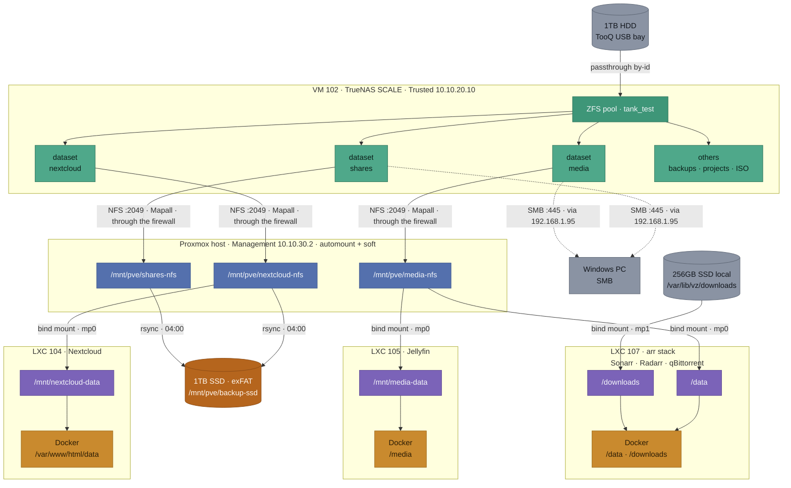
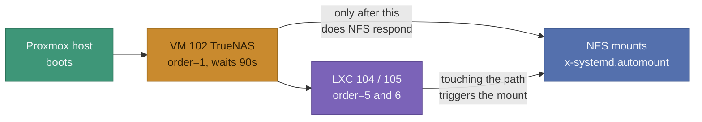

# Data and Storage Map - Homelab v2

Companion to [NETWORK.md](NETWORK.md): where that one shows the path packets take, this one shows **where the files live** and how many layers sit between the physical disk and the application reading them.

It exists for a concrete reason: the chain is long, each link is invisible from the next one, and it has already caused three separate incidents (NFS permissions, mounts lost after a reboot, and confused paths during diagnosis). Having it drawn out saves rebuilding the chain from memory every time.

## The full chain, from disk to container



| Layer | |
|---|---|
| ⬜ | Physical disk / external client |
| 🟩 | ZFS (pool and datasets) on TrueNAS |
| 🟦 | NFS mount on the Proxmox host |
| 🟪 | Path inside the LXC (bind mount target) |
| 🟧 | Path inside the Docker container |
| 🟫 | Backup destination |

## The same folder under four names

The single most error-prone thing about this architecture: one folder is reached by a different path at every layer, and a path that is correct in one layer produces "No such file or directory" in the next. Worse, the *arr stack and Jellyfin mount **the same media library under different names**, so a recipe that works in one container fails in the other.

| What | TrueNAS dataset | Proxmox host | Inside the LXC | Inside the container |
|---|---|---|---|---|
| Media library, as Jellyfin sees it | `tank_test/media` | `/mnt/pve/media-nfs` | 105: `/mnt/media-data` | `/media` |
| Media library, as Sonarr/Radarr see it | `tank_test/media` | `/mnt/pve/media-nfs` | 107: `/data` | `/data` |
| Downloads (local SSD, not TrueNAS) | *(none)* | `/var/lib/vz/downloads` | 107: `/downloads` | `/downloads` |
| Nextcloud files | `tank_test/nextcloud` | `/mnt/pve/nextcloud-nfs` | 104: `/mnt/nextcloud-data` | `/var/www/html/data` |
| Documents and personal videos | `tank_test/shares` | `/mnt/pve/shares-nfs` | *(not mounted)* | *(not mounted)* |
| Backup destination | *(none)* | `/mnt/pve/backup-ssd` | *(not mounted)* | *(not mounted)* |

Reading it in practice: a movie sitting at `/media/Movies/X.mkv` for Jellyfin is `/data/Movies/X.mkv` for Radarr, `/mnt/pve/media-nfs/Movies/X.mkv` on the host, and `/mnt/tank_test/media/Movies/X.mkv` on TrueNAS. Four names, one file.

Two rules that follow from the table:

- **Before running a command, decide which layer you are standing in.** `pct exec 107 -- ...` runs in the LXC; `docker exec sonarr ...` runs one layer deeper; a bare shell on the OptiPlex is the host. Shell globs are the classic trap: they expand where you type them, not where the command runs.
- **A local-disk bind mount needs `chown -R 100000:100000` on the host; an NFS one does not.** Unprivileged containers shift UIDs by 100000, and on the NFS side TrueNAS's `Mapall` already absorbs that translation. The downloads folder is the only local bind mount here, and it is exactly the one that failed with "Permission denied" when it was created.

## Why the chain is this long

Each layer exists for a reason that is not obvious until you try to skip it:

1. **Passthrough instead of a virtual disk**: TrueNAS manages the disk directly, which preserves the ZFS pool carried over from v1.
2. **NFS mounted on the host, not in the container**: an *unprivileged* LXC cannot mount NFS, even with `nesting`. The attempt fails with `Operation not permitted`. So the host mounts it and passes it along.
3. **Bind mount (`mp0`) into the LXC**: the way a container gets to see a host folder.
4. **Docker volume inside the LXC**: one more layer, because the application runs in Docker inside the LXC.

The practical effect: **the "root" arriving at TrueNAS is not real root**. It has been through two UID translations (unprivileged LXC + Docker) and arrives with a shifted UID. That is why the exports need `Mapall` and not `Maproot`: `Maproot` only treats as root whatever genuinely arrives as UID 0.

Since 11/08/2026 there is a fifth consideration: TrueNAS lives in the Trusted zone and the host in Management, so the NFS traffic **crosses the dedicated firewall**. The mounts show it (`clientaddr=10.10.30.2`, `addr=10.10.20.10`). The exports are authorised only to `10.10.30.0/24`, the network the host arrives from.

## Where each thing actually lives

| Data | Where it lives | Backed up? |
|---|---|---|
| Nextcloud files | `nextcloud` dataset (TrueNAS) | **Yes**, daily |
| `shares` (documents, personal videos) | `shares` dataset (TrueNAS) | **Yes**, daily |
| Jellyfin media library | `media` dataset (TrueNAS) | **No** |
| Downloads in progress and seeding | `/var/lib/vz/downloads`, Proxmox's local SSD | **No**, deliberately (transient) |
| *arr configuration (Sonarr, Radarr, Prowlarr, qBittorrent) | Docker volumes on the LXC 107 disk | **No** |
| Nextcloud database (MariaDB) | Docker volume on the LXC 104 disk | **Yes**, daily dump since 01/09/2026, 7 versions kept |
| Jellyfin config and cache | Docker volumes on the LXC 105 disk | **No** |
| VM and LXC disks | Proxmox's local 256GB SSD | **No** |
| OPNsense configuration | inside VM 106 | **Manual only** - exported by hand 24/08/2026, automation still pending |

### What this reveals

Gaps the table makes visible, in order of severity. The first is now closed; the reasoning is kept because it is what made the fix worth doing:

- ~~**The Nextcloud database is not backed up.**~~ **Closed 01/09/2026.** The files were safe while the database that knows who owns them, which shares exist and what metadata they carry was not - a restore would have handed back files with no Nextcloud around them. Now dumped daily before the file sync, with seven versions retained. See "The Nextcloud database" below.
- **The OPNsense configuration is not backed up.** Already recorded as a risk in `PROJECT_CONTEXT.md` and as an open task in `CHECKLIST.md`, but worth repeating: losing this means losing the entire network policy, not one service.
- **The media library is not backed up**, which is probably a conscious decision (it is large and re-obtainable), but was never recorded as one. Worth confirming it is genuinely intentional.

## Protocols and ports used in this chain

| Link | Protocol | Port |
|---|---|---|
| Proxmox host → TrueNAS (NFS mounts) | NFS | 2049/TCP, plus 111/TCP-UDP (rpcbind) and the dynamic ports of `mountd`/`statd`/`lockd` |
| Windows PC → TrueNAS (shares) | SMB | 445/TCP, redirected through `192.168.1.95` by the firewall |
| Bind mount host → LXC | *(none)* | Does not go over the network, it is the kernel exposing the same folder |
| Docker volume LXC → container | *(none)* | Also local, no network |
| Backup to the SSD | *(none)* | Local `rsync`, disk attached over USB to the host |

Only the first two cross the network, and they are therefore the only ones needing firewall rules now that TrueNAS is in the Trusted zone. The rest are local to the host and keep working regardless of what the firewall does.

## Boot dependencies

This explains the incident that recurred four times with Nextcloud and Jellyfin after restarting the host, and how it was finally resolved on 10/08/2026.



TrueNAS is a VM running *inside* the very host that depends on it. That circular dependency is the root of the whole problem: when the host boots, it would try to mount NFS before TrueNAS was ready to serve it, and when the host shut down, it would stop TrueNAS before releasing the mounts.

**The current solution has three parts:**

- **`onboot=1` with an explicit order** (TrueNAS `order=1,up=90` → OPNsense → WireGuard → Caddy → Nextcloud → Jellyfin). Guests now start on their own, and shutdown runs in reverse, so TrueNAS stops last, after everything has released its mounts.
- **`x-systemd.automount`** inverts the mount logic: instead of mounting at boot and giving up if it fails, the system mounts on first access, and retries on the next access if it fails. The previous `nofail` only stopped the boot from hanging, which turned a transient failure into a permanent, silent one.
- **`soft`** with generous timeouts, so a dead NFS server returns an I/O error instead of blocking forever. Without it, a stopped TrueNAS locked up the whole host, including the management plane, which meant the very tools needed to bring TrueNAS back (`qm`) were unusable.

Current fstab options:

```
_netdev,noauto,x-systemd.automount,x-systemd.mount-timeout=30,soft,timeo=150,retrans=3
```

The old manual recipe (`mount -a` followed by restarting the containers) is no longer needed. Validated across two full reboots.

## Backup

| Field | Value |
|---|---|
| Destination | 1TB external SSD (SanDisk Portable), exFAT, at `/mnt/pve/backup-ssd` |
| Source | `/mnt/pve/nextcloud-nfs`, `/mnt/pve/shares-nfs`, and the Nextcloud database dump |
| Command | `rsync -rlt --delete --modify-window=1` |
| Schedule | daily cron at 04:00, on the Proxmox host |
| Script | `/usr/local/bin/backup-homelab.sh` |
| Log | `/var/log/backup-homelab.log` |
| Heartbeat | pushes to Uptime Kuma on the final line - see [MONITORING.md](MONITORING.md) |

### What kind of backup this is

**A mirror, not a versioned backup**, and the distinction matters more than it sounds. The *transfer* is incremental, because rsync only moves what changed - which is why a daily run takes minutes. But the *result* is always a single copy: the state of right now.

The consequences are worth being explicit about:

- **There is no history.** A file corrupted today overwrites the good copy at 04:00 tomorrow. There is no earlier version to go back to.
- **`--delete` propagates deletions.** Delete something by mistake on Monday and it is gone from the backup by Tuesday morning. That is intentional - it is what keeps the mirror faithful and stops the SSD growing forever - but it cuts both ways.
- **It defends against exactly one thing**: the source disk failing. It does not defend against human error, silent corruption or ransomware, because in all three the damage is faithfully copied within 24 hours.

That gap is what the ZFS snapshots below are for. The two are complementary, not alternatives: snapshots protect the source from mistakes, the mirror protects against the source disappearing.

### The Nextcloud database

Added 01/09/2026, closing what had been the most serious gap in this design: the *files* were backed up daily while the database that knows who owns them, which shares exist and what metadata they carry was not. A restore would have handed back files with no Nextcloud around them.

The dump runs **before** the file sync, to keep the two halves close in time, and uses `--single-transaction` for an InnoDB-consistent snapshot without locking writes. Credentials never touch the script: `mysqldump` runs inside the container and reads them from the environment variables already there.

**It writes to `.tmp`, verifies, and only then renames.** A truncated dump has size, opens without error, and is useless - the same silent failure that left a 5MB video file where a 166MB one belonged. Only the `-- Dump completed` footer proves `mysqldump` reached the end. Without that check, a failed dump would quietly replace the last good one, and it would be discovered on the day of the restore.

Seven daily versions are kept locally and mirrored to the SSD. Database corruption can go unnoticed for days, and by then yesterday's dump is no use either.

**Why not `rsync -a`**: exFAT does not store Unix ownership. `-a` always tries to preserve it, fails with `chown failed: Operation not permitted`, and rsync aborts the entire transfer. `-rlt` copies without trying, and `--modify-window=1` compensates for exFAT's lower timestamp precision.

**Why exFAT and not ZFS**: it keeps the disk usable as an ordinary external drive on Windows, in exchange for losing TrueNAS's native *Replication Tasks*. A deliberate trade.

Restore validated on 02/08/2026 at three levels (file listings, checksum, and actually playing back a restored file). The remount recipe after unplugging the disk lives in `SECRETS.md`.

### The lesson that had to be learned twice

On 01/09/2026 the backup was found to have failed silently on **three consecutive nights**. The disk was physically connected but not mounted, and the fstab entry carried `defaults,nofail`.

`nofail` does exactly what it promises: a failed mount does not block the boot. It also never retries. The host had rebooted around 27/08, the USB disk presumably enumerated too late, the mount failed, `nofail` swallowed the error, and every run since then exited early writing a line to a log nobody reads.

**This is the same lesson as 10/08/2026**, when `nofail` on the NFS mounts turned a transient failure into a permanent silent one. Those three entries were fixed that day; this one was left behind. The fix is identical: `noauto,x-systemd.automount,x-systemd.mount-timeout=30`, which mounts on first access and retries instead of giving up.

It also removed a manual step that had been documented as normal: the recipe in `SECRETS.md` telling you to run `mount -a` after reconnecting the disk. With automount, reconnecting is enough.

One consequence for the script: with automount, `mountpoint -q` returns true for the *autofs* mountpoint even when the real filesystem is absent - a false positive that would have the backup writing to the local disk believing it was writing to the SSD. The guard is now an `ls` to trigger the mount followed by `findmnt -n -t exfat`, which only matches when the actual exFAT filesystem is there.

## ZFS snapshots (added 01/09/2026)

Snapshots answer the question the mirror cannot: *what did this file look like last Tuesday?* They are copy-on-write, so taking one copies nothing - it only marks the existing blocks as retained, and consumes space gradually as data changes.

| Dataset | Schedule | Retention | Why |
|---|---|---|---|
| `tank_test/nextcloud` | Daily 03:00 | 2 weeks | Personal, irreplaceable, small changes |
| `tank_test/shares` | Daily 03:15 | 2 weeks | Same |
| `tank_test/media` | **none** | - | See below |

**Why `media` is deliberately excluded.** It is the largest dataset, it now carries the download churn, and its contents are the only ones that can simply be obtained again. The mechanism matters here: a snapshot retains the blocks that existed when it was taken, so deleting 40GB of a series would **not** free that space until the snapshot holding it expires. With the pool at 71.7% and a 48GB cleanup just completed, snapshotting media would make that work count for less. Worth adding a weekly with short retention if protection against deleting an episode by mistake becomes wanted - but start with what cannot be re-obtained.

Snapshots do **not** replace the mirror: they live on the same pool, so they protect against mistakes, not against the disk dying.

### Recovering a file from a snapshot

Validated end to end on 01/09/2026 with a disposable file, on the principle that a snapshot nobody has restored is the same untested hypothesis as a backup nobody has restored.

ZFS exposes snapshots through a hidden directory inside the dataset itself. **Do the recovery from inside TrueNAS**, not over NFS: `.zfs` is hidden by default and may not be exposed through the export, depending on its configuration.

```bash
# 1. Find the snapshot you want
qm guest exec 102 -- /bin/bash -c "zfs list -t snapshot -o name,used,creation -s creation | tail -10"

# 2. Copy the file out of it, back to its normal place
qm guest exec 102 -- /bin/bash -c "cp '/mnt/tank_test/shares/.zfs/snapshot/<snapshot>/<path>' '/mnt/tank_test/shares/<path>'"

# 3. Verify by checksum from the host, against whatever you are comparing to
md5sum "/mnt/pve/shares-nfs/<path>"
```

Nothing is rolled back and nothing is undone: the snapshot is read-only and recovering is an ordinary file copy out of it. A full `zfs rollback` exists but discards everything written since the snapshot, and is almost never what you want for a single lost file.

## History

- 06/08/2026: document created. The storage chain had only ever been described in fragments scattered across `CHECKLIST.md` (inside incident write-ups) and `SECRETS.md` (loose paths), with no overall view. Drawing it end to end made three backup gaps visible that were not recorded anywhere, the most serious being the Nextcloud database.
- 11/08/2026: translated to English and brought up to date. The fstab options, the boot-dependency section and the manual recovery recipe all described a state that the fixes of 10/08 and the TrueNAS migration of 11/08 had made obsolete.
- 12/08/2026: **added the *arr stack (LXC 107) and the path translation table**. The document drew the chain down to Jellyfin and Nextcloud but did not know LXC 107 existed, so the local-SSD downloads branch was missing entirely. Added the "same folder under four names" table after two path mix-ups in the same week: a host-side loop written with the container's path, and downloads looked for at `/downloads/complete` on a host where they live at `/var/lib/vz/downloads/complete`. The trap is not the number of layers, it is that Jellyfin and the *arr stack mount **the same** media library under **different** names.
- 01/09/2026: **the two remaining backup gaps closed, and one silent failure found in the process**. The Nextcloud database is now dumped daily before the file sync, verified by its `-- Dump completed` footer before replacing the previous copy, and kept in seven rotating versions - closing what this document had listed as the most serious gap since 06/08. ZFS snapshots added on `nextcloud` and `shares`, daily with two weeks of retention, deliberately not on `media` because it is the largest dataset, the one with download churn, and the only one whose contents can be obtained again. The recovery procedure was validated with a disposable file and written down, on the same principle that made the 02/08 restore test worth doing. **And running the modified script revealed the backup had failed silently on three consecutive nights**: the SSD was connected but unmounted, and its fstab entry still carried `defaults,nofail` - the exact lesson learned for the NFS mounts on 10/08 and never applied to this one. Fixed with `x-systemd.automount`, which also retires the manual `mount -a` step that had been documented as normal practice.
