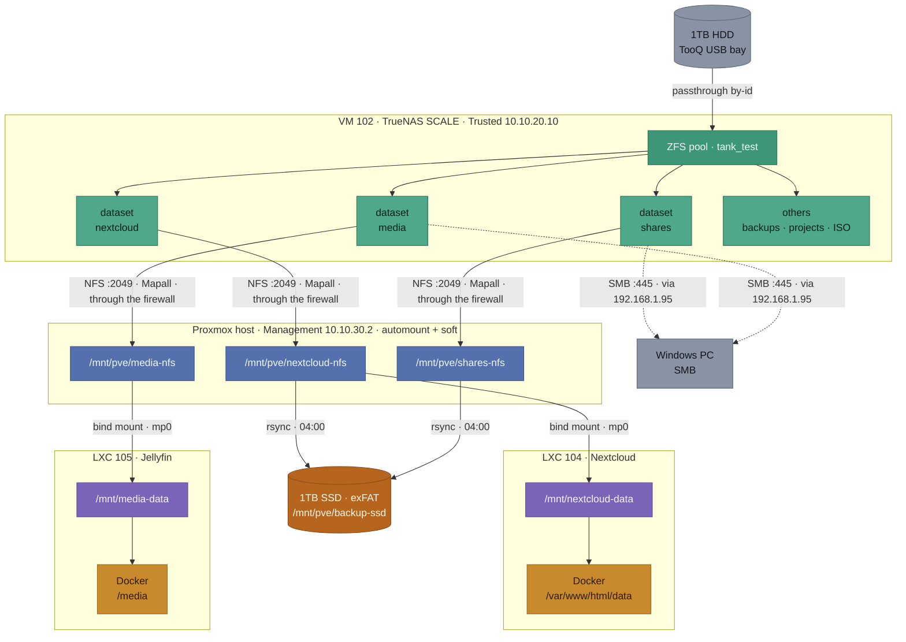
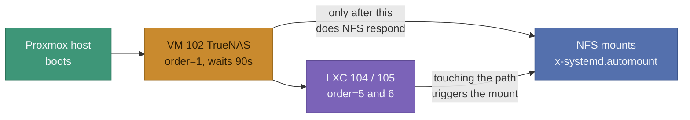

# Data and Storage Map - Homelab v2

Companion to [NETWORK.md](NETWORK.md): where that one shows the path packets take, this one shows **where the files live** and how many layers sit between the physical disk and the application reading them.

It exists for a concrete reason: the chain is long, each link is invisible from the next one, and it has already caused three separate incidents (NFS permissions, mounts lost after a reboot, and confused paths during diagnosis). Having it drawn out saves rebuilding the chain from memory every time.

## The full chain, from disk to container



| Layer | |
|---|---|
| ⬜ | Physical disk / external client |
| 🟩 | ZFS (pool and datasets) on TrueNAS |
| 🟦 | NFS mount on the Proxmox host |
| 🟪 | Path inside the LXC (bind mount target) |
| 🟧 | Path inside the Docker container |
| 🟫 | Backup destination |

## Why the chain is this long

Each layer exists for a reason that is not obvious until you try to skip it:

1. **Passthrough instead of a virtual disk**: TrueNAS manages the disk directly, which preserves the ZFS pool carried over from v1.
2. **NFS mounted on the host, not in the container**: an *unprivileged* LXC cannot mount NFS, even with `nesting`. The attempt fails with `Operation not permitted`. So the host mounts it and passes it along.
3. **Bind mount (`mp0`) into the LXC**: the way a container gets to see a host folder.
4. **Docker volume inside the LXC**: one more layer, because the application runs in Docker inside the LXC.

The practical effect: **the "root" arriving at TrueNAS is not real root**. It has been through two UID translations (unprivileged LXC + Docker) and arrives with a shifted UID. That is why the exports need `Mapall` and not `Maproot`: `Maproot` only treats as root whatever genuinely arrives as UID 0.

Since 11/08/2026 there is a fifth consideration: TrueNAS lives in the Trusted zone and the host in Management, so the NFS traffic **crosses the dedicated firewall**. The mounts show it (`clientaddr=10.10.30.2`, `addr=10.10.20.10`). The exports are authorised only to `10.10.30.0/24`, the network the host arrives from.

## Where each thing actually lives

| Data | Where it lives | Backed up? |
|---|---|---|
| Nextcloud files | `nextcloud` dataset (TrueNAS) | **Yes**, daily |
| `shares` (documents, personal videos) | `shares` dataset (TrueNAS) | **Yes**, daily |
| Jellyfin media library | `media` dataset (TrueNAS) | **No** |
| Nextcloud database (MariaDB) | Docker volume on the LXC 104 disk | **No** |
| Jellyfin config and cache | Docker volumes on the LXC 105 disk | **No** |
| VM and LXC disks | Proxmox's local 256GB SSD | **No** |
| OPNsense configuration | inside VM 106 | **No** |

### What this reveals

Three gaps the table makes visible, in order of severity:

- **The Nextcloud database is not backed up.** The *files* are safe, but the database that knows who owns them, which shares exist and what metadata they carry is not. A restore today would hand back files with no Nextcloud around them.
- **The OPNsense configuration is not backed up.** Already recorded as a risk in `PROJECT_CONTEXT.md` and as an open task in `CHECKLIST.md`, but worth repeating: losing this means losing the entire network policy, not one service.
- **The media library is not backed up**, which is probably a conscious decision (it is large and re-obtainable), but was never recorded as one. Worth confirming it is genuinely intentional.

## Protocols and ports used in this chain

| Link | Protocol | Port |
|---|---|---|
| Proxmox host → TrueNAS (NFS mounts) | NFS | 2049/TCP, plus 111/TCP-UDP (rpcbind) and the dynamic ports of `mountd`/`statd`/`lockd` |
| Windows PC → TrueNAS (shares) | SMB | 445/TCP, redirected through `192.168.1.95` by the firewall |
| Bind mount host → LXC | *(none)* | Does not go over the network, it is the kernel exposing the same folder |
| Docker volume LXC → container | *(none)* | Also local, no network |
| Backup to the SSD | *(none)* | Local `rsync`, disk attached over USB to the host |

Only the first two cross the network, and they are therefore the only ones needing firewall rules now that TrueNAS is in the Trusted zone. The rest are local to the host and keep working regardless of what the firewall does.

## Boot dependencies

This explains the incident that recurred four times with Nextcloud and Jellyfin after restarting the host, and how it was finally resolved on 10/08/2026.



TrueNAS is a VM running *inside* the very host that depends on it. That circular dependency is the root of the whole problem: when the host boots, it would try to mount NFS before TrueNAS was ready to serve it, and when the host shut down, it would stop TrueNAS before releasing the mounts.

**The current solution has three parts:**

- **`onboot=1` with an explicit order** (TrueNAS `order=1,up=90` → OPNsense → WireGuard → Caddy → Nextcloud → Jellyfin). Guests now start on their own, and shutdown runs in reverse, so TrueNAS stops last, after everything has released its mounts.
- **`x-systemd.automount`** inverts the mount logic: instead of mounting at boot and giving up if it fails, the system mounts on first access, and retries on the next access if it fails. The previous `nofail` only stopped the boot from hanging, which turned a transient failure into a permanent, silent one.
- **`soft`** with generous timeouts, so a dead NFS server returns an I/O error instead of blocking forever. Without it, a stopped TrueNAS locked up the whole host, including the management plane, which meant the very tools needed to bring TrueNAS back (`qm`) were unusable.

Current fstab options:

```
_netdev,noauto,x-systemd.automount,x-systemd.mount-timeout=30,soft,timeo=150,retrans=3
```

The old manual recipe (`mount -a` followed by restarting the containers) is no longer needed. Validated across two full reboots.

## Backup

| Field | Value |
|---|---|
| Destination | 1TB external SSD (SanDisk Portable), exFAT, at `/mnt/pve/backup-ssd` |
| Source | `/mnt/pve/nextcloud-nfs` and `/mnt/pve/shares-nfs` |
| Command | `rsync -rlt --delete --modify-window=1` |
| Schedule | daily cron at 04:00, on the Proxmox host |
| Script | `/usr/local/bin/backup-homelab.sh` |
| Log | `/var/log/backup-homelab.log` |

**Why not `rsync -a`**: exFAT does not store Unix ownership. `-a` always tries to preserve it, fails with `chown failed: Operation not permitted`, and rsync aborts the entire transfer. `-rlt` copies without trying, and `--modify-window=1` compensates for exFAT's lower timestamp precision.

**Why exFAT and not ZFS**: it keeps the disk usable as an ordinary external drive on Windows, in exchange for losing TrueNAS's native *Replication Tasks*. A deliberate trade.

Restore validated on 02/08/2026 at three levels (file listings, checksum, and actually playing back a restored file). The remount recipe after unplugging the disk lives in `SECRETS.md`.

## History

- 06/08/2026: document created. The storage chain had only ever been described in fragments scattered across `CHECKLIST.md` (inside incident write-ups) and `SECRETS.md` (loose paths), with no overall view. Drawing it end to end made three backup gaps visible that were not recorded anywhere, the most serious being the Nextcloud database.
- 11/08/2026: translated to English and brought up to date. The fstab options, the boot-dependency section and the manual recovery recipe all described a state that the fixes of 10/08 and the TrueNAS migration of 11/08 had made obsolete.
