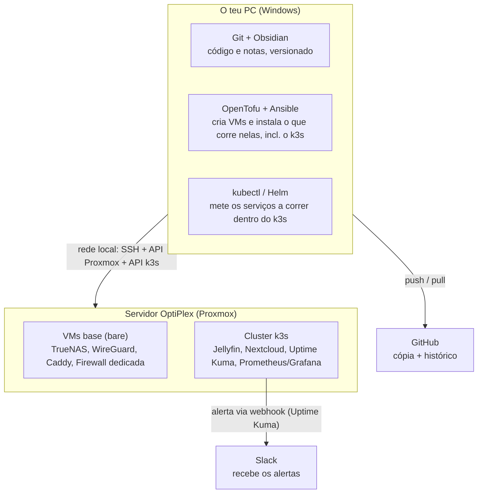

# Arquitetura e fluxo de trabalho (para iniciantes)

Documento vivo - atualizar sempre que uma ferramenta mudar de sítio ou o fluxo mudar. Não é um plano de decisão (isso é `TOOLING.md`); é o "onde é que isto vive e como é que tudo se encaixa", explicado de forma simples.

## Regra de ouro

**O teu PC é onde planeias e comandas. O OptiPlex é onde tudo corre 24/7.**
Quase nenhuma ferramenta é instalada nos dois sítios - cada uma tem um único lugar certo. O teu PC nunca corre nada 24/7; ele só é usado quando estás a trabalhar. O OptiPlex é que fica sempre ligado a fazer o trabalho de fundo.

> Arquitetura de rede (VLANs, zonas, firewall dedicada) não está neste diagrama - tem documento próprio: `NETWORK.md`. Este diagrama fica só na visão "PC vs OptiPlex".

## Onde vive cada ferramenta

| Ferramenta                            | Para que serve                                                                                                                              | Onde fica instalada                                                                            |
| ------------------------------------- | ------------------------------------------------------------------------------------------------------------------------------------------- | ---------------------------------------------------------------------------------------------- |
| Git                                   | Guardar o histórico de todas as alterações (código, configs, notas)                                                                         | **O teu PC** (repo clonado em `Documents\GitHub\homelab`)                                      |
| GitHub                                | Cópia de segurança do repo na nuvem + histórico partilhável                                                                                 | **Nuvem** (github.com) - o teu PC envia (`push`) e recebe (`pull`)                             |
| Obsidian                              | Ler/editar a documentação com mais conforto (links, tags, pesquisa)                                                                         | **O teu PC** (aponta para a mesma pasta do repo)                                               |
| OpenTofu                              | Cria/apaga VMs e LXCs no Proxmox a partir de ficheiros de código                                                                            | **O teu PC** - liga-se à API do Proxmox pela rede local                                        |
| Ansible                               | Configura as VMs "bare" (TrueNAS, WireGuard, firewall) e instala o próprio k3s no(s) nó(s) dedicado(s)                                      | **O teu PC** - liga-se por SSH às VMs no OptiPlex                                              |
| **k3s (Kubernetes)**                  | Corre os serviços de aplicação como *workloads* - Jellyfin, Nextcloud, monitorização - em vez de uma VM/LXC própria por serviço             | **OptiPlex**, dentro de 1+ VM(s) criada(s) pelo OpenTofu; o k3s em si é instalado pelo Ansible |
| **kubectl / Helm**                    | Colocar e atualizar os serviços de aplicação dentro do k3s (manifests/Helm charts, pasta `infra/kubernetes/`)                               | **O teu PC** - liga-se à API do k3s pela rede local                                            |
| Proxmox                               | O "sistema operativo" do servidor, corre as VMs/LXCs                                                                                        | **OptiPlex** (já instalado)                                                                    |
| TrueNAS, WireGuard, Caddy, Firewall dedicada | Serviços que correm "bare", fora do k3s - TrueNAS por causa do passthrough de disco; WireGuard e a firewall porque medeiam as zonas de rede; Caddy ainda não foi migrado | **OptiPlex**, cada um na sua própria VM criada pelo Proxmox                                    |
| Jellyfin, Nextcloud                   | Serviços de aplicação - media server e cloud pessoal                                                                                        | **OptiPlex**, como workloads dentro do k3s                                                     |
| Uptime Kuma, Prometheus/Grafana       | Vigiar se os serviços acima estão vivos e a correr, e gráficos de CPU/RAM/disco                                                             | **OptiPlex**, como workloads dentro do k3s                                                     |
| Healthchecks.io                       | "Dead man's switch" para jobs agendados (backups, scrub ZFS) - apanha falhas silenciosas que o Uptime Kuma não vê                           | **OptiPlex**, self-hosted (dentro ou fora do k3s, ainda por decidir)                           |
| Slack                                 | Onde recebes os alertas (só uma app/site, nada para instalar no homelab)                                                                    | **Nuvem** (slack.com) - o OptiPlex envia-lhe mensagens                                         |

## O fluxo de trabalho típico, do início ao fim

1. No teu PC, editas ficheiros (documentação no Obsidian, ou código Terraform/Ansible/manifests Kubernetes num editor) - tudo dentro da pasta `homelab`.
2. `git commit` + `push` - fica guardado no GitHub.
3. A partir do teu PC corres `tofu apply` - fala com o Proxmox pela rede local (mesma rede de casa) e cria/atualiza as VMs no OptiPlex, incluindo o(s) nó(s) do k3s.
4. A partir do teu PC corres `ansible-playbook` - entra por SSH nas VMs (ainda no OptiPlex): configura o que corre "bare" (TrueNAS, WireGuard, firewall) e instala o próprio k3s no(s) nó(s) dedicado(s).
5. A partir do teu PC corres `kubectl apply` / `helm install` - fala com a API do k3s (já dentro do OptiPlex) e coloca os serviços de aplicação (Jellyfin, Nextcloud, Uptime Kuma, Prometheus/Grafana) a correr lá dentro, a partir dos manifests/Helm charts em `infra/kubernetes/`.
6. Uma vez o Uptime Kuma a correr *dentro* do k3s, ele próprio (sem precisares de fazer nada) fica a verificar os outros serviços; se algo cair, envia uma mensagem para o Slack através do webhook.
7. Recebes o alerta no telemóvel/PC via app do Slack - o teu PC não é intermediário nesse último passo.

## Nota técnica: Ansible no Windows precisa de WSL2

O OpenTofu corre nativamente no Windows sem problema, mas o **Ansible não corre no Windows como "máquina de comando"** - só sabe configurar máquinas Linux remotas, e para isso precisa de ele próprio correr dentro de um Linux. A forma standard de resolver isto é ativar o **WSL2** (Windows Subsystem for Linux, já vem com o Windows 11) e instalar o Ansible lá dentro - continua-se a editar tudo no mesmo PC, só se corre esse comando específico de dentro do WSL em vez do PowerShell.

## Histórico

- 18/07/2026: primeira versão deste documento, com o mapa de onde vive cada ferramenta e o fluxo de trabalho ponta a ponta.
- 29/07/2026: atualizado para refletir a adoção do k3s (decidida em 22/07/2026, ver `TOOLING.md`) - este documento nunca tinha sido atualizado com isso. Diagrama, tabela e fluxo passam a distinguir VMs "bare" (TrueNAS, WireGuard, firewall dedicada) de workloads dentro do k3s (Jellyfin, Nextcloud, Uptime Kuma, Prometheus/Grafana); `kubectl`/`Helm` entram como ferramenta e etapa própria do fluxo, depois do Ansible.
- 29/07/2026: auditoria da documentação - o Caddy estava em falta na tabela e no diagrama (fica como VM "bare", ainda não migrado para o k3s). Corrigido o uso do travessão longo por hífen simples em todo o documento.
