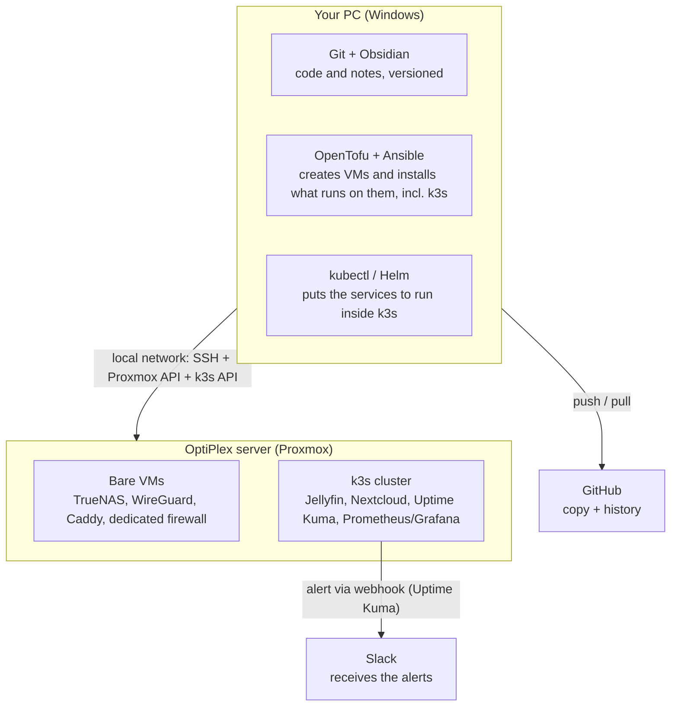

# Architecture and workflow (beginner-friendly)

Living document - update it whenever a tool moves or the workflow changes. This is not a decision document (that is `TOOLING.md`); it is the "where does this live and how does it all fit together", explained plainly.

## The golden rule

**Your PC is where you plan and command. The OptiPlex is where everything runs 24/7.**
Almost no tool is installed in both places - each one has a single right home. Your PC never runs anything around the clock; it is only used while you are working. The OptiPlex is the one that stays on, doing the background work.

> Network architecture (VLANs, zones, dedicated firewall) is not in this diagram - it has its own document, `NETWORK.md`. This one stays on the "PC vs OptiPlex" view.

## Where each tool lives

| Tool | What it is for | Where it is installed |
| --- | --- | --- |
| Git | Keeping the history of every change (code, configs, notes) | **Your PC** (repo cloned at `Documents\GitHub\homelab`) |
| GitHub | Cloud backup of the repo plus a shareable history | **Cloud** (github.com) - your PC pushes and pulls |
| Obsidian | Reading and editing the documentation more comfortably (links, tags, search) | **Your PC** (points at the same repo folder) |
| OpenTofu | Creates and destroys VMs and LXCs on Proxmox from code files | **Your PC** - talks to the Proxmox API over the local network |
| Ansible | Configures the bare VMs (TrueNAS, WireGuard, firewall) and installs k3s itself on the dedicated node(s) | **Your PC** - connects over SSH to the VMs on the OptiPlex |
| **k3s (Kubernetes)** | Runs the application services as *workloads* - Jellyfin, Nextcloud, monitoring - instead of one VM/LXC per service | **OptiPlex**, inside one or more VMs created by OpenTofu; k3s itself is installed by Ansible |
| **kubectl / Helm** | Deploying and updating the application services inside k3s (manifests/Helm charts, `infra/kubernetes/`) | **Your PC** - talks to the k3s API over the local network |
| Proxmox | The server's "operating system", runs the VMs and LXCs | **OptiPlex** (already installed) |
| TrueNAS, WireGuard, Caddy, dedicated firewall | Services that run bare, outside k3s - TrueNAS because of disk passthrough; WireGuard and the firewall because they mediate the network zones; Caddy has not been migrated yet | **OptiPlex**, each in its own VM created by Proxmox |
| Jellyfin, Nextcloud | Application services - media server and personal cloud | **OptiPlex**, as workloads inside k3s |
| Uptime Kuma, Prometheus/Grafana | Watching whether the services above are alive, plus CPU/RAM/disk graphs | **OptiPlex**, as workloads inside k3s |
| Healthchecks.io | Dead man's switch for scheduled jobs (backups, ZFS scrub) - catches the silent failures Uptime Kuma cannot see | **OptiPlex**, self-hosted (inside or outside k3s, still undecided) |
| Slack | Where the alerts land (just an app/site, nothing to install in the homelab) | **Cloud** (slack.com) - the OptiPlex sends messages to it |

## The typical workflow, end to end

1. On your PC you edit files (documentation in Obsidian, or Terraform/Ansible/Kubernetes manifests in an editor) - all inside the `homelab` folder.
2. `git commit` + `push` - it is now stored on GitHub.
3. From your PC you run `tofu apply` - it talks to Proxmox over the local network and creates or updates the VMs on the OptiPlex, including the k3s node(s).
4. From your PC you run `ansible-playbook` - it connects over SSH into those VMs: configures what runs bare (TrueNAS, WireGuard, firewall) and installs k3s itself on the dedicated node(s).
5. From your PC you run `kubectl apply` / `helm install` - it talks to the k3s API (already inside the OptiPlex) and puts the application services (Jellyfin, Nextcloud, Uptime Kuma, Prometheus/Grafana) to run in there, from the manifests and Helm charts in `infra/kubernetes/`.
6. Once Uptime Kuma is running *inside* k3s, it watches the other services on its own, with nothing further from you; if something goes down, it sends a message to Slack through the webhook.
7. You get the alert on your phone or PC via the Slack app - your PC is not an intermediary in that last step.

## Technical note: Ansible on Windows needs WSL2

OpenTofu runs natively on Windows without trouble, but **Ansible does not run on Windows as the control machine** - it only knows how to configure remote Linux machines, and to do that it needs to run inside a Linux environment itself. The standard way around this is to enable **WSL2** (Windows Subsystem for Linux, included with Windows 11) and install Ansible in there - you still edit everything on the same PC, you just run that one specific command from inside WSL instead of PowerShell.

## History

- 18/07/2026: first version of this document, with the map of where each tool lives and the end-to-end workflow.
- 29/07/2026: updated to reflect the adoption of k3s (decided 22/07/2026, see `TOOLING.md`) - this document had never been updated for it. The diagram, table and workflow now distinguish bare VMs (TrueNAS, WireGuard, dedicated firewall) from workloads inside k3s (Jellyfin, Nextcloud, Uptime Kuma, Prometheus/Grafana); `kubectl`/`Helm` enter as a tool and as their own step in the workflow, after Ansible.
- 29/07/2026: documentation audit - Caddy was missing from the table and the diagram (it stays a bare VM, not yet migrated to k3s). Em dashes replaced by plain hyphens throughout.
- 11/08/2026: translated to English.
