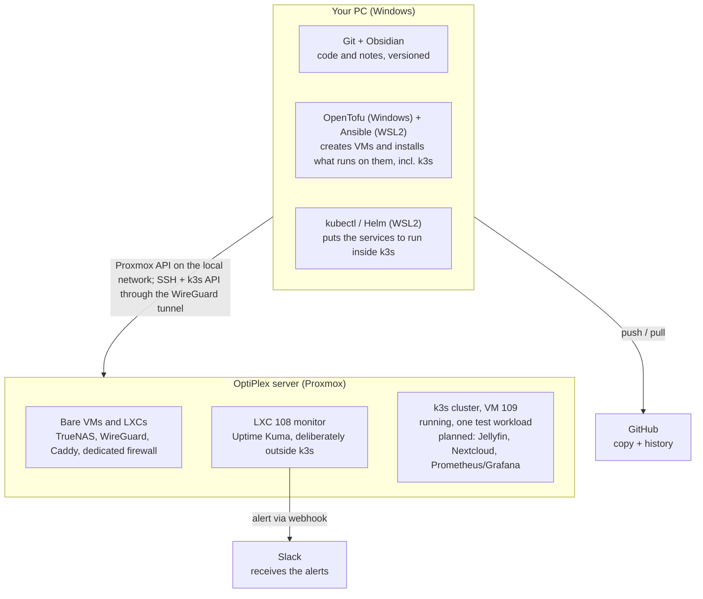

# Architecture and workflow (beginner-friendly)

Living document - update it whenever a tool moves or the workflow changes. This is not a decision document (that is `TOOLING.md`); it is the "where does this live and how does it all fit together", explained plainly.

## The golden rule

**Your PC is where you plan and command. The OptiPlex is where everything runs 24/7.**
Almost no tool is installed in both places - each one has a single right home. Your PC never runs anything around the clock; it is only used while you are working. The OptiPlex is the one that stays on, doing the background work.

> Network architecture (VLANs, zones, dedicated firewall) is not in this diagram - it has its own document, `NETWORK.md`. This one stays on the "PC vs OptiPlex" view.

## Where each tool lives

| Tool | What it is for | Where it is installed |
| --- | --- | --- |
| Git | Keeping the history of every change (code, configs, notes) | **Your PC** (repo cloned at `Documents\GitHub\homelab`) |
| GitHub | Cloud backup of the repo plus a shareable history | **Cloud** (github.com) - your PC pushes and pulls |
| Obsidian | Reading and editing the documentation more comfortably (links, tags, search) | **Your PC** (points at the same repo folder) |
| OpenTofu | Creates, imports and destroys VMs and LXCs on Proxmox from code files | **Your PC** - talks to the Proxmox API at `192.168.1.206:8006`, the flat-network address, which needs no tunnel. The Management address has answered too since the PC started using its WireGuard tunnel on 16/09/2026, and moving there is a decision still open (see `infra/README.md`) |
| Ansible | Configures the bare VMs (TrueNAS, WireGuard, firewall) and installs k3s itself on the dedicated node(s) | **Your PC, inside WSL2** - connects over SSH to the VMs on the OptiPlex, through the WireGuard tunnel (see the technical note below) |
| **k3s (Kubernetes)** | Runs the application services as *workloads* - Jellyfin, Nextcloud, monitoring - instead of one VM/LXC per service | **OptiPlex**, inside VM 109 `k3s-1` (a single node for now), created by OpenTofu; k3s itself is installed by Ansible. **Not on your PC**, not even inside WSL2 |
| **kubectl / Helm** | Deploying and updating the application services inside k3s (manifests/Helm charts, `infra/kubernetes/`) | **Your PC, inside WSL2**, beside the kubeconfig Ansible writes there - they are *clients*, they run nothing and store nothing, they just turn commands into HTTP requests to the k3s API on port 6443, through the WireGuard tunnel. `kubectl` is pinned to the server's exact version, 1.36.4; the copies on Windows, including the one Docker Desktop leaves in `PATH`, are not used. Helm is still on Windows and unused, and moves to WSL2 with the first chart |
| Proxmox | The server's "operating system", runs the VMs and LXCs | **OptiPlex** (already installed) |
| TrueNAS, WireGuard, Caddy, dedicated firewall | Services that run bare, outside k3s - TrueNAS because of disk passthrough; WireGuard and the firewall because they mediate the network zones; Caddy has not been migrated yet | **OptiPlex**, each in its own VM created by Proxmox |
| Jellyfin, Nextcloud | Application services - media server and personal cloud | **OptiPlex**, today in their own LXCs (105 and 104, Trusted); planned to move into k3s as workloads |
| Uptime Kuma | Watching whether the services above are alive, and the dead man's switch for the scheduled jobs through Push monitors | **OptiPlex**, in its **own LXC (108)**, deliberately outside k3s - the watcher has to be simpler than what it watches |
| Prometheus/Grafana | History and graphs of CPU/RAM/disk, which answers "why is this slow" rather than "is it up" | **OptiPlex**, planned as a workload inside k3s (not installed yet) |
| Slack | Where the alerts land (just an app/site, nothing to install in the homelab) | **Cloud** (slack.com) - the OptiPlex sends messages to it |

## The typical workflow, end to end

1. On your PC you edit files (documentation in Obsidian, or Terraform/Ansible/Kubernetes manifests in an editor) - all inside the `homelab` folder.
2. `git commit` + `push` - it is now stored on GitHub.
3. From your PC you run `tofu apply` - it talks to Proxmox over the local network and creates or updates the VMs on the OptiPlex, including the k3s node(s).
4. From WSL2 on your PC you run `ansible-playbook` - it connects over SSH into those VMs, through the WireGuard tunnel: configures what runs bare (TrueNAS, WireGuard, firewall) and installs k3s itself on the dedicated node(s).
5. From WSL2 on your PC you run `kubectl apply` / `helm install` - it talks to the k3s API (inside VM 109 on the OptiPlex) and puts the application services (Jellyfin, Nextcloud, Prometheus/Grafana) to run in there, from the manifests and Helm charts in `infra/kubernetes/`.
6. Uptime Kuma, in its own LXC 108 and deliberately outside k3s, watches the services on its own, with nothing further from you; if something goes down, it sends a message to Slack through the webhook.
7. You get the alert on your phone or PC via the Slack app - your PC is not an intermediary in that last step.

## Technical note: Ansible on Windows needs WSL2

OpenTofu runs natively on Windows without trouble, but **Ansible does not run on Windows as the control machine** - it only knows how to configure remote Linux machines, and to do that it needs to run inside a Linux environment itself. The standard way around this is to enable **WSL2** (Windows Subsystem for Linux, included with Windows 11) and install Ansible in there - you still edit everything on the same PC, you just run that one specific command from inside WSL instead of PowerShell.

**`kubectl` lives in WSL2 too, since 17/09/2026**, beside the kubeconfig that Ansible writes there, and Helm will follow it when it is first used.

**What WSL2 is, because it is easy to misread.** It is a lightweight virtual machine that Windows starts on demand, with a real Linux kernel. Its Linux files live inside a single virtual disk file on the Windows drive, and it sees the Windows drive itself at `/mnt/c`, which is how it reads this repository without a copy. Its network goes out through Windows, which is why the WireGuard tunnel you turn on in Windows also works for Ansible and `kubectl`. **k3s does not run in WSL2**: it runs in VM 109 on the OptiPlex. WSL2 only holds the clients and their credentials, meaning Ansible, `kubectl`, the SSH key and the kubeconfig. The full map is in `infra/README.md`.

## History

- 11/09/2026: corrected during the review of Phase 4. Three rows and the diagram were describing a plan that had been abandoned in August: Uptime Kuma was shown as a k3s workload when it has lived in LXC 108 since 31/08 precisely so the alerting does not depend on the cluster, and Healthchecks.io was still listed as a tool to install with its location "still undecided" when it had been dropped on 31/08. Added where the `kubectl` on this PC actually comes from, because it was inherited from Docker Desktop rather than chosen, and the Proxmox address OpenTofu has to use.
- 18/07/2026: first version of this document, with the map of where each tool lives and the end-to-end workflow.
- 29/07/2026: updated to reflect the adoption of k3s (decided 22/07/2026, see `TOOLING.md`) - this document had never been updated for it. The diagram, table and workflow now distinguish bare VMs (TrueNAS, WireGuard, dedicated firewall) from workloads inside k3s (Jellyfin, Nextcloud, Uptime Kuma, Prometheus/Grafana); `kubectl`/`Helm` enter as a tool and as their own step in the workflow, after Ansible.
- 29/07/2026: documentation audit - Caddy was missing from the table and the diagram (it stays a bare VM, not yet migrated to k3s). Em dashes replaced by plain hyphens throughout.
- 11/08/2026: translated to English.
- 17/09/2026: `kubectl` moved into WSL2, at the server's exact version and beside the kubeconfig, and the technical note gained a plain explanation of what WSL2 is, after the natural question of whether k3s had ended up inside it. It had not: it runs in VM 109, and the diagram now says so, with the cluster shown as running and still empty. The rows for Jellyfin, Nextcloud and Prometheus/Grafana described the plan as if it were current, so they now separate where each runs today from where it is headed. Ansible and `kubectl` now show the WireGuard tunnel as their path. Two workflow steps still described Uptime Kuma inside k3s, missed by the correction of 11/09, and were fixed.
