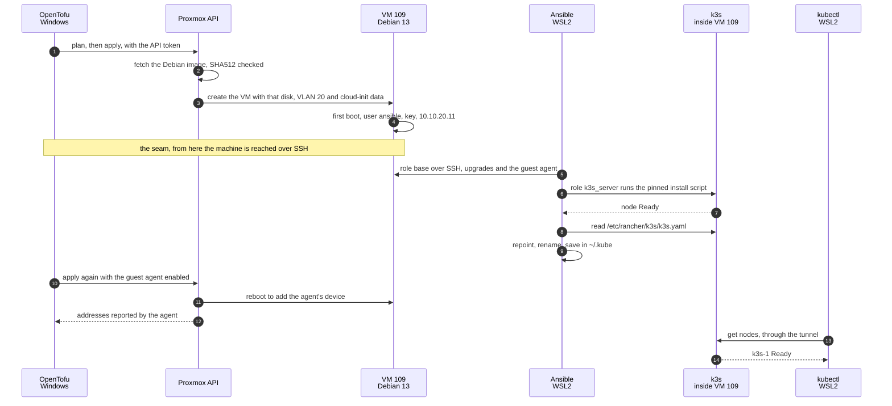

# `infra/` - Infrastructure as Code

Everything in this tree describes the homelab as code. It is not documentation of what was done by hand: if something is in here, it is meant to be the thing that actually does it.

The reasoning behind each choice lives in [TOOLING.md sections 4 and 5](../docs/TOOLING.md#4-infrastructure-as-code). The status of each task lives in [CHECKLIST.md Phase 4](../docs/CHECKLIST.md). This file is the operational one: what each folder owns, where each tool runs, and how to run it.

## The three layers

| Folder | Owns | Runs from |
|---|---|---|
| `opentofu/` | Creating, importing and destroying VMs and LXCs on Proxmox. The shape of the machine: cores, memory, disks, which VLAN its NIC is tagged into | Windows (PowerShell) |
| `ansible/` | Configuring the inside of those machines: packages, users, k3s itself | **WSL2**, because Ansible does not run on Windows as a control node |
| `kubernetes/` | The application workloads on k3s, as manifests and Helm values | **WSL2** (`kubectl` and Helm), beside the kubeconfig the Ansible role writes there |

The split is not arbitrary. OpenTofu knows that a VM exists and how big it is, and knows nothing about what is installed inside it. Ansible knows what is installed and cannot create the machine. The seam between them is the machine being reachable over SSH, which is also why that seam is where things break.

All three layers describe an end state rather than steps, and they differ in who compares that description with reality, and when. OpenTofu compares it with its state and the API, only when `plan` or `apply` runs. Ansible compares it with the machine itself, task by task, only when the playbook runs, and keeps no state of its own. Kubernetes compares continuously and on its own, for as long as the cluster is up.

## Where each piece runs


| Piece | Runs in | Talks to | Using | Path |
|---|---|---|---|---|
| OpenTofu | Windows | Proxmox API, `192.168.1.206:8006` | token `opentofu@pve!provider`, in `terraform.tfvars` | flat network |
| Ansible | WSL2 | VM 109 over SSH, `10.10.20.11:22` | user `ansible`, key `~/.ssh/homelab_ansible` | WireGuard tunnel |
| `kubectl`, Helm | WSL2 | the k3s API, `10.10.20.11:6443` | `~/.kube/homelab-k3s.yaml` | WireGuard tunnel |
| k3s | VM 109 `k3s-1` | - | - | - |

**Nothing of k3s runs on the PC.** `kubectl` is a client that turns commands into HTTPS requests, and the kubeconfig is an address plus a credential. The server, its database and every container live in VM 109.

k3s runs with its packaged components enabled, Traefik among them, which is why ports 80 and 443 answer on the node itself: `/whoami` reaches the test workload, and any other path gets a `404`. What runs inside the cluster, its conventions and the path of a request to a pod are in [`kubernetes/README.md`](kubernetes/README.md). When Ansible or `kubectl` cannot reach the node, [NETWORK.md, Flow 4](../docs/NETWORK.md#flow-4-the-home-pc-administers-the-zones-through-its-tunnel) walks the path hop by hop, with the test for each one.

WSL2 is itself a lightweight VM that Windows starts on demand, and three of its properties have already shaped this tree:

- **Its Linux filesystem is a virtual disk**, an `ext4.vhdx` under `%LOCALAPPDATA%\wsl\` that grows as it is written. `/root/.ssh` and `/root/.kube` live in there, not in this repository.
- **This repository is read through `/mnt/c`**, the Windows drive shared into the VM. NTFS has no Unix permissions, so everything there shows as `777`. Ansible refuses an `ansible.cfg` in a world-writable directory, which is why the connection settings live in the inventory; and SSH refuses a private key with those permissions, which is why the key and the kubeconfig live on the Linux side, at `600`.
- **It reaches the network through NAT on Windows**, so it follows the Windows routes, and the WireGuard tunnel up on Windows is what carries Ansible and `kubectl` into Trusted. Windows programs can be called from inside it too: there, `kubectl` is ours, while `kubectl.exe` would run the copy Docker Desktop installs.

## How a node is built, end to end

The k3s node was built in this order on 16/09/2026, and the order is the design: each tool hands over to the next at a point the next one can check on its own.



Three things the diagram makes visible:

- **Three doors, three credentials.** OpenTofu only ever talks to the Proxmox API, with its token; Ansible only to the node over SSH, with its key; `kubectl` only to the Kubernetes API, with the kubeconfig. Each credential opens one door, and none of the tools can do another's job.
- **The seam is SSH.** OpenTofu is finished once the VM exists with a user and a key, and Ansible starts from there. When something breaks between steps 4 and 5, the first question is whether the machine answers on port 22, not what either tool did.
- **The guest agent comes last, on purpose.** The cloud image does not ship it, and with the agent enabled at creation the provider would wait for addresses nobody reports. Ansible installs it first, and only the second `apply` turns it on, at the price of a reboot.

## How Ansible gets into a container

The k3s node was born with the door open: OpenTofu handed cloud-init a user and a key. The six containers predate all of this and came from a template with no SSH server at all, so nothing configured them, and it showed. Measured on 21/09/2026: each of the five running containers was 55 to 65 Debian packages behind, while the node Ansible manages was at zero, because its role upgrades it on every run.

**Decided 21/09/2026: they get the same door as the node.** SSH to the guest itself, as `ansible`, with the key that lives in WSL2. The alternative was to let Ansible into the host and have it run `pct exec` from there, which needs SSH to the hypervisor as root or nearly: that is the door the API token's design closed on purpose, and it fails worse, since one stolen key would reach every guest instead of one, and `pct exec` into LXC 103, the single privileged container, is root on the host by another road.

The door is opened once per container, from the host, with [`ansible/bootstrap-lxc.sh`](ansible/bootstrap-lxc.sh). It installs the SSH server, `sudo` and `python3`, creates the user with no password at all, writes the key, tells sshd to refuse passwords and root, and prints the address to put in the inventory. Every step checks before it acts, so a second run changes nothing.

```bash
./bootstrap-lxc.sh 101 "ssh-ed25519 AAAA... ansible@homelab"
```

After that a container is no different from the VM: it enters `inventory/hosts.yml` and the roles do the rest.

**Done for all five on 21/09/2026**, one at a time and Caddy first, each second run reporting `changed=0`, and every container now at zero packages pending. Two habits came out of it. The containers are taken with `--limit`, one by one, because the role's first task upgrades everything `apt` knows, which on these guests includes Docker and therefore restarts what is running inside; what runs unattended afterwards is only Debian, which is the point of writing the origins out. And the guest that carries the tunnel, LXC 103, is the one to do last, since Ansible reaches it through the very tunnel it serves.

## Prerequisites

Installed 11/09/2026, `kubectl` replaced on 17/09/2026, Helm moved on 18/09/2026. Versions are recorded because a version skew is the most likely cause of something behaving differently later:

| Tool | Version | Where |
|---|---|---|
| OpenTofu | 1.12.6 | Windows, `winget` |
| Helm | 4.3.0 | WSL2, `/usr/local/bin`, since 18/09/2026, for the first chart: from `get.helm.sh` and checked against its published sha256, the same version as the unused `winget` copy on Windows. Built against the Kubernetes 1.37 client, and Helm supports the three minor versions before the one it was built against, so 1.36 is inside the range |
| `kubectl` | 1.36.4 | WSL2, `/usr/local/bin`, from `dl.k8s.io` and checked against its published sha256. The exact version of the server, so the one-minor skew is not a question. The copies on Windows, Docker Desktop's 1.34.1 and a `winget` 1.37.0, are not used by this project |
| `ansible-core` | 2.21.4 | WSL2 (Ubuntu 24.04), as `root` |
| `ansible-lint` | 26.8.0 | WSL2 |

The versions pinned on the other side live in the code itself: the provider in `opentofu/versions.tf`, and the k3s release with its install script checksum in `ansible/roles/k3s_server/defaults/main.yml`.

## How it connects to Proxmox

OpenTofu talks to the Proxmox API at **`https://192.168.1.206:8006/`**, the host's flat-network address, with `insecure = true` because the certificate is self-signed.

That address was the only one answering from the PC when it was chosen on 11/09/2026: the Management address `10.10.30.2:8006` gave no response at all, which was measured rather than assumed. It is also a **leftover** from the network migration of 06/08/2026, kept "for now", so removing it from the host silently breaks every `apply`.

**What changed on 16/09/2026 is the way out of that debt.** The PC now reaches the zones through its WireGuard tunnel, and through it the Management address answers too (`401`, measured 17/09/2026). The Phase 2 item that would have added a firewall rule for the PC's address was closed by that decision instead. Moving OpenTofu there is one variable, `proxmox_endpoint`, and would let the flat address go one day, at the cost of every `plan` needing the tunnel up, as Ansible and `kubectl` already do. Not taken yet: that is a decision, not a correction.

Provisioning runs as **`opentofu@pve`**, never `root@pam`. What that identity may and may not do, and which privileges were deliberately refused, is in [TOOLING.md](../docs/TOOLING.md#the-proxmox-identity-for-opentofu).

## Secrets

Nothing secret is in this tree, and the `.gitignore` is what enforces it rather than discipline:

- `terraform.tfvars` holds the API token and is ignored. `terraform.tfvars.example` is the committed template. The provider wants the token as **one single string**, `opentofu@pve!provider=<secret>`, which is the kind of detail that produces an unhelpful error when it is wrong.
- `*.tfstate` is ignored, and this is the one that matters most. State is not a cache: it holds every attribute of every managed resource in clear text, and this repository is public.

  Measured on 11/09/2026, on a real state file rather than a hypothetical path, because the patterns before it had only ever been tested against imagined filenames: the API token does **not** appear in the state. That is worth knowing and worth not over-reading. It is absent because provider configuration is not persisted, not because state is safe. There are no resources yet; the day a VM exists with a cloud-init password or an injected key, those attributes land in the state in clear. The rule has not saved us yet, which is different from not being needed.

  **Measured again on 17/09/2026, with VM 109 in the state**, by a script that answers yes or no and never prints a value: still no token, no private key and no password, since cloud-init is given none. It does hold the injected SSH **public** key, which is not a secret, and the VM's MAC address alongside the addresses the guest agent reports, details this repository keeps out of its public documents on purpose. So the rule is no longer hypothetical.
- `*.tfplan` is ignored too, and matters as much. A saved plan carries a copy of the state and, unlike the state, the API token in clear text; what it holds is under [Running it, in order](#running-it-in-order).
- `.terraform.lock.hcl` **is** committed, deliberately. It pins the provider hashes and is what makes `init` reproducible.
- The k3s kubeconfig is an administrator credential for the cluster. The `k3s_server` role writes it to `~/.kube/homelab-k3s.yaml` inside WSL2, directory `0700` and file `0600`, outside this repository and outside `/mnt/c`. It is rebuilt field by field rather than copied: `server:` points at `10.10.20.11` instead of the `127.0.0.1` k3s writes, and the cluster, user and context are named `homelab-k3s` instead of `default`. It is a file of its own rather than `~/.kube/config`, selected with `KUBECONFIG=`, so nothing else is overwritten or merged into it. Recorded in `SECRETS.md`.

## Running it, in order

Each command runs in one specific shell, and the prompt says which:

| Prompt | Where you are | What runs there |
|---|---|---|
| `PS C:\...>` | Windows | `tofu` |
| `root@<pc>:...#` | WSL2 on the PC | `ansible-playbook`, `kubectl`, `ssh` to the node |
| `root@pve:~#` | the Proxmox host | `pct`, `qm`, `pvesm` |
| `ansible@k3s-1:~$` | inside VM 109 | `k3s crictl`, the processes of the pods |

`tofu` does not exist inside WSL2, and Ubuntu's suggestions are both wrong: `snap install opentofu` brings another version, and a Linux `init` would add Linux hashes to the committed lock file; `python3-ufo-tofu` is an unrelated Python library.

**Windows PowerShell 5.1 splits an argument that starts with `-` at its first dot.** `-generate-config-out=caddy_generated.tf` reaches `tofu` as two arguments and fails with "Too many command line arguments". Quote every such argument: `"-out=caddy.tfplan"`, `"-var-file=other.tfvars"`.

From the repository root. The first three are safe to run at any time and change nothing:

```bash
tofu -chdir=infra/opentofu init
tofu -chdir=infra/opentofu fmt -check -recursive
tofu -chdir=infra/opentofu validate
```

Then the one that reads real infrastructure and still changes nothing:

```bash
tofu -chdir=infra/opentofu plan
```

And only then, deliberately and never with `-auto-approve`:

```bash
tofu -chdir=infra/opentofu apply
```

When the plan touches a guest that matters, save it and apply that file instead, so that what is applied is exactly what was read:

```bash
tofu -chdir=infra/opentofu plan "-out=<name>.tfplan"
```

```bash
tofu -chdir=infra/opentofu apply <name>.tfplan
```

**What a saved plan is**, measured on 18/09/2026 on a throwaway one with a fake token. The extension is only a convention; the file is a zip holding:

- the actions it computed, and the value of every input variable, **the API token included, in clear text**. `sensitive = true` hides a value on screen, not in the file;
- the state of every managed resource, as it was before and after the refresh;
- a copy of every `.tf` file in the folder, and that copy is what `apply` runs. The code was edited between the two commands, and the version that had been read was the one applied.

It is applied without asking for `yes`, because reading it was the approval. And it is used once: when the state moves, it is refused as `Saved plan is stale`, whether it was applied or something else changed the state first. Delete it right after the `apply`, and keep the `.tfplan` extension, since that is the pattern the `.gitignore` catches: under any other name, the file would be one `git add .` away from publishing the token.

Ansible and `kubectl` run from WSL2, not from PowerShell, and both need the WireGuard tunnel up:

```bash
wsl -d Ubuntu -- bash -lc "cd /mnt/c/Users/ruigr/Documents/GitHub/homelab/infra/ansible && ansible-playbook -i inventory site.yml"
```

A second run must report `changed=0`. That is the test that the roles describe a state rather than a sequence of commands that happened to work once.

```bash
wsl -d Ubuntu -- bash -lc "KUBECONFIG=~/.kube/homelab-k3s.yaml kubectl get nodes -o wide"
```

Workloads inside the cluster are applied one folder at a time, with `kubectl diff -k` as the plan: see [`kubernetes/README.md`](kubernetes/README.md#running-it).

## Importing a guest that already exists

Proven on LXC 101, Caddy, on 17/09/2026, then on 18/09/2026 on LXC 107, the stopped \*arr stack, on LXC 108, the running monitor, on LXCs 103, 104 and 105 together in one plan, and on VM 106, the firewall, as the first VM: the least valuable guests first, chosen on purpose, with VM 102 last. An import sends nothing to Proxmox. It records in the state that a resource block is an object that already exists, and the test afterwards is the one used everywhere else: `plan` must report no changes.

1. **Write only the `import` block**, with `id = "pve/<vmid>"`. Do not commit it yet: an import block without its resource fails `tofu validate` in CI.
2. **Let OpenTofu draft the resource from the real guest**, in PowerShell from `infra/opentofu`, with the quotes explained above. Planning may stop on a validation error; the draft is written anyway.

   ```bash
   tofu plan "-generate-config-out=<name>_generated.tf"
   ```

3. **Treat the draft as a draft.** Every draft so far carried an empty `entrypoint`, which the provider's own validation rejects, and every container with more than one core also `cpu.units = 0`, which is what the host reports when no CPU weight is set. Every one carried the MAC address, which does not belong in a public repository and which the provider keeps when it is not set. Remove what only repeats a default (empty strings, zeros, empty lists) and keep every block. **Check every `false` before removing it**: `started` and `start_on_boot` default to `true`, so a stopped guest needs `started = false` written down, or the apply starts it. **Keep the container's note**, as 108's was kept: the provider's default is an empty note, so leaving it out would plan to erase it. A VM's draft is longer and needs the same care attribute by attribute: VM 106's carried an empty `cpu.affinity`, `cpu.units = 0` and an empty `memory.hugepages`, all three rejected, and every attribute left out was checked against the provider's default at the pinned version. The order of a VM's `network_device` blocks is their identity: the provider numbers them from zero, and the guest assigns its interfaces by that number. Add `prevent_destroy`. Ignore the container's template: the Proxmox API does not record which template created a container, while the provider requires one, and a difference there would plan a replacement. Keep the `import` block after the import, so that a lost state file imports again instead of creating a duplicate. Delete the draft.
4. **`fmt`, `validate`, commit, and let CI pass.**
5. **Read the plan until it shows one import per guest, `0 to add` and `0 to destroy`.** For a container, a change is acceptable only once it is shown not to reach Proxmox: every container plan only filled in the provider's own timeouts and the `vm_id` its importer leaves empty, the provider source at the pinned version sends no request for either, and the measurement in the next step agreed. **For a VM, the plan must also show `0 to change`.** The pinned provider's VM update sends the VM's name on every update, changed or not, so a change of any kind becomes a write to its configuration. The VM read, unlike the container one, fills in `vm_id` and the timeouts itself, which is what makes a clean plan possible: on VM 106 the apply imported without the update ever running.
6. **Measure around the apply, and apply exactly the reviewed plan**, saved as described above. In PowerShell:

   ```bash
   tofu plan "-out=<name>.tfplan"
   ```

   ```bash
   tofu apply <name>.tfplan
   ```

   On the host, three signals, each answering a different question:

   - **Did anything write?** The API's access log records every request with its method and the identity behind it. An import only reads, so every request from the token for the guest must be a `GET`; a change would be a `PUT` or a `POST`. It can be read afterwards too, for as long as the log is kept. The first command must print nothing: it filters by the token, since whatever was done by hand in the web UI lands in the same log, and the configuration's date below still catches that. The second must count more than zero, which shows the log covers the run and the filter catches the token:

     ```bash
     zcat -f /var/log/pveproxy/access.log* | grep -E '/(lxc|qemu)/<vmid>[/ ?]' | grep 'opentofu@pve' | grep -v '"GET '
     ```

     ```bash
     zcat -f /var/log/pveproxy/access.log* | grep -E '/(lxc|qemu)/<vmid>[/ ?]' | grep -c 'opentofu@pve'
     ```

   - **Did the configuration change?** Its modification time moves with any write, in `/etc/pve/lxc/` for a container and `/etc/pve/qemu-server/` for a VM:

     ```bash
     stat -c '%n %y' /etc/pve/lxc/<vmid>.conf
     ```

   - **Was the guest restarted?** For a running container, its uptime before and after, `pct exec <vmid> -- cat /proc/uptime`; for a VM, the `uptime` line of `qm status <vmid> --verbose`, which counts from the start of its QEMU process; for a stopped guest, its status.

   The host's journal is not on the list for a container. It was counted for Caddy, and reading the source on 18/09/2026 showed it could not have said anything: `pve-container` logs no configuration change except a disk resize, while `qemu-server` logs every change to a VM as `update VM <vmid>`, so for VMs it remains a fourth signal. The host keeps its clock in UTC, one hour behind the PC in summer.

   Caddy: `1 imported, 1 changed`, the uptime grew by 75 seconds instead of resetting, and the next `plan` reported `No changes`. 107: the same counts, still `stopped` afterwards, and `No changes`. For both, read on 18/09/2026: the access log held 39 requests from the token for the two containers, every one a `GET`, and their configurations had last been written on 08/09 and 09/09, days before either import. 108, measured around the apply as written above rather than afterwards: the same counts, the uptime grew by 38 seconds, its configuration kept its date of 09/09, and the access log held 13 requests from the token, every one a `GET`. 103, 104 and 105, in one plan: `3 imported, 3 changed`, the three uptimes grew by 29 seconds, the configurations kept their dates of 09/09, 09/09 and 16/09, and the access log held 39 requests from the token, every one a `GET`. VM 106, the first VM: `1 imported, 0 changed`, so the update never ran; the uptime grew by 24 seconds, the configuration kept its date of 09/09, the journal held no `update VM 106`, and the access log held 6 requests from the token, every one a `GET`. Delete the saved plan afterwards.

**Several guests in one run** works once the procedure has stopped surprising: it was done on 18/09/2026 with LXCs 103, 104 and 105, after three imports in a row had produced the same clean plan. What is left to discover is then in each guest's attributes, and those show in the draft and in the plan whether a guest comes alone or not. One `import` block per guest, each in its own file; one `-generate-config-out`, which writes every resource into a single draft, then split per guest; one plan and one measured apply. The saved plan is all or nothing, so a guest whose plan shows a real change leaves the group and is imported alone later. A longer plan is easier to review through this filter, which keeps only the lines that change something: for each guest, its `resource` line, the five timeouts and the `vm_id`, and nothing else.

```bash
tofu show -no-color <name>.tfplan | Select-String '^\s*[-+~]'
```

VMs are imported one at a time. The provider models them as a different resource, with far more attributes, and the first VM import has to teach what the first container import taught. VM 106 went first, on its own, so that the first VM imported was not the one holding the data.

**VM 102 cannot be imported with the pinned provider**, found on 18/09/2026. Its pool disk is passed through by its USB `by-id` name, which ends in the SCSI target and LUN, `-0:0`, and the provider splits a disk's volume at the first colon to tell the storage from the file. The read then asks the API for the content of a storage that does not exist, and fails with `501` before any plan. The line is `strings.Cut(dd.FileVolume, ":")` in `proxmoxtf/resource/vm/disk/disk.go`, unchanged on `main`. Nothing is sent to the VM, since the failure is in the read, but the import waits for a release that treats a volume starting with `/` as a path.

Three details, recorded here because the bug was not reported upstream, by decision of 18/09/2026:

- **Nothing in the configuration avoids it.** The read fails before the configuration is compared with anything, so leaving the disk out of the code does not help, and neither does `lifecycle.ignore_changes`.
- **The same assumption is in two more places**: `CustomStorageDevice.PathInDatastore()` and the parsing of a disk's JSON, both in `proxmox/nodes/vms/custom_storage_device.go`. A fix has to cover all three: a volume that starts with `/` is a path on the host, never `storage:file`, and the path goes whole into `path_in_datastore` with an empty `datastore_id`, as already happens for paths without a colon.
- **Unreported, the fix depends on the maintainers or another user meeting the bug**, so every provider upgrade is the moment to test it again. Put the `import` block back locally without committing it, run `tofu plan`, and remove the block if the read still fails. Until the read works, the `import` block for VM 102 must stay out of the configuration, or every `plan` fails on it.

No new privilege was needed for any of them, since an import only reads, and 107 was the first to test that where it could have failed. It carries three kinds of option that Proxmox lets only `root@pam` change, as `pve-container`'s permission check shows: two bind mounts, a device passthrough, and the `keyctl` flag, since any feature flag other than `nesting` is reserved. The token matched all of them without a write, and later the bind mounts of 104 and 105 and the GPU passthrough of 105 the same way. Later on, the provider sends a block only when it changes, so the token can still change a container's memory or cores, while a change to any of those blocks has to be made by hand, as `root@pam`.

**The first change to an imported guest went through on 21/09/2026**, and it was the kind this arrangement is for. The host was upgraded and rebooted, and LXC 107 came back running, because its `onboot` was set while the repository said it should be stopped: the intention lived in a document, the behaviour lived in Proxmox. Writing `start_on_boot = false` beside the `started = false` that was already there made the two agree, and the plan then showed exactly two lines. The apply took two seconds, wrote `onboot: 0`, left the boot order alone, and the next plan reported no changes. A guest is only really under this tooling once a change like that has been made through it.

Two more things a later change should expect, both read in the provider's source at the pinned version. A change to a container's network block or to its address restarts the container. And the provider numbers interfaces from zero, so on 104 and 105, whose only interface is `net1`, that same change also rewrites the interface as `net0` and deletes `net1`. On a VM, `reboot_after_update` defaults to `true`, so a change the provider marks as needing a reboot restarts the VM as part of the `apply`; for the firewall that is an open decision in `CHECKLIST.md`. VM 102 carries its own list of traps there too.

## Rules that are not negotiable here

1. **Read the `plan` before every `apply`.** The difference between CI over application code and CI over infrastructure is the cost of a mistake: a malformed change does not fail a test, it destroys a VM.
2. **`code-review` and `security-review` before anything that touches real infrastructure.** The GitHub Actions workflow catches mechanical errors, not bad ideas.
3. **VM 102 is imported, never created.** It carries the disk passthrough and every byte of data in this homelab. After importing it, `tofu plan` must report *no changes*; while it wants to change something, the code does not yet describe reality.
4. **No `tofu plan` in CI, and it is not an oversight.** The runners are on the public internet and the Proxmox API is on a private LAN behind the firewall. No credential fixes a missing route.
