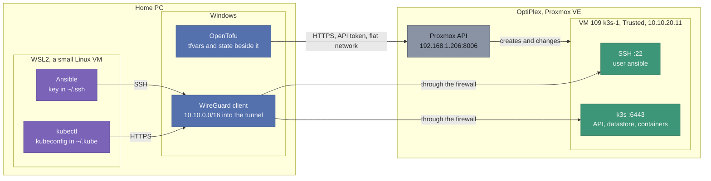
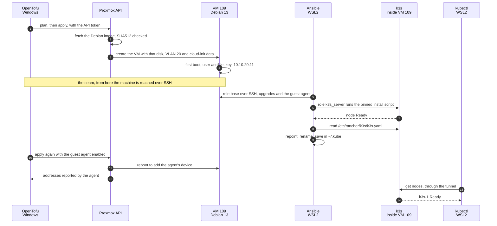

# `infra/` - Infrastructure as Code

Everything in this tree describes the homelab as code. It is not documentation of what was done by hand: if something is in here, it is meant to be the thing that actually does it.

The reasoning behind each choice lives in [TOOLING.md sections 4 and 5](../docs/TOOLING.md#4-infrastructure-as-code). The status of each task lives in [CHECKLIST.md Phase 4](../docs/CHECKLIST.md). This file is the operational one: what each folder owns, where each tool runs, and how to run it.

## The three layers

| Folder | Owns | Runs from |
|---|---|---|
| `opentofu/` | Creating and destroying VMs and LXCs on Proxmox. The shape of the machine: cores, memory, disks, which VLAN its NIC is tagged into | Windows (PowerShell) |
| `ansible/` | Configuring the inside of those machines: packages, users, k3s itself | **WSL2**, because Ansible does not run on Windows as a control node |
| `kubernetes/` | The application workloads on k3s, as manifests and Helm values | **WSL2** (`kubectl`), beside the kubeconfig the Ansible role writes there |

The split is not arbitrary. OpenTofu knows that a VM exists and how big it is, and knows nothing about what is installed inside it. Ansible knows what is installed and cannot create the machine. The seam between them is the machine being reachable over SSH, which is also why that seam is where things break.

All three layers describe an end state rather than steps, and they differ in who compares that description with reality, and when. OpenTofu compares it with its state and the API, only when `plan` or `apply` runs. Ansible compares it with the machine itself, task by task, only when the playbook runs, and keeps no state of its own. Kubernetes compares continuously and on its own, for as long as the cluster is up.

## Where each piece runs



| Piece | Runs in | Talks to | Using | Path |
|---|---|---|---|---|
| OpenTofu | Windows | Proxmox API, `192.168.1.206:8006` | token `opentofu@pve!provider`, in `terraform.tfvars` | flat network |
| Ansible | WSL2 | VM 109 over SSH, `10.10.20.11:22` | user `ansible`, key `~/.ssh/homelab_ansible` | WireGuard tunnel |
| `kubectl` | WSL2 | the k3s API, `10.10.20.11:6443` | `~/.kube/homelab-k3s.yaml` | WireGuard tunnel |
| k3s | VM 109 `k3s-1` | - | - | - |

**Nothing of k3s runs on the PC.** `kubectl` is a client that turns commands into HTTPS requests, and the kubeconfig is an address plus a credential. The server, its database and every container live in VM 109.

k3s runs with its packaged components enabled, Traefik among them, which is why ports 80 and 443 on the node already answer `404` with nothing deployed. When Ansible or `kubectl` cannot reach the node, [NETWORK.md, Flow 4](../docs/NETWORK.md#flow-4-the-home-pc-administers-the-zones-through-its-tunnel) walks the path hop by hop, with the test for each one.

WSL2 is itself a lightweight VM that Windows starts on demand, and three of its properties have already shaped this tree:

- **Its Linux filesystem is a virtual disk**, an `ext4.vhdx` under `%LOCALAPPDATA%\wsl\` that grows as it is written. `/root/.ssh` and `/root/.kube` live in there, not in this repository.
- **This repository is read through `/mnt/c`**, the Windows drive shared into the VM. NTFS has no Unix permissions, so everything there shows as `777`. Ansible refuses an `ansible.cfg` in a world-writable directory, which is why the connection settings live in the inventory; and SSH refuses a private key with those permissions, which is why the key and the kubeconfig live on the Linux side, at `600`.
- **It reaches the network through NAT on Windows**, so it follows the Windows routes, and the WireGuard tunnel up on Windows is what carries Ansible and `kubectl` into Trusted. Windows programs can be called from inside it too: there, `kubectl` is ours, while `kubectl.exe` would run the copy Docker Desktop installs.

## How a node is built, end to end

The k3s node was built in this order on 16/09/2026, and the order is the design: each tool hands over to the next at a point the next one can check on its own.



Three things the diagram makes visible:

- **Three doors, three credentials.** OpenTofu only ever talks to the Proxmox API, with its token; Ansible only to the node over SSH, with its key; `kubectl` only to the Kubernetes API, with the kubeconfig. Each credential opens one door, and none of the tools can do another's job.
- **The seam is SSH.** OpenTofu is finished once the VM exists with a user and a key, and Ansible starts from there. When something breaks between steps 4 and 5, the first question is whether the machine answers on port 22, not what either tool did.
- **The guest agent comes last, on purpose.** The cloud image does not ship it, and with the agent enabled at creation the provider would wait for addresses nobody reports. Ansible installs it first, and only the second `apply` turns it on, at the price of a reboot.

## Prerequisites

Installed 11/09/2026, `kubectl` replaced on 17/09/2026. Versions are recorded because a version skew is the most likely cause of something behaving differently later:

| Tool | Version | Where |
|---|---|---|
| OpenTofu | 1.12.6 | Windows, `winget` |
| Helm | 4.3.0 | Windows, `winget`. Not used yet; it moves to WSL2 with the first chart, for the same reason as `kubectl` |
| `kubectl` | 1.36.4 | WSL2, `/usr/local/bin`, from `dl.k8s.io` and checked against its published sha256. The exact version of the server, so the one-minor skew is not a question. The copies on Windows, Docker Desktop's 1.34.1 and a `winget` 1.37.0, are not used by this project |
| `ansible-core` | 2.21.4 | WSL2 (Ubuntu 24.04), as `root` |
| `ansible-lint` | 26.8.0 | WSL2 |

The versions pinned on the other side live in the code itself: the provider in `opentofu/versions.tf`, and the k3s release with its install script checksum in `ansible/roles/k3s_server/defaults/main.yml`.

## How it connects to Proxmox

OpenTofu talks to the Proxmox API at **`https://192.168.1.206:8006/`**, the host's flat-network address, with `insecure = true` because the certificate is self-signed.

That address was the only one answering from the PC when it was chosen on 11/09/2026: the Management address `10.10.30.2:8006` gave no response at all, which was measured rather than assumed. It is also a **leftover** from the network migration of 06/08/2026, kept "for now", so removing it from the host silently breaks every `apply`.

**What changed on 16/09/2026 is the way out of that debt.** The PC now reaches the zones through its WireGuard tunnel, and through it the Management address answers too (`401`, measured 17/09/2026). The Phase 2 item that would have added a firewall rule for the PC's address was closed by that decision instead. Moving OpenTofu there is one variable, `proxmox_endpoint`, and would let the flat address go one day, at the cost of every `plan` needing the tunnel up, as Ansible and `kubectl` already do. Not taken yet: that is a decision, not a correction.

Provisioning runs as **`opentofu@pve`**, never `root@pam`. What that identity may and may not do, and which privileges were deliberately refused, is in [TOOLING.md](../docs/TOOLING.md#the-proxmox-identity-for-opentofu).

## Secrets

Nothing secret is in this tree, and the `.gitignore` is what enforces it rather than discipline:

- `terraform.tfvars` holds the API token and is ignored. `terraform.tfvars.example` is the committed template. The provider wants the token as **one single string**, `opentofu@pve!provider=<secret>`, which is the kind of detail that produces an unhelpful error when it is wrong.
- `*.tfstate` is ignored, and this is the one that matters most. State is not a cache: it holds every attribute of every managed resource in clear text, and this repository is public.

  Measured on 11/09/2026, on a real state file rather than a hypothetical path, because the patterns before it had only ever been tested against imagined filenames: the API token does **not** appear in the state. That is worth knowing and worth not over-reading. It is absent because provider configuration is not persisted, not because state is safe. There are no resources yet; the day a VM exists with a cloud-init password or an injected key, those attributes land in the state in clear. The rule has not saved us yet, which is different from not being needed.

  **Measured again on 17/09/2026, with VM 109 in the state**, by a script that answers yes or no and never prints a value: still no token, no private key and no password, since cloud-init is given none. It does hold the injected SSH **public** key, which is not a secret, and the VM's MAC address alongside the addresses the guest agent reports, details this repository keeps out of its public documents on purpose. So the rule is no longer hypothetical.
- `.terraform.lock.hcl` **is** committed, deliberately. It pins the provider hashes and is what makes `init` reproducible.
- The k3s kubeconfig is an administrator credential for the cluster. The `k3s_server` role writes it to `~/.kube/homelab-k3s.yaml` inside WSL2, directory `0700` and file `0600`, outside this repository and outside `/mnt/c`. It is rebuilt field by field rather than copied: `server:` points at `10.10.20.11` instead of the `127.0.0.1` k3s writes, and the cluster, user and context are named `homelab-k3s` instead of `default`. It is a file of its own rather than `~/.kube/config`, selected with `KUBECONFIG=`, so nothing else is overwritten or merged into it. Recorded in `SECRETS.md`.

## Running it, in order

From the repository root. The first three are safe to run at any time and change nothing:

```bash
tofu -chdir=infra/opentofu init
tofu -chdir=infra/opentofu fmt -check -recursive
tofu -chdir=infra/opentofu validate
```

Then the one that reads real infrastructure and still changes nothing:

```bash
tofu -chdir=infra/opentofu plan
```

And only then, deliberately and never with `-auto-approve`:

```bash
tofu -chdir=infra/opentofu apply
```

Ansible and `kubectl` run from WSL2, not from PowerShell, and both need the WireGuard tunnel up:

```bash
wsl -d Ubuntu -- bash -lc "cd /mnt/c/Users/ruigr/Documents/GitHub/homelab/infra/ansible && ansible-playbook -i inventory site.yml"
```

A second run must report `changed=0`. That is the test that the roles describe a state rather than a sequence of commands that happened to work once.

```bash
wsl -d Ubuntu -- bash -lc "KUBECONFIG=~/.kube/homelab-k3s.yaml kubectl get nodes -o wide"
```

## Rules that are not negotiable here

1. **Read the `plan` before every `apply`.** The difference between CI over application code and CI over infrastructure is the cost of a mistake: a malformed change does not fail a test, it destroys a VM.
2. **`code-review` and `security-review` before anything that touches real infrastructure.** The GitHub Actions workflow catches mechanical errors, not bad ideas.
3. **VM 102 is imported, never created.** It carries the disk passthrough and every byte of data in this homelab. After importing it, `tofu plan` must report *no changes*; while it wants to change something, the code does not yet describe reality.
4. **No `tofu plan` in CI, and it is not an oversight.** The runners are on the public internet and the Proxmox API is on a private LAN behind the firewall. No credential fixes a missing route.
