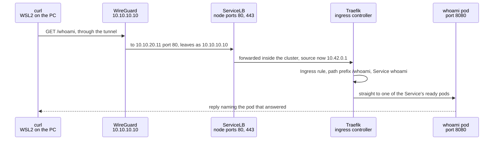
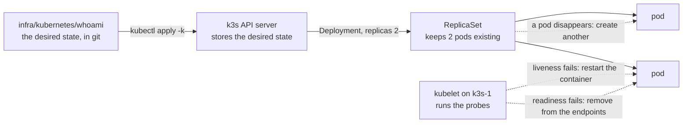

# `infra/kubernetes/` - workloads on k3s

What runs inside the cluster, and how it gets there. Where the cluster itself comes from, and where each tool runs, is in [`infra/README.md`](../README.md).

## Layout

One folder per workload, each a kustomization that is applied, compared and removed as a unit.

| Folder | What | State |
|---|---|---|
| `whoami/` | A tiny HTTP server that answers with the request it received and the pod that answered | Running since 17/09/2026, kept on purpose as a canary: if it answers, the node, Traefik, the Service and a pod all work |
| `monitoring/` | Prometheus and Grafana, from the community chart `kube-prometheus-stack`, installed with Helm | Installed and verified 18/09/2026; the procedure, what the chart produces and what was measured are in [its README](monitoring/README.md) |
| `truenas-storage/` | Placeholder for Phase 4b | Empty |

Our own manifests use kustomize, which is built into `kubectl`, so no extra tool is involved. Helm is for third-party charts, the first being `kube-prometheus-stack`, and for those the repository keeps only the values that differ from the chart.

## Conventions, set by the first workload

- **A namespace per workload, under the `restricted` Pod Security standard**, pinned to the cluster's minor version. The API server itself refuses pods that run as root, keep capabilities or can escalate privileges. Seen refusing, not only accepting: on 17/09/2026 a pod submitted without those settings, as a server-side dry run, was rejected with four violations. **The one exception is `monitoring-node`**, `privileged`, for node-exporter alone, which has to read the node itself; it has a namespace of its own so the exception covers nothing else.
- **Images pinned by tag and digest.** The tag is for the reader; the digest is what cannot be moved to another image.
- **A memory limit and no CPU limit.** Memory cannot be taken back from a process once given; CPU can, and a CPU limit only adds throttling.
- **Readiness and liveness probes** on every container that serves something.
- **No service account token** unless the workload talks to the Kubernetes API.
- **Ingress through the Traefik that k3s ships, by path prefix**, since this homelab has no local names.

## Running it

From WSL2, at the repository root, with the tunnel up and `KUBECONFIG=~/.kube/homelab-k3s.yaml`. The same discipline as the other two layers, plan before apply:

```bash
kubectl diff -k infra/kubernetes/whoami
```

```bash
kubectl apply -k infra/kubernetes/whoami
```

```bash
kubectl delete -k infra/kubernetes/whoami
```

`kubectl diff` is the plan. No output and exit code `0` mean the cluster matches the repository, which is the Kubernetes equivalent of OpenTofu's `No changes` and Ansible's `changed=0`. Pods deleted or restarted do not count, because the repository describes the Deployment, not its pods.

A chart installed with Helm follows its own procedure, in its folder's README, with the same rule of a plan before every change.

**The first time a workload is applied, create its namespace on its own first** (`kubectl apply -f <folder>/namespace.yaml`). `diff` simulates the change on the server, and a simulated namespace is not created, so every object meant to live in it would fail with "namespace not found".

## What k3s provides out of the box

Read from `kube-system` on 17/09/2026: CoreDNS; the local-path provisioner, which backs volumes with the node's own disk; metrics-server, behind `kubectl top`; Traefik, the default ingress class; and ServiceLB, whose `svclb-traefik` pod holds ports 80 and 443 on the node itself. That is why those ports answered, with a `404`, before anything was deployed.

## Where a pod lives inside the node

A pod is not a virtual machine. Its containers are ordinary Linux processes in VM 109's own kernel, beside `sshd`, kept apart by namespaces, which limit what a process can see, and cgroups, which limit what it can use. Read from inside the node on 17/09/2026 for the pod `whoami-55bff86bb5-md8lh`, over SSH as `ansible`:

| Layer | Where to look | What it showed |
|---|---|---|
| Pod, as Kubernetes names it | `kubectl -n whoami get pods` | `whoami-55bff86bb5-md8lh`, uid `b67c5389-...` |
| Pod, as containerd names it | `sudo k3s crictl pods --namespace whoami` | pod ID `a3efb3e3b3dd0` |
| Shim, one per pod | the parent of the process, in `ps` | `containerd-shim-runc-v2 -namespace k8s.io -id a3efb3e3...`, unpacked by k3s into `/var/lib/rancher/k3s/data/<hash>/bin/` |
| Processes | `ps -o pid,user,args --ppid <shim>` | `/pause`, which holds the pod's namespaces, and `/whoami --port=8080`, both as `nobody` |
| Filesystem the process sees | `sudo ls /proc/<pid>/root/` | the image built `FROM scratch`: a 12MB `whoami` binary and `usr` with certificates and time zones, plus `dev`, `etc`, `proc` and `sys` supplied by the runtime. No shell, which is why it is inspected from outside |
| cgroup | `/proc/<pid>/cgroup` | `kubepods.slice/kubepods-burstable.slice/kubepods-burstable-pod<uid>.slice/cri-containerd-<container>.scope` |
| Memory limit | `memory.max` in that cgroup | `67108864`, the 64 MiB of the manifest, enforced by the kernel |
| Network | `sudo nsenter -t <pid> -n ip -4 -brief addr` | its own `eth0`, `10.42.0.18/24`, the address `kubectl get pods -o wide` reports |
| Logs | `/var/log/pods/` | one folder per pod, `<namespace>_<pod>_<uid>` |
| Image | `sudo k3s crictl images --digests` | pulled by the pinned digest `c4717a8d1f013`, image ID `cd370f99dbfb6`, 5.14MB compressed. No tag is recorded, because it was pulled by digest |

Three readings worth keeping:

- **Two memory figures, both right.** `ps` gave 15.5 MiB of resident memory and `kubectl top` gave 6 MiB. `/proc/<pid>/status` separates them: 6.5 MiB of anonymous memory, which the application allocated for itself, and 9.0 MiB mapped from the binary on disk, which is shareable and can be reclaimed. The cgroup counted 6.8 MiB, and that is the figure the 64 MiB limit applies to.
- **Burstable, by design.** The cgroup places the pod in the `burstable` quality-of-service class, because its memory request, 16Mi, is below its limit and it has no CPU limit. When the node runs short of memory, pods with no requests at all go first and pods using more than they requested go before those within their requests, which is a reason to set requests honestly.
- **"Namespace" means three different things here.** The Kubernetes namespace is `whoami`. The shim's `-namespace k8s.io` is a containerd namespace, where every Kubernetes container lives. And the Linux namespaces are what isolate the process, which `nsenter` steps into.

## A request, from the PC to a pod



The hops up to the node, and the firewall between them, are [Flow 4 in NETWORK.md](../../docs/NETWORK.md#flow-4-the-home-pc-administers-the-zones-through-its-tunnel). Two things this part shows:

- **The application never sees who asked.** `X-Forwarded-For` arrived as `10.42.0.1`, the node's own address on the pod network. The PC's address is replaced by WireGuard's, and that one by the node's on the way through ServiceLB. Harmless for whoami; worth remembering before moving anything that logs or limits by client address.
- **Only ready pods receive traffic.** Traefik sends requests to the Service's endpoints, and a pod failing its readiness probe is removed from them before its liveness probe restarts it.

## What Kubernetes does on its own



This is the third way of comparing described in `infra/README.md`: not when someone runs a command, but continuously. Observed on 17/09/2026:

- **A pod deleted by hand** was replaced by a new one within the same second.
- **A pod told to fail its health check**, by posting `500` to whoami's `/health`, was restarted by its liveness probe about thirty seconds later, and counted one restart.
- **The whole workload deleted and applied again** came back from the repository to the same state, with `kubectl diff` empty.
