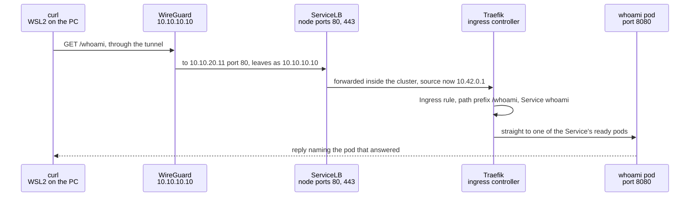
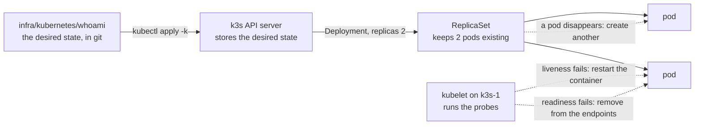

# `infra/kubernetes/` - workloads on k3s

What runs inside the cluster, and how it gets there. Where the cluster itself comes from, and where each tool runs, is in [`infra/README.md`](../README.md).

## Layout

One folder per workload, each a kustomization that is applied, compared and removed as a unit.

| Folder | What | State |
|---|---|---|
| `whoami/` | A tiny HTTP server that answers with the request it received and the pod that answered | Running since 17/09/2026, kept on purpose as a canary: if it answers, the node, Traefik, the Service and a pod all work |
| `monitoring/`, `truenas-storage/` | Placeholders for Phase 4b | Empty |

Our own manifests use kustomize, which is built into `kubectl`, so no extra tool is involved. Helm stays for third-party charts, the first planned being `kube-prometheus-stack`.

## Conventions, set by the first workload

- **A namespace per workload, under the `restricted` Pod Security standard**, pinned to the cluster's minor version. The API server itself refuses pods that run as root, keep capabilities or can escalate privileges. Seen refusing, not only accepting: on 17/09/2026 a pod submitted without those settings, as a server-side dry run, was rejected with four violations.
- **Images pinned by tag and digest.** The tag is for the reader; the digest is what cannot be moved to another image.
- **A memory limit and no CPU limit.** Memory cannot be taken back from a process once given; CPU can, and a CPU limit only adds throttling.
- **Readiness and liveness probes** on every container that serves something.
- **No service account token** unless the workload talks to the Kubernetes API.
- **Ingress through the Traefik that k3s ships, by path prefix**, since this homelab has no local names.

## Running it

From WSL2, at the repository root, with the tunnel up and `KUBECONFIG=~/.kube/homelab-k3s.yaml`. The same discipline as the other two layers, plan before apply:

```bash
kubectl diff -k infra/kubernetes/whoami
```

```bash
kubectl apply -k infra/kubernetes/whoami
```

```bash
kubectl delete -k infra/kubernetes/whoami
```

`kubectl diff` is the plan. No output and exit code `0` mean the cluster matches the repository, which is the Kubernetes equivalent of OpenTofu's `No changes` and Ansible's `changed=0`. Pods deleted or restarted do not count, because the repository describes the Deployment, not its pods.

**The first time a workload is applied, create its namespace on its own first** (`kubectl apply -f <folder>/namespace.yaml`). `diff` simulates the change on the server, and a simulated namespace is not created, so every object meant to live in it would fail with "namespace not found".

## What k3s provides out of the box

Read from `kube-system` on 17/09/2026: CoreDNS; the local-path provisioner, which backs volumes with the node's own disk; metrics-server, behind `kubectl top`; Traefik, the default ingress class; and ServiceLB, whose `svclb-traefik` pod holds ports 80 and 443 on the node itself. That is why those ports answered, with a `404`, before anything was deployed.

## A request, from the PC to a pod



The hops up to the node, and the firewall between them, are [Flow 4 in NETWORK.md](../../docs/NETWORK.md#flow-4-the-home-pc-administers-the-zones-through-its-tunnel). Two things this part shows:

- **The application never sees who asked.** `X-Forwarded-For` arrived as `10.42.0.1`, the node's own address on the pod network. The PC's address is replaced by WireGuard's, and that one by the node's on the way through ServiceLB. Harmless for whoami; worth remembering before moving anything that logs or limits by client address.
- **Only ready pods receive traffic.** Traefik sends requests to the Service's endpoints, and a pod failing its readiness probe is removed from them before its liveness probe restarts it.

## What Kubernetes does on its own



This is the third way of comparing described in `infra/README.md`: not when someone runs a command, but continuously. Observed on 17/09/2026:

- **A pod deleted by hand** was replaced by a new one within the same second.
- **A pod told to fail its health check**, by posting `500` to whoami's `/health`, was restarted by its liveness probe about thirty seconds later, and counted one restart.
- **The whole workload deleted and applied again** came back from the repository to the same state, with `kubectl diff` empty.
